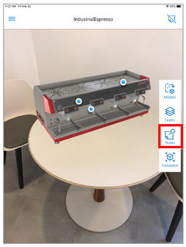
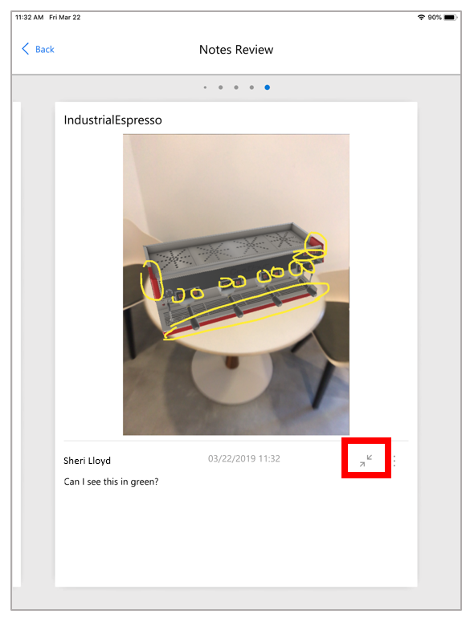
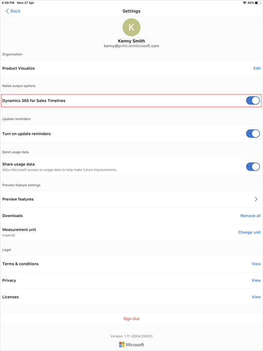

# Add a note to a 3D model in Dynamics 365 Product Visualize

[!INCLUDE [cc-beta-prerelease-disclaimer](../includes/cc-beta-prerelease-disclaimer.md)]

You can capture notes on specific points on a 3D model in Microsoft Dynamics 365 Product Visualize, and even add text or draw on the notes. For example, when you're in the field with a customer, you can capture any required product changes directly on the model. Any notes you create are saved in Common Data Service.

To review notes attached to a model, tap any spatial anchor on the model. Anchors on the front of the model appear as blue circles with white outlines. Anchors on the back appear as blurred circles with transparent outlines. For a model and note that's off the screen, a "note bubble" points in the direction of the model and note. See the table below for information about how these notes appear.

You can also browse through your notes by swiping the notes at the bottom of the screen. The corresponding spatial anchor is activated on the model as you swipe.

The following table shows how notes appear on the model, depending on where the note is located.

|Note on front of the model|Note on back of the model|Note and model off the screen|
|-------------------------------------|-------------------------------------------|-----------------------------------------|
||||

## Add a note

1.	Place the model as described in [Place and manipulate 3D models](manipulate-models.md), and then select **Notes** from the right side of the screen.

    

2. Select **Add Note**.

    
 
2.	Select **Photo** to take a picture of the model, or select **Camera Roll** if you want to use a photo already stored on your device.

    

 3.	Do one or both of the following: 
    
      a. Optional: To draw on the screen, select a color and start drawing. For example, draw an arrow to call out a particular part of the model.
    
      b. Required: To add text, tap **Add caption** in the notes box at the bottom of the screen, and then enter the text you want. When you're finished adding text, select **Next**.
    
       
         
     > [!NOTE]
     > If you're not happy with the picture, select **Replace** to redo the capture or select a different picture from your camera roll. When you select **Replace**, text you entered is retained, but any drawings are lost.
         
 4. Tap the model where you want to place the note.
 
      
      
 5. Select **Finish** when you're done.
   

## View the notes attached to a model

1.	After placing the model, select **Notes** on the right side of the screen.

2.	Tap a blue dot to open a specific note, or swipe right or left in the notes browser at the bottom of the screen to go forward or backward between notes.

    > [!NOTE]
    > If you want to see a larger view of the notes, which is useful if you can't see all the text in the notes card, tap the expand arrow in the upper-right corner of the notes card or flick up. Then you can use the scroll bar in the notes card to move through the text.
    
     
     
## Delete a note

1.	Select **Notes** on the right side of the screen.

2.	Select the **Overflow** menu  in the upper-right corner of the notes card.

3.	Select **Delete Note**.

     
  
## Change how your notes are shared with other apps

By default, your notes are saved to the SharePoint account associated with your Dynamics 365 Sales account. By default, Dynamics 365 Product Visualize also sends your notes to your Dynamics 365 Sales timeline and any connected Microsoft Teams channel.

To turn off sharing with the Dynamics 365 Sales timeline or Teams channels:

1. Select the Main menu button , and then select the account you're signed in to.  

2. Under **Note Output Options**, move the sliders to the off position for the options you want to turn off.

   
 
## Export a note

You can export your notes to share them with other apps on your device that support the iOS sharing function. The notes image and text are exported without any special formatting.

To export a note:

1.	Select **Notes** on the right side of the screen.

    > [!div class=mx-imgBorder]
    > 

2.	Navigate to the note you want to export, and select the **Overflow** menu in the upper-right corner of the notes card.

    > [!div class=mx-imgBorder]
    > 

3.	In the **Options** dialog box, select **Export note**.

    > [!div class=mx-imgBorder]
    > 

4. Select the required option for exporting the note.

    > [!div class=mx-imgBorder]
    > 

### See also

[Install, open, and sign in to the app](sign-in.md) 
[Place and manipulate 3D models](manipulate-models.md) 
[Show or hide layers in a 3D model](layers.md) 
[Explore sample 3D models](explore-samples.md) 
[View 3D models stored on your device](browse-models.md) 
[Add your own 3D model to an existing Dynamics 365 Sales product](add-model.md) 
[Download 3D models to use offline](download-models.md)
