# Add a note to a 3D model in Dynamics 365 Product Visualize

[!INCLUDE [cc-beta-prerelease-disclaimer](../includes/cc-beta-prerelease-disclaimer.md)]

You can capture notes while giving a product demonstration, and add text or draw on the notes. You also can attach notes at specific points on a 3D model. For example, when you're in the field with a customer, you can capture any required product changes directly on the model. Any notes you create are saved in Common Data Service.

To review notes attached to a model, tap any spatial anchor on the model. Anchors on the front of the model appear as blue circles with white outlines. Anchors on the back appear as blurred circles with transparent outlines. For a model and note that's off the screen, a "note bubble" points in the direction of the model and note. See the table below for information about how these notes appear.

You also can browse through your notes by swiping the notes at the bottom of the screen. The corresponding spatial anchor is activated on the model as you swipe.

The following images show how notes appear on the model, depending on where the note is located.

|Note on front of the model|Note on back of the model|Note and model off the screen|
|-------------------------------------|-------------------------------------------|-----------------------------------------|
|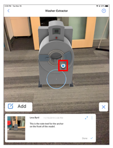|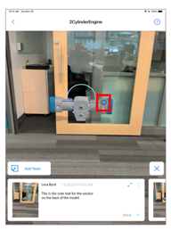|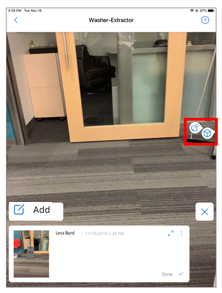|

## Add a note

1.	Place the model as described in [Place and manipulate 3D models](manipulate-models.md), and then tap **Notes** at the bottom of the screen.

    > [!div class=mx-imgBorder]
    > 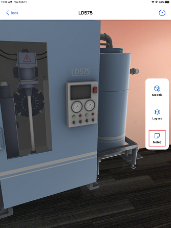

2. Tap **Add**.

    > [!div class=mx-imgBorder]
    > 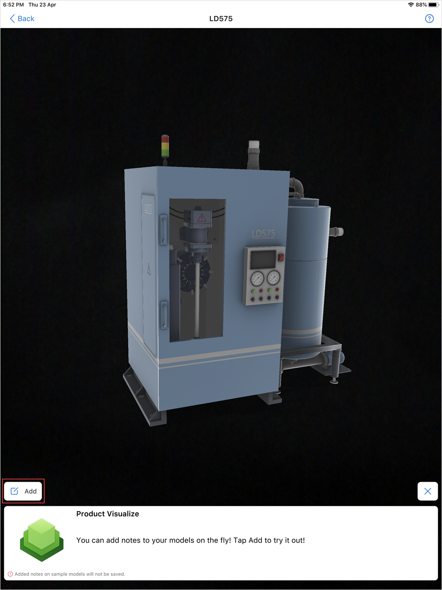

3. To attach a photo, see [Attach a photo to the note](#attach-a-photo-to-the-note).

4. To attach a video, see [Attach a video to the note](#attach-a-video-to-the-note).

5. To add a message, tap **Type a message here**, and then add the text.

    > [!div class=mx-imgBorder]
    > 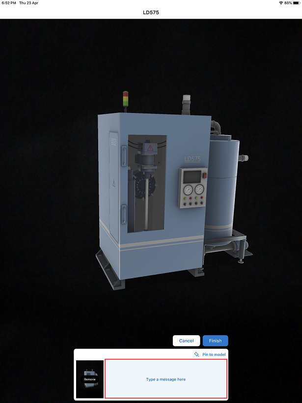

    The text message is added.

    > [!div class=mx-imgBorder]
    > 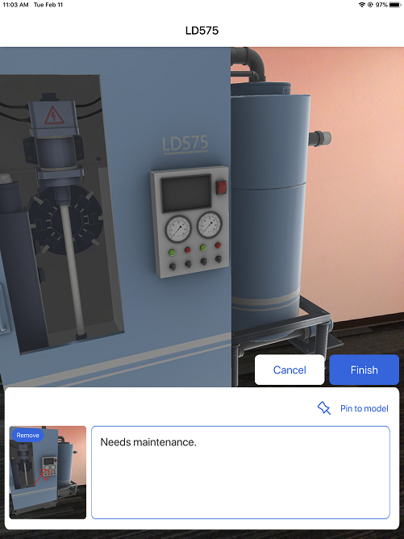

6. To attach the note at a specific point in your model, tap **Pin to model**.

    > [!div class=mx-imgBorder]
    > 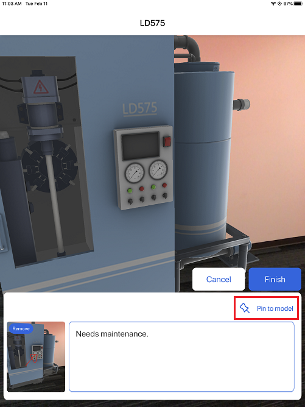

7. Tap the model where you want to attach the note, and then tap **Done**.
 
    > [!div class=mx-imgBorder]
    > 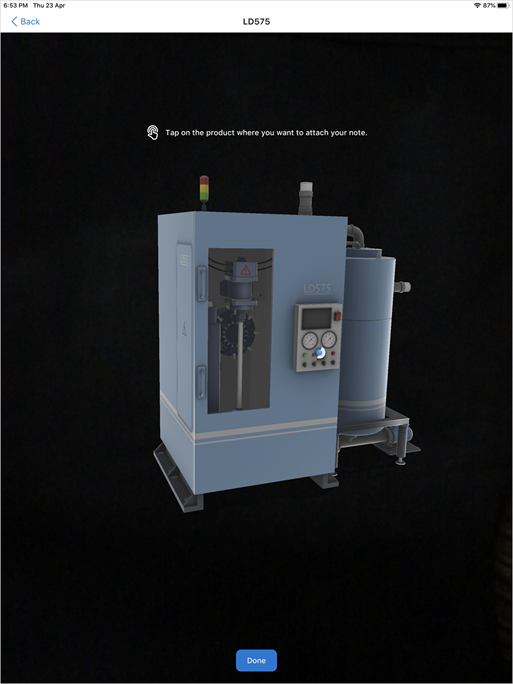

    The note is attached at the tapped location on the model. If you want to remove the pin from the model, tap **Remove pin**.

    > [!div class=mx-imgBorder]
    > 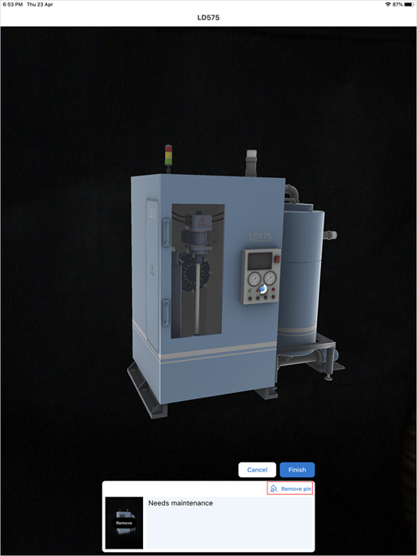

8. Tap **Finish**.

### Attach a photo to the note

1. When adding a note, tap **Attach image**.

    > [!NOTE]
    > If you have enabled the **Video notes** feature, the button name changes to **Attach**. You must then tap **Attach** > **Take a photo**.

    > [!div class=mx-imgBorder]
    > 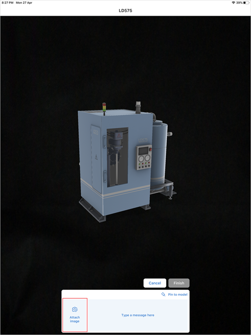
    
2. Tap **Photo** to take a photo of the model, or tap **Camera roll** if you want to use a photo that's already stored on your device.

    > [!div class=mx-imgBorder]
    > 

3. To draw on the screen, select a color and start drawing. (For example, draw an arrow to call out a particular part of the model.) Tap **Next** .

    > [!div class=mx-imgBorder]
    > 

    The captured image is displayed in the place of the **Attach image** button. If you're not happy with the photo, tap **Remove** to remove the photo and then capture the photo again.

    > [!div class=mx-imgBorder]
    > 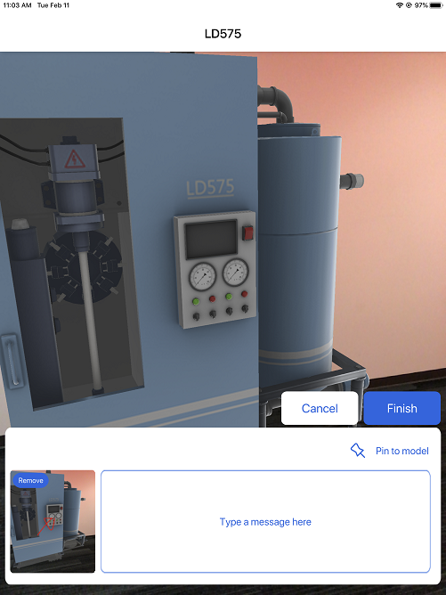

4. Continue with adding a message to your note.

### Attach a video to the note

A video allows you to capture more details about your customers' requirements. You can use video to demonstrate the functionality of your products in addition to their placement at the customer's premises. To attach a video to a note, you must enable the video notes feature. More information: [Enable video notes feature](enable-preview-features.md)

> [!NOTE]
> - Video notes is a preview feature. Preview features are experimental features that provide access to the latest innovations that the Dynamics 365 Product Visualize team is working on.
> - The maximum file size for attached videos is 5 MB.

**To attach a video to the note**

1. When adding a note, tap **Attach** > **Upload from library**.

    > [!div class=mx-imgBorder]
    > 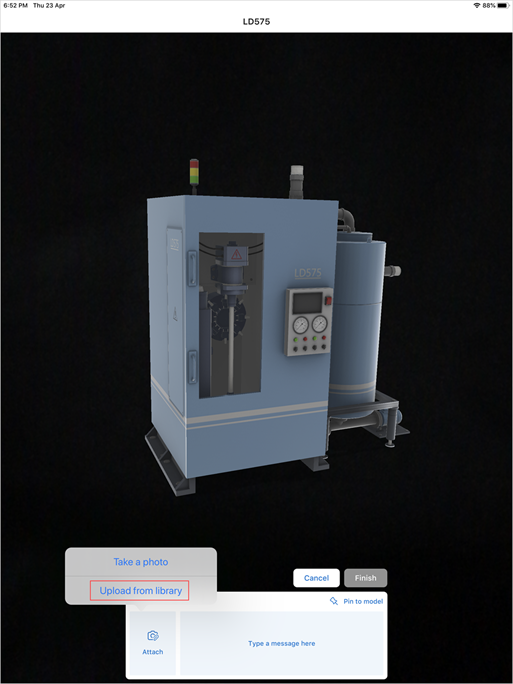

2. From the photo library of your device, select a video. 

    The uploaded video is displayed in the place of the **Attach** button. If you're not happy with the video, tap **Remove** to remove the video and then upload a different video.

3. Continue with adding a message to your note.

## View the notes added to a model

1.	After placing the model, tap **Notes** at the bottom of the screen.

    > [!div class=mx-imgBorder]
    > 

2.	Tap a blue dot to open a specific note, or swipe right or left in the notes browser at the bottom of the screen to go forward or backward between notes.

    If you want to see a larger view of the notes&mdash;which is useful if you can't see all the text in the notes card&mdash;tap the expand arrow in the upper-right corner of the notes card, or flick up. 

    > [!div class=mx-imgBorder]
    > 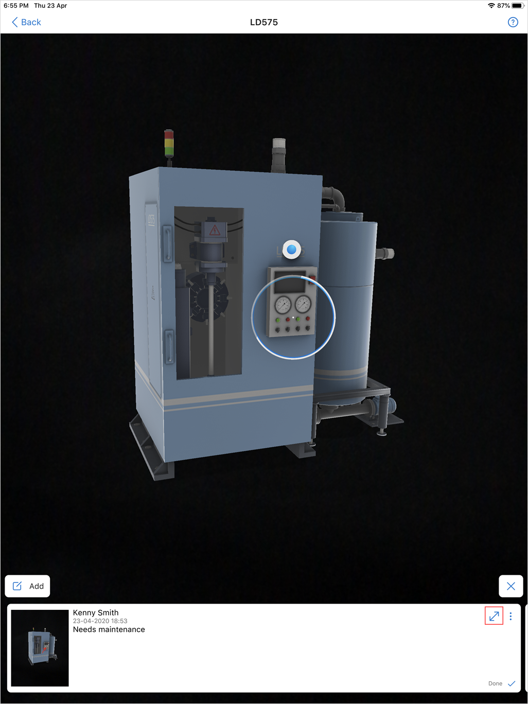

    The note is expanded, and you can swipe the notes card to move through the notes.

    > [!div class=mx-imgBorder]
    > 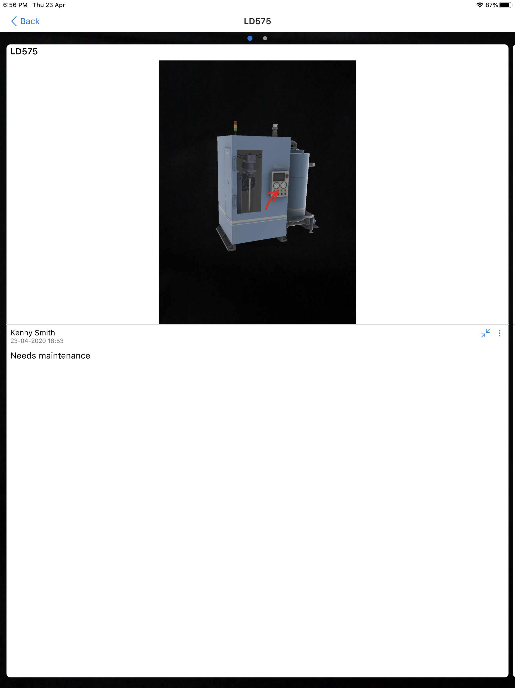

    > [!NOTE]
    > If you've attached a PDF or added a URL to a note from the Product Visualize Hub app, they'll be visible in the iOS app.

## Export a note

You can export your notes to share them with other apps on your device that support the iOS sharing function. The notes image and text are exported without any special formatting.

**To export a note**

1.	Tap **Notes** at the bottom of the screen.

    > [!div class=mx-imgBorder]
    > 

2.	Navigate to the note you want to export, and tap the overflow menu  in the upper-right corner of the notes card.

    > [!div class=mx-imgBorder]
    > 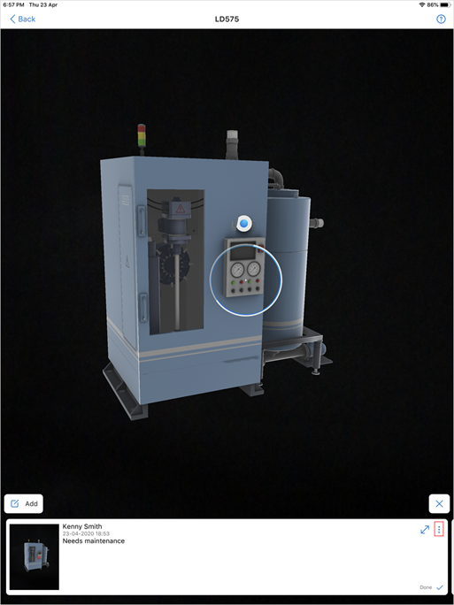

3.	In the **Options** dialog box, tap **Export note**.

    > [!div class=mx-imgBorder]
    > 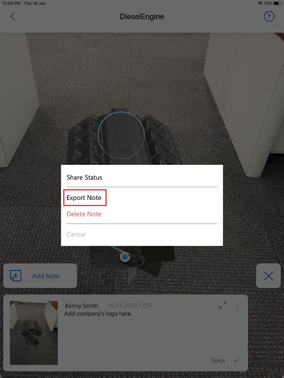

4. Tap the required option for exporting the note.

    > [!div class=mx-imgBorder]
    > 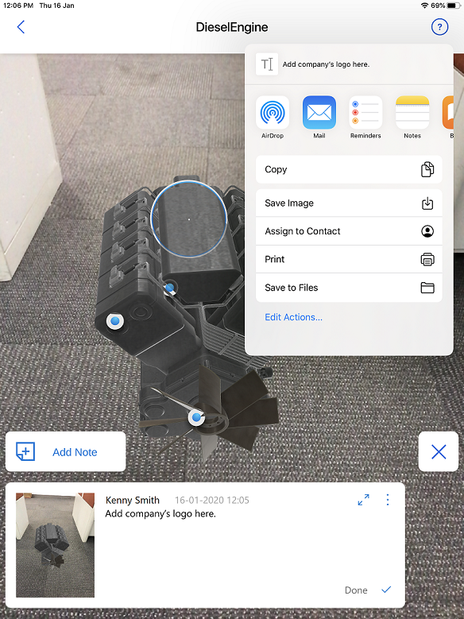

## Edit a note

1.	Tap **Notes** at the bottom of the screen.

    > [!div class=mx-imgBorder]
    > 

2.	Navigate to the note you want to edit, and tap the overflow menu  in the upper-right corner of the notes card.

    > [!div class=mx-imgBorder]
    > 

3.	In the **Options** dialog box, tap **Edit note**.

    > [!div class=mx-imgBorder]
    > 

4. Make the required changes to the note such as updating the attached file, adding or removing the pin, and editing the text message. 

5. Tap **Finish**.

## Delete a note

1.	Tap **Notes** at the bottom of the screen.

    > [!div class=mx-imgBorder]
    > 

2.	Navigate to the note you want to delete, and tap the overflow menu  in the upper-right corner of the notes card.

    > [!div class=mx-imgBorder]
    > 

3.	In the **Options** dialog box, tap **Delete note**.

    > [!div class=mx-imgBorder]
    > 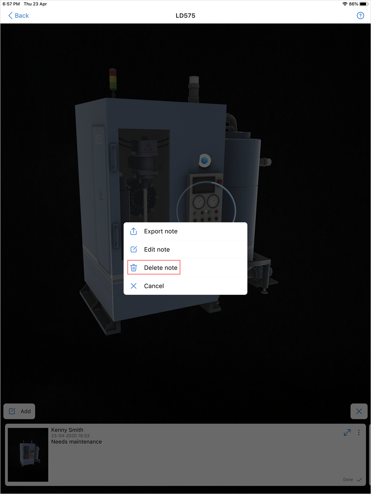

4. Tap **Delete** in the confirmation dialog box.

## Change how your notes are shared with other apps

By default, your notes are saved to the mixed-reality session associated with your Dynamics 365 instance. By default, Dynamics 365 Product Visualize also sends your notes to your Sales timeline and any connected Microsoft Teams channel.

**To turn off sharing with the mixed-reality session timeline or Teams channels**

1. Tap **Main** , and then select the account you're signed in to.  

2. Turn off the **Mixed Reality Session Timeline in Dynamics** toggle.

   > [!div class=mx-imgBorder]
   > 

### See also

[Install, open, and sign in to the app](sign-in.md) 
[Place and manipulate 3D models](manipulate-models.md) 
[Show or hide layers in a 3D model](layers.md) 
[Explore sample 3D models](explore-samples.md) 
[View 3D models stored on your device](browse-models.md) 
[Download 3D models to use offline](download-models.md) 
[Enable product dimensions](product-dimensions.md)
