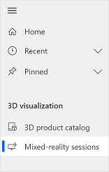
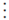
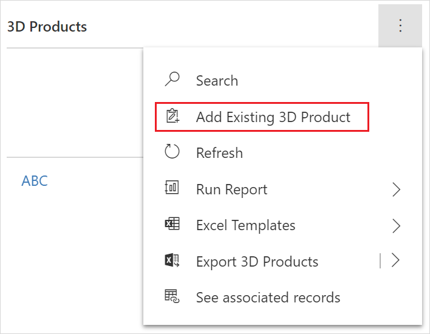
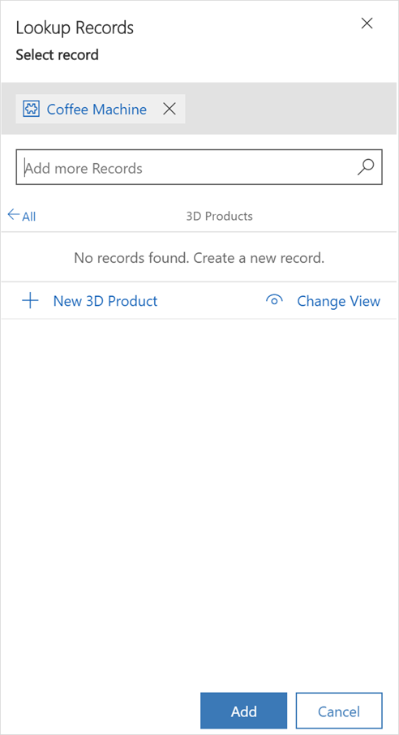
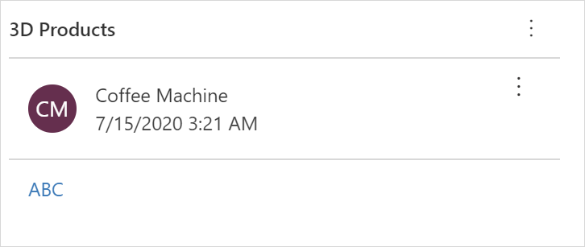

# Add a product to a mixed-reality session

[!INCLUDE [cc-beta-prerelease-disclaimer](../includes/cc-beta-prerelease-disclaimer.md)]

After you've created a mixed-reality session, you add products to it. A product contains models that you can show to your customers.

**To add a product to a mixed-reality session**

1.  [Sign in to Dynamics 365 Product Visualize Hub](sign-in-app.md).

2.  In the left pane, select **Mixed-reality sessions**.

    

3.  On the **My Active Mixed Reality Sessions** page, select your mixed-reality session.

4.  Under **3D Products**, select **More Commands** , and then select **Add Existing 3D Product**.

    

5.  In the **Lookup Records** panel, search for and select the product.

    

6.  Add more products, if you need.

7.  Select **Add**.

8.  On the **Mixed Reality Session** page, select **Save**. The selected product is added under **3D Products**.

    

### See also

[Sign in to Dynamics 365 Product Visualize Hub](sign-in-app.md) 
[Add a 3D product](add-3d-product.md) 
[Add 3D models to a product](add-3d-model-product.md) 
[Add a note to a model](add-note-model.md) 
[Create a mixed-reality session](create-mr-session.md) 
[Set up Microsoft Teams](setup-ms-teams.md)

[!INCLUDE[footer-include](../includes/footer-banner.md)]
