# Administrator guide for Dynamics 365 Product Visualize

[!INCLUDE [cc-beta-prerelease-disclaimer](../includes/cc-beta-prerelease-disclaimer.md)]

After you've completed the [setup process](setup.md) for Microsoft Dynamics 365 Product Visualize, you need to:

- Create an Office 365 user group, and share your SharePoint site with that group.

- Add users and assign security roles.

- Add products.

- Add models.

- Add opportunities.

- Install the Dynamics 365 Product Visualize solution.

- Set up Microsoft Teams.

The following topics provide step-by-step procedures for all of the above.

## Set up a user group

You can use Office 365 Groups to choose a set of people to collaborate with and to set up a collection of shared resources. Providing access to the group saves time because that way, you don't have to provide individual SharePoint permissions. The group needs to have read/write permission to the SharePoint site to make full use of Dynamics 365 Product Visualize.

### Create a user group

1. Open a new private browser window.

2. Go to [https://admin.microsoft.com](https://admin.microsoft.com), and sign in with the administrator credentials.

3. In the left pane, select **Groups**, and then select **Groups** again.

   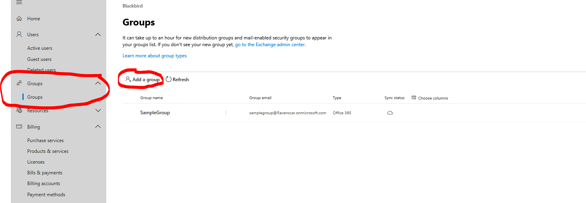

4. Near the top of the page, select **Add a group**.

5. Give the group a name, and then set the **Group Type** to **Office 365**.

6. Add the admin user as the owner of the group by selecting the **Select Owner** button.

7. Select **Add** to finish adding the group.

### Share the SharePoint site with the group
<!--note from editor: Please check edit to step 1.-->

1. Go to the SharePoint site for your Dynamics 365 Product Visualize trial: [https://\<org name\>.sharepoint.com]().

2. In the upper-right corner of the page, select **Share site**.

   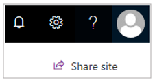

3. In the **Share** window, search for the group you created earlier, and then select the group name to add it to the site.

4. Grant the group Edit permission by selecting the small arrow under the group name.

   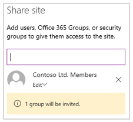

5. Select **Share** to finish granting group access to SharePoint.

## Add users

The admin user created during the setup of your instance has full control of all aspects of your trial environment. This user can administer your team's licenses, edit settings in Dynamics 365, and manage who has access to your services. The admin user can also add more users with more restrictive permissions so each salesperson can work with their own account.

New users must first be added in Azure Active Directory, which assigns them a username and password. Then, the user must be assigned a security role in Dynamics 365 so they can access the Dynamics 365 applications.

### Add a user to your organization

1. Go to [https://admin.microsoft.com](https://admin.microsoft.com), and sign in with the administrator credentials.

2. In the left pane, select **Users**, and then select **Active users**.

   

3. Near the top of the page, select **Add a user**.

4. In the **New User** dialog box, fill in the following fields:

    - **First Name**
    
    - **Last Name**
    
    - **Display Name**
    
    - **Username**
    
    Select **Next**.
	
5. Under the **Licenses** field, ensure that _Assign a user a product license_ is selected and the user is assigned a _Dynamics 365 Customer Engagement Plan_ license, and then select **Next**.
  
6. Under **Roles**, assign the user a role based on the resources they need to access, and then select **Next**.

    * **User** – This user won't have permissions to the Microsoft 365 admin center or any admin tasks.
    
    * **Global Administrator** – This user will have access to all features in the admin center and can perform all tasks in the admin center.
    
    * **Custom Administrator** – You can assign this user one or many roles so they can manage specific areas of Office 365.

7. On the confirmation page, make note of the username and password before selecting **Finish Adding**, and then select **Close**.

8. Select the user you just created, and then on the **Account** tab under **Groups**, select **Manage groups**.

   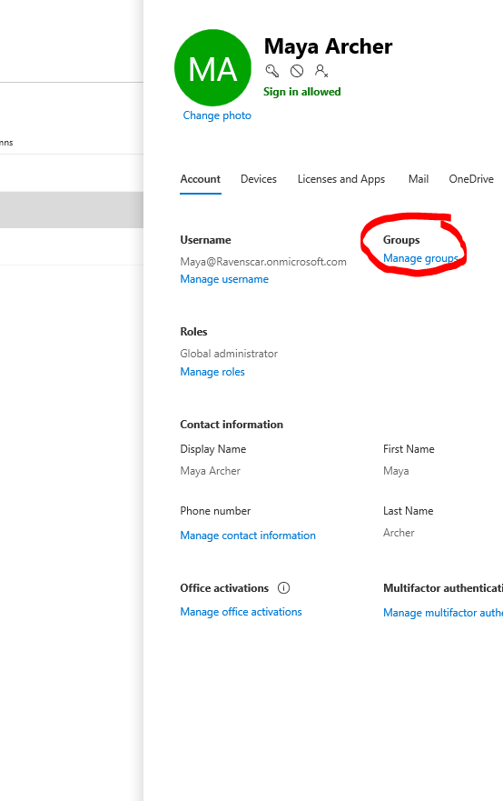

9. Select **Add Memberships**, search for the user group you created earlier, and then select the group name to add the user to the group.

10. Select **Close** to finish adding the user.

    > [!NOTE]
    > It can take some time for users added to your organization to show up in Dynamics 365, so it's a good idea to add all the users to your organization before continuing.

### Assign a security role to the user

1. In your private browser window, go to your Dynamics 365 URL, [https://\<org name\>.crm.dynamics.com]().

2. Select the Sales Hub application in the list.

   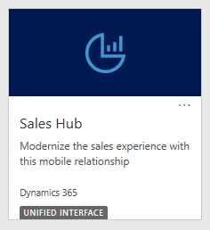

3. Select the **Settings** button in the upper-right corner of the page, and then select **Advanced Settings**.

4. In the **Settings** drop-down list at the top of the page, select **Security**.

   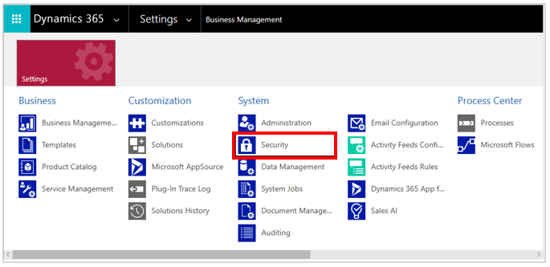

5. On the **Security** page, select **Users**.

   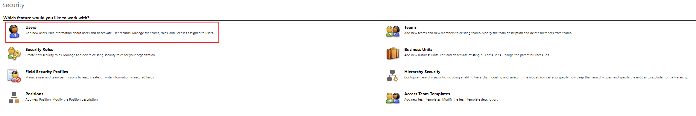

6. Select the name of the user you created.

7. On the **Users** page, from the menu bar near the top of the page, select **Approve email** so the user is synced by the server.

   

8. On the menu bar, select **Manage roles**.

   

9. Select the **Sales, Enterprise app access** and **Salesperson** options from the list, and then select **OK**.

   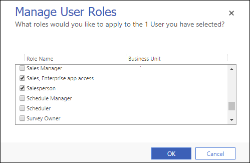

## Add products

*Products* are the things you sell to the customer, which can be physical goods or services. Products that a customer might be interested in purchasing are added to a sales opportunity. This enables salespeople to exactly track a customer's needs to the potential revenue a sale might bring in.

Products are sold in *units*, which represent the possible quantities that are sold together. Examples of units include hours, cases, or pallets. Units are grouped into *unit groups*, which keep units that have a similar purpose together. If you sell services, "time" might be a unit group containing days, hours, and minutes.

Products can be priced differently depending on who you're selling to, when the sale is happening, and where the customer works. Prices with a similar purpose are grouped together into *price lists*. For example, you might have one price list for customers in Canada and another for customers in the United States.

Individual products can be arranged into a hierarchy, as well. You can use *product families* to categorize similar products based on your organization's needs.

This section provides step-by-step instructions for creating a new price list, product family, and product. Dynamics 365 provides default values for units and unit groups.

### Create a price list

1. Go to the Dynamics 365 Sales Hub [https://\<org name\>.crm.dynamics.com](https://\<org\>.crm.dynamics.com).

2. In the upper-right corner of the page, select **Settings**, and then select **Advanced Settings**.

3. In the **Settings** drop-down list at the top of the page, select **Product Catalog**.

   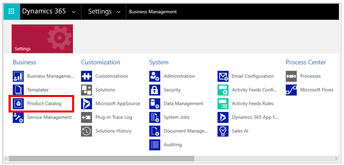

4. Select **Price Lists**.

5. Create a new price list by selecting **New** near the upper-left corner of the page.

6. Give the price list a name (**Default Price List**), and then select **Save and Close**.

### Create a product family (optional)

1. Go to the Dynamics 365 Sales Hub [https://\<org name\>.crm.dynamics.com](https://\<org\>.crm.dynamics.com).

2. Open the navigation menu on the left, and then select **Products**.

3. Select **Add Family** to create a new product family.

4. Give the family a name (**Product Samples**) and a Product ID (**PS-1**), and then select **Save and Close**.

5. Select the check box for the product family, and then select **Publish** to finish creating the product family.

   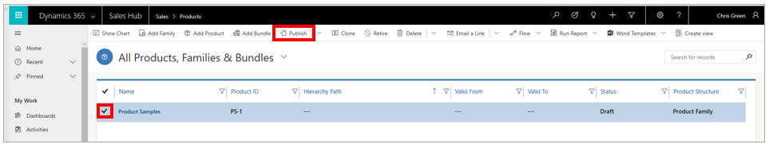
  
### Create a product

1. In the left pane, select **Products** to return to the product list, and then select **Add Product** to create a new product.

   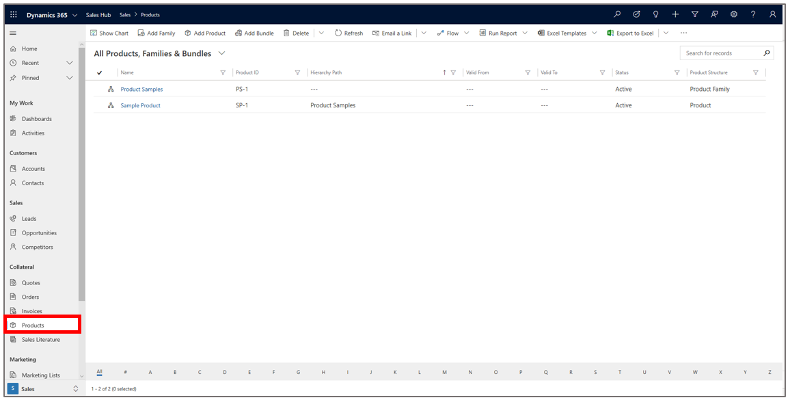

2. In the **Product** form, enter the following values:

   - **Name**. Use any value you want.
   
   - **Product ID**. Use any value you want.

   - **Parent**. Set this field to **Product Samples** (the product family created in the previous procedure).
   
   - **Unit Group**. Set this field to **Default Unit**.
   
   - **Default Unit**. Set this field to **Primary Unit**.
   
   - **Decimals Supported**. Set this field to **2**.

      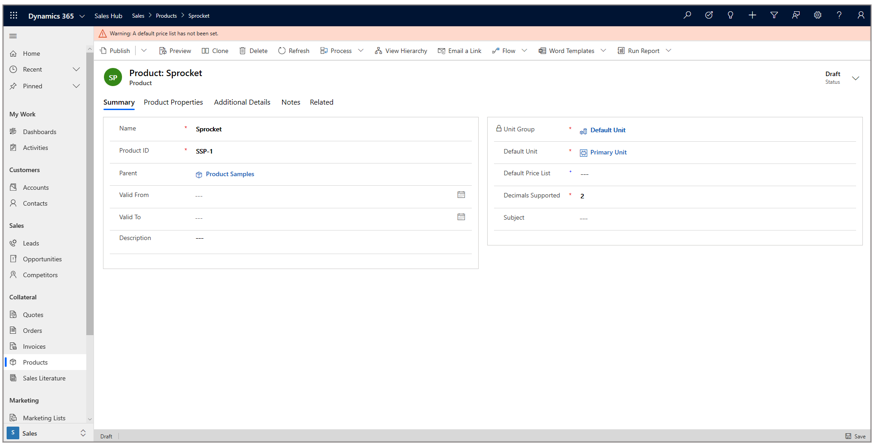

3. Set the **Default Price List** field to **Default Price List**.

4. Select **Save**, but don't close the product.

5. Select the **Additional Details** tab, and then select **New Price List Item**.

    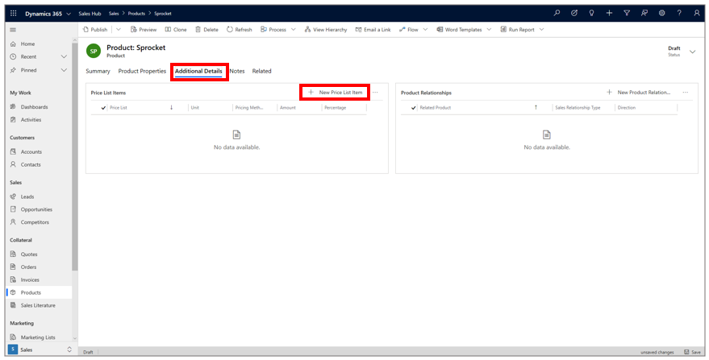

6. In the **Price List** field, assign the price list created earlier.
   
    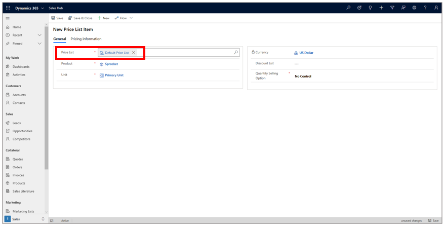

7. Switch to the **Pricing information** tab, and then fill in the **Amount** field with the price for your product.

    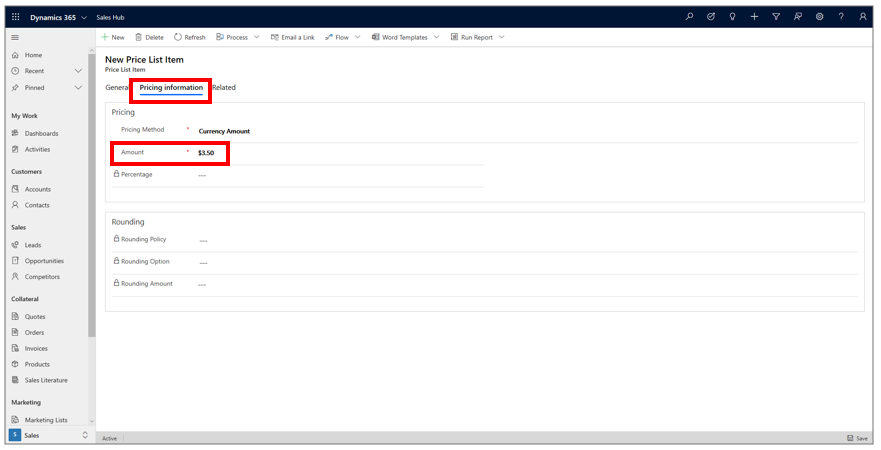

8. Select **Save**.

9. In the left pane, select **Products**, select the newly created product by selecting the check box to the left of the product name, and then select **Publish**.

    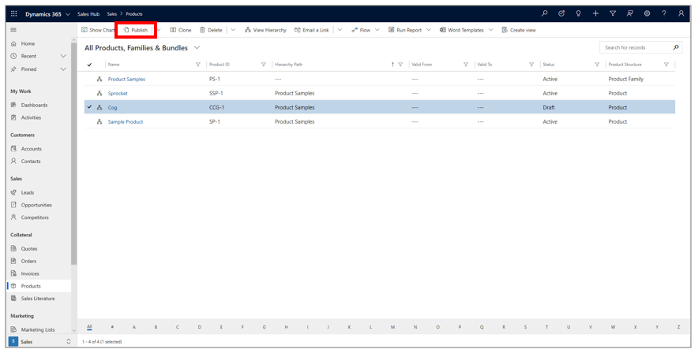

## Add models

Presenting complicated products to a customer by using traditional 2D materials is unsatisfactory, and creating 
physical 3D models is time-consuming and costly. Dynamics 365 Product Visualize simplifies the entire process by bringing 3D digital 
models into the real world.

Dynamics 365 Product Visualize makes use of the widely available GL Transmission Format (glTF) to store model data. Many of the most popular 3D modeling products used by engineering and marketing teams already support this format, and <!--self: reword?-->exporting tools exist to convert many other formats to glTF. The GLB format is the binary version of .glTF version 2.0, which can include textures.

This section provides step-by-step instructions for adding a model and thumbnail image to Dynamics 365 Product Visualize.

### Add a model

1. In the left pane, select **Products** to go back to the **Product list** page.

2. Select a product to open it.

3. On the **Related** tab, select **Documents**.

   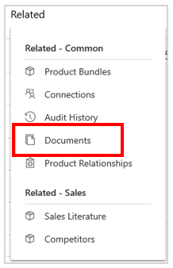

   You'll see a view of the SharePoint document location for that product.

4. In the **Open Location** drop-down list, select **Documents on Default Site 1** to open the SharePoint location outside of Dynamics 365.

5. Drag and drop your model file (as a GLB file) into this location. It will automatically show up in Dynamics 365 Product Visualize.

    > [!NOTE]
    > SharePoint folders are created when you first visit the Documents folder by using a Dynamics 365 app. If the folder for a product doesn't exist yet, return to the Sales Hub and open the product's document location from there. After it's created, you can access it through SharePoint.

6. Optional: SharePoint automatically provides a thumbnail for Dynamics 365 Product Visualize. However, if you want to add an optional custom thumbnail to a model, drag and drop a PNG image with the same name as the model. Example: "ModelName1.png" is a custom thumbnail for "ModelName1.glb".

## Add opportunities

Opportunities represent a chance to sell your products to a customer. They capture a customer's needs, budget, and timeline, in addition to the list of products the customer is interested in buying. Salespeople can view their open opportunities directly from the Dynamics 365 Product Visualize app, but they must be added through the Sales Hub interface.

### Add an opportunity

1. Go to the Dynamics 365 Sales Hub.

2. In the left pane, select **Opportunities**.

3. To create a new opportunity, select **New** at the top of the page.

4. In the **Topic** field, add a name for the opportunity.

5. Assign the **Owner** field to any user you have already added (optional).

    > [!NOTE]
    > The **Owner** field relocates to accommodate the size of your browser window. In a large browser window, it appears in the upper-right corner of the page. In a medium-sized window, it's hidden in a drop-down menu in that same corner. In a small browser window or on mobile devices, it appears at the top of the **Summary** section.

6. Select **Save**, but don't close the opportunity.

7. Open the **Product line items** tab.

   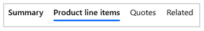

8. Set the **Price List** to the one created earlier.

9. Select **Add New Opportunity Product**.

   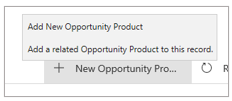

10. In the **Existing Product** field, select one of the products you created.

11. In the **Quantity** field, enter a quantity.

12. Select **Save and Close**.

## Install the Dynamics 365 Product Visualize solution

The Dynamics 365 Product Visualize solution is a package that customizes your Dynamics 365 Sales installation to support Dynamics 365 Product Visualize.

### Import the Dynamics 365 Product Visualize solution

1. [Download the **Dynamics 365 Product Visualize** solution](https://download.microsoft.com/download/F/D/E/FDEE4BA0-F7E5-4FBD-80C1-E670F9F397BA/ProductVisualize.Solution.zip).

2. Go to the Dynamics 365 Sales Hub.

2. Select the **Settings** button, and then select **Advanced Settings**.

3. In the **Settings** drop-down list at the top of the page, select **Solutions**.

5. Import the solution by selecting the **Import** button, and then selecting the solution (.zip file) you downloaded.

   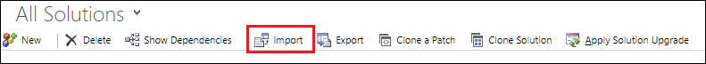
 
6. In the **Solution Information** dialog box, select **Import** to begin the import process.

   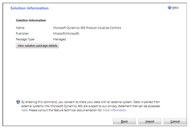
   
    > [!NOTE]
    > Importing a solution will replace any existing versions of that solution.
    
    After the import process is complete, you'll see the **Importing Solution** dialog box:

   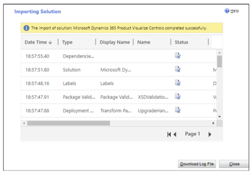

7. Select **Close**.

### Customize the Opportunity page

The Dynamics 365 Product Visualize solution also contains an optional enhancement (a control) that allows salespeople to open the Dynamics 365 Product Visualize app directly from Dynamics 365 Sales on their mobile devices. The control is lightweight and can easily be updated or removed.

There are numerous ways you can customize your Opportunity page in Dynamics 365 Sales. This procedure provides suggested customizations, but feel free to adapt them to your needs.

1. In the **Settings** drop-down list at the top of the page, select **Customizations**, and then select **Customize the System**.

2. In the left pane, select **Entities** > **Opportunity** > **Forms**.

3. Select the **Opportunity** form where the **Form Type** is set to **Main** (not the one marked **Quick Create**).

4. In the **Summary** section, on the **Insert** menu at the top of the page, insert a **One Column Tab**.

5. Double-click the newly created tab, set the **Name** and **Label** fields to **Product Visualize**, and then select **OK**.

6. Drag a **Topic** field into the newly created tab from the menu on the right. You might have to clear the check box for the **Only Show Unused Fields** options to see the **Topic** field.

7. Double-click the **Topic** field you just placed to open the **Field Properties** dialog box.

8. On the **Display** tab, clear the check box for **Display Label on the Form**.

9. On the **Controls Page**, add the **Product Visualize Launcher** control from the list, and then select the **Web**, **Phone**, and **Tablet** options.

10. Select **OK** to finish adding the control.

11. Select **Save** to save your changes from the menu bar.

12. Select **Publish** to publish your changes and make them immediately visible on any Opportunity page.

## Set up Microsoft Teams

Microsoft Teams is the best way to collaborate with your team, manage files, and have conversations in one easy-to-use location. You can connect Dynamics 365 Product Visualize to Teams to make collaboration with your sales team even easier.

### Sign up for Teams

1. In a private browser window, go to the Microsoft 365 admin center at [https://admin.microsoft.com](https://admin.microsoft.com).

2. Sign in with the administrator credentials you created.

3. In the left pane, select **Billing**, and then select **Purchase services**.

4. Search for **Office 365 Business Premium**, and then select the **Office 365 Business Premium** panel from the results.

   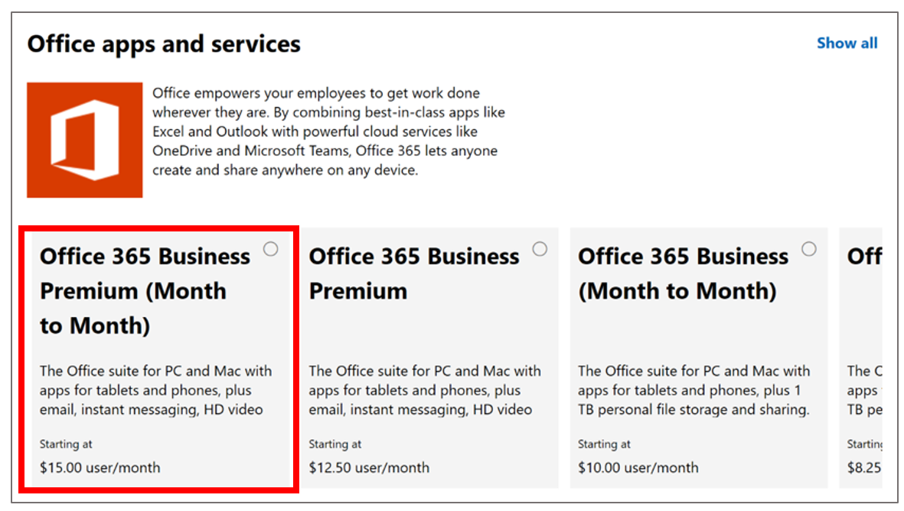

5. On the summary page, select **Get free trial**.

6. On the checkout page, select **Try now**. After this processes, select **Continue**. 

### Create a team

1. Launch Teams in a private browser by going to: teams.microsoft.com

2. When prompted, select **Use the web app instead**.

3. Select **Get Started**.

4. After the web app has loaded, you should see an option to join or create a team. Select **Create Team**.

5. When you see the option to build a team from scratch or create one from an existing team, select **Build a team from scratch**.

6. Make the group **Org-Wide**.

7. Give the group a name and a description.

8. Select **Create**.

### Add channels to the team

1. In the **Teams and Channels** list, select the **More Information** button next to the team you just created.

2. Select **Add Channel**.

3. Give the channel a name related to the opportunities you want to connect to it (for example: Seattle-area opportunities).

4. Select **Add**.
   
### Connect Teams to Dynamics 365

1. In the lower-left corner of the Teams client, select **Apps**.

2. Search for **Dynamics 365**.

3. Select the icon for Dynamics 365 (Preview) to open the installation dialog box.

4. Ensure that the **Add for You** option is set to **Yes**.

5. Select the **Open** menu, and then select **Add to a team.**

   

    a. Select an environment. This will be the organization name for the instance.
   
    b. Select **Sales Hub**.
   
      
      
   c. Select an opportunity, and then select **Save**.

6. In the **Add to a team** section, search for your team's name, which will also set the second option to **Yes**.

7. Select **Install**.

8. On the next page, select the channel you just created, and then select **Set up**.

9. On the **Setup** page, set the following:

   - Select your Dynamics 365 organization from the **Org** list.
   
   - Select **Sales Hub** from the **App Module** list.
   
10. Select **Select**.
   
11. From the list of Dynamics 365 entities, select an opportunity, and then select **Save**.

For more information about setting up Teams, see [Install and set up the Dynamics 365 app for Teams](https://docs.microsoft.com/dynamics365/customer-engagement/basics/teams-install-app).

### Post notes from Dynamics 365 Product Visualize

Dynamics 365 Product Visualize makes your customers' needs part of the conversation by posting any notes you make in the app back to a connected Teams channel. The text and mixed-reality image get posted to Teams, giving your team the information and context they need to make smart decisions. This feature is enabled by default, but can be turned off through the in-app **Settings** menu.

## What's next?

You now have everything you need to start using Microsoft Dynamics 365 Product Visualize. New opportunities, products, and models will show up automatically in the application after they've been added to Dynamics 365 Sales. For help or feedback, use the **Feedback** button in the Dynamics 365 Product Visualize app.

### See also

[Requirements for setting up Dynamics 365 Product Visualize](requirements.md) 
[Setup](setup.md) 
[User guide](user-guide.md) 
[FAQ](faq.md) 
