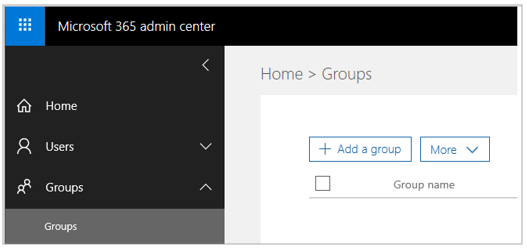

# Administrator Guide for Dynamics 365 Product Visualize

[!INCLUDE [cc-beta-prerelease-disclaimer](../includes/cc-beta-prerelease-disclaimer.md)]

After you've completed the [setup process](setup.md) for Microsoft Dynamics 365 Product Visualize, you need to:

- Create an Office 365 user group and share your SharePoint site with that group

- Add users and assign security roles

- Add products

- Add models

- Add opportunities

- Install the Product Visualize control if you want sales people to be able to open Product Visualize directly from Dynamics 365 for Sales

- Adjust permissions

- Set up Microsoft Teams

This topic provides step-by-step procedures for all of the above.

## Set up a user group

You can use Office 365 Groups to choose a set of people to collaborate with and to set up a collection of shared resources. Providing access to the group saves time because that way, you don't have to provide individual SharePoint permissions. The group needs to have Read/Write permissions to the SharePoint site to make full use of Product Visualize.

### Create a user group

1. Open a new private browser window.

2. Go to [https://admin.microsoft.com](https://admin.microsoft.com) and sign in with the administrator credentials.

3. In the left navigation, select **Groups** and then select **Groups** again.

   

4. Near the top of the page, select the **Add a Group** button.

5. Give the group a name and set the **Group Type** to **Office 365**.

6. Add the admin user as the owner of the group by selecting the **Select Owner** button.

7. Select **Add** to finish adding the group.

### Share the SharePoint site with the group

1. Go to your trial's SharePoint site: [https://\<org name\>.sharepoint.com]().

2. In the upper-right corner of the page, select **Share site**.

   

3. In the **Share** window, search for the group you created earlier, and then select the group name to add it to the site.

4. Grant the group Edit permission by selecting the small arrow under the group name.

   

5. Select **Share** to finish granting group access to SharePoint.

## Add users

The admin user created during the setup of your instance has full control of all aspects of your test environment. This user can administer your team's licenses, edit settings in Dynamics 365, and manage who has access to your services. The admin user can also add more users with more restrictive permissions so each salesperson can work with their own account.

New users must first be added in the Azure Active Directory, which assigns them a username and password. Then, the user must be assigned a security role in Dynamics 365 so they can access the Dynamics 365 applications.

### Add a user to your organization

1. Go to [https://admin.microsoft.com](https://admin.microsoft.com) and sign in with the administrator credentials.

2. In the left nagivation, select **Users**, and then select **Active users**.

   

3. Near the top of the page, select the **Add a user** button.

4. In the **New User** dialog box, fill in the following fields:

    - First Name
    
    - Last Name
    
    - Display Name
    
    - Username
    
    - Location
    
5. Assign the user a role based on the resources they need to access:

    * **User** - This user won't have permissions to the Microsoft 365 admin center or any admin tasks.
    
    * **Global Administrator** - This user will have access to all features in the admin center and can perform all tasks in the admin center.
    
    * **Custom Administrator** - You can assign this user one or many roles so they can manage specific areas of Office 365.
    
6. Enable the licenses for **Dynamics 365 for Sales** and **Office 365 Enterprise**, and then select **Add**.

7. In the confirmation page, make note of the username and password before selecting **Close**.

8. Select the user you just created, and then select the **Edit** button for **Group memberships**.

   

9. Select the **Add Memberships** button, search for the user group you created earlier, and then select the group name to add the user to the group.

10. Select **Close** to finish adding the user.

    > [NOTE]
    > It may take some time for users added to your organization to show up in Dynamics 365, so it's a good idea to add all the users to your organization before continuing.

### Assign a security role to the user

1. In your private browser window, go to your Dynamics 365 URL [https://\<org name\>.crm.dynamics.com]().

2. Select the Sales Hub application in the list.

   

3. Select the **Settings** button in the upper-right corner of the page, and then select **Advanced Settings**.

4. In the **Settings** drop-down list at the top of the page, select **Security**.

   

5. In the **Security** page, select **Enabled Users**.

6. Select the name of the user you created.

7. In the **Users** page, from the menu bar near the top of the page, select **Approve Email** so the user is synced by the server.

8. On the menu bar, select **Manage Roles**.

9. Select the **Sales, Enterprise app access** and **Salesperson** options from the list, and then select **OK**.

## Add products

*Products* are the things you sell to the customer, which can be physical goods or services. Products that a customer may be interested in purchasing are added to a sales opportunity. This enables salespeople to exactly track a customer's needs to the potential revenue a sale might bring in.

Products are sold in *units*, which represent the possible quantities that are sold together. Examples of units include hours, cases, or pallets. Units are grouped into *unit groups* which keep units with a similar purpose together. If you sell services, 'time' might be a unit group containing days, hours, and minutes. 

Products may be priced differently depending on who you are selling to, when the sale is happening, and where the customer works. Prices with a similar purpose are grouped together into *Price Lists*. For example, you may have one price list for customers in Canada and another for customers in the U.S.

Individual products can be arranged into a hierarchy, as well. *Product Families* allow you to categorize similar products based on your organization's needs.

This section provides step-by-step instructions for creating a new price list, product family, and product. Dynamics 365 provides default values for units and unit groups.

### Create a price list

1. Go to the Dynamics 365 Sales Hub [https://\<org name\>.crm.dynamics.com](https://\<org\>.crm.dynamics.com).

2. In the upper-right corner of the page, select the **Settings** button, and then select **Advanced Settings**.

3. In the **Settings** drop-down list at the top of the page, select **Product Catalog**.

   

4. Select **Price Lists**.

5. Create a new price list by selecting **New** near the top-left of the page.

6. Give the price list a name (Default Price List), and then select **Save and Close**.

### Create a product family (optional)

1. Go to the Dynamics 365 Sales Hub [https://\<org name\>.crm.dynamics.com](https://\<org\>.crm.dynamics.com).

2. Open the navigation menu on the left, and then select **Products**.

3. Select **Add Family** to create a new product family.

4. Give the family a name (Product Samples) and a Product ID (PS-1), and then select **Save and Close**.

5. Select **Publish** to finish creating the product family.

### Create a product

1. In the left navigation, select **Products** to return to the product list. 

2. Select **Add Product** to create a new product.

3. Add values for **Name** and **Product ID** (use any values that you want).

4. Set the **Parent** field to the **Product Samples** (the product family created in the previous procedure).

5. Set the **Unit Group** field to **Default Unit**, and set the **Default Unit** field to **Primary Unit**.

6. Set the **Decimals Supported** to **2**.

7. Select **Save**, but don't close the product.

8. Set the **Default Price List** field to **Default Price List**.

9. Select the **Additional Details** tab, directly above the **Name** field.

10. In the **Price List Items** section, select **Add New Price List Item**.

11. Assign the price list created earlier in the **Price List** field.

12. Switch to the **Pricing Information** tab, and then fill in the **Amount** field with the price for your product.

13. Select **Save**.

## Add models

Presenting complicated products to a customer with traditional 2D materials is unsatisfactory and creating 
physical 3D models is time-consuming and costly. Product Visualize simplifies the entire process by bringing 3D digital 
models into the real-world. 

Product Visualize makes use of the widely available GL Transmission Format (glTF) to store model data. Many of the most popular 3D modeling products used by engineering and marketing teams already support this format and exporting tools exist to convert many other formats to glTF. This section provides step-by-step instructions for adding a model and thumbnail image to Product Visualize.

### Add a model

1. In the left navigation, select **Products** to go back to the **Product list** page.

2. Select a product to open it. 

3. On the **Related** tab, select **Documents**.

   

   You'll see a view of the SharePoint Document location for that product.

4. In the **Open Location** drop-down list, select **Documents on Default Site 1** to open the SharePoint location outside of Dynamics 365.

5. Drag and drop your model folder into this location. It will automatically show up in Product Visualize. Add models using the following folder structure:

   1. Create a folder with the name of the file (without the extension) under the product that it's associated with. Example: “ModelName1”

   2. Add the GLB file inside that folder. Example: “ModelName1.glb”

   3. Products can have multiple models inside of them. Create a new folder and model file for each model that you want to add.

      Example: 
      
      - *Product*
          - *Product Name A*
              - **ModelName1**
                  - **ModelName1.glb**
              - **ModelName2**
                  - **ModelName2.glb**
          - *Product Name B*
              - **ModelName3**
                  - **ModelName3.glb**

     Italicized folders above are automatically generated by Dynamics 365. Add the files and folders marked in bold.

     > [!NOTE]
     > SharePoint folders are created when you first visit the documents folder using a Dynamics 365 app. If the folder for a Product doesn't exist yet, return to the Sales Hub and open the Product's document location from there. After it's created, you can access it through SharePoint.
    
 6. Optional: SharePoint will automatically provide a thumbnail for Product Visualize. However, if you want to add an optional custom thumbnail to a model, do the following:
 
    1. Create a **Thumbnails** folder under the model folder.
  
    2. Add a PNG image (with the same name as the model folder) and the model file to the **Thumbnails** folder.
  
       Example: 

       - *Product*
           - *Product Name A*
               - ModelName1
                   - ModelName1.glb
               - ModelName2
                   - ModelName2.glb
                   - **Thumbnails**
                       - **ModelName2.png**
           - *Product Name B*
               - ModelName3
                   - ModelName3.glb

       Italicized folders above are automatically generated by Dynamics 365. Add the files and folders marked in bold.

### Example file structure:

- Product
    - Fabrikam 257_3B621A74A83FE911A977000D3A1C5716
        - Fabrikam_257-6R
            - Fabrikam_257-6R.glb
        - Fabrikam_257-90
            - Fabrikam_257-90.glb
            - Thumbnails
                - Fabrikam_257-90.png
   - Fabrikam 360_F2F31831A83FE911A977000D3A1C5716
        - Fabrikam_260-X
            - Fabrikam_260-X.glb
    
## Add opportunities

Opportunities represent a chance to sell your products to a customer. They capture a customer's needs, budget, and timeline, in addition to the list of products the customer is interested in buying. Salespeople can view their open opportunities directly from the Product Visualize app, but they must be added through the Sales Hub interface.

### Add an opportunity

1. Go to the Dynamics 365 Sales Hub.

2. In the left navigation, select **Opportunities**.

3. Select **New** at the top of the page to create a new opportunity.

4. In the **Topic** field, add a name for the opportunity.

5. Assign the **Owner** field to any user you already added (optional).

    > [!NOTE]
    > The **Owner** field relocates to accommodate the size of your browser window. In a large browser window it appears in the upper-right corner of the page and in a medium-sized window it will be hidden in a drop-down menu in that same corner. In a small browser window or on mobile devices it will appear at the top of the **Summary** section.

6. Select **Save**, but don't close the opportunity.

7. Open the **Product line items** tab. 

   

8. Set the **Price List** to the one created earlier.

9. Select the **Add New Opportunity Product** button. 

10. In the **Existing Product** field, select one of the products you created.

11. In the **Quantity** field, enter a quantity.

12. Select **Save and Close**.

## Install the Product Visualize Control

The Product Visualize Control is an optional enhancement that allows salespeople to open the Product Visualize app directly from Dynamics 365 for Sales on their mobile devices. The control is lightweight and can easily be updated or removed.

### Import the Product Visualize solution

1. Go to the Dynamics 365 Sales Hub.

2. Select the **Settings** button, and then select **Advanced Settings**.

3. In the **Settings** drop-down list at the top of the page, select **Solutions**.

4. Download the **Product Visualize** solution to your PC.

5. Import the solution by selecting the **Import** button and selecting the solution zip file you downloaded.

### Customize the Opportunity page

There are numerous ways you can customize your Opportunity page in Dynamics 365 for Sales. This procedure provides suggested customizations, but feel free to adapt to your needs.

1. In the **Settings** drop-down list at the top of the page, select **Customizations**, and then select **Customize the System**.

2. In the panel on the left, select **Entities > Opportunity > Forms**.

3. Select the **Opportunity** form where the **Form Type** is set to **Main** (not the one marked **Quick Create**).

4. In the **Summary** section, on the **Insert** menu at the top of the page, insert a **One Column Tab**.

5. Double-click the newly created tab, set the **Name** and **Label** fields to **Product Visualize**, and then select **OK**.

6. Drag a **Description** field into the newly created tab from the menu on the right. You may have to clear the check box for the **Only Show Unused Fields** options to see the **Description** field.

7. Double-click the **Description** field you just placed to open the **Field Properties** dialog box.

8. On the **Display** tab, clear the check box for **Display Label on the Form**.

9. On the **Controls Page**, add the **Product Visualize** control from the list, and then select the **Web**, **Phone**, and **Tablet** options.

10. Select **OK** to finish adding the control.

11. Select **Save** to save your changes from the menu bar.

12. Select **Publish** to publish your changes and make them immediately visible on any Opportunity page.

## Accept app permissions

The Product Visualize mobile app requires permission to access the Dynamics 365 for Sales and SharePoint instances you set up earlier. As a global administrator for the trial tenant you can grant access to the entire organization so that each user doesn't have to do it individually.

1. Download the **Microsoft Dynamics 365 Product Visualize** app from the Apple App Store.

2. Open the app, select **Sign In**, and then enter the administrator credentials for the trial environment.

3. At the **Permissions Requested** prompt, select **Consent on behalf of your organization**.

4. Select **Accept** to return to the app.

## Set up Microsoft Teams

Microsoft Teams is the best way to collaborate with your team, manage files, and have conversations in one easy-to-use location. You can connect Product Visualize to Teams to make collaboration with your sales team even easier.

### Sign up for Teams

1. In a private browser window, go to [https://teams.microsoft.com](https://teams.microsoft.com).

2. Make sure you're signed in as the admin for your trial tenant.

3. When asked whether you want to open the desktop client or web app, select __Use the web app__.

   You'll see a message that says: "We didn't find a Teams account for you, but you can use your organization's trial license to get started". 

4. Select __Start__.

### Create a team

1. Once the web app has loaded you should see an option to join or create a team. Select __Create Team__.

2. When you see the option to build a team from scratch or create from an existing team, select __Build a team from scratch__.

3. Make the group __Org-Wide__.

4. Give the group a name and a description.

5. Select __Create__.

### Add channels to the team

1. In the **Teams and Channels** list, select the elipses (...) next to the team you just created.

2. Select __Add Channel__. 

3. Give the channel a name related to the opportunities you want to connect to it (ex: Seattle-area opportunities).

4. Select __Add__.
   
### Connect Teams to Dynamics 365

1. In the bottom-left corner of the Teams client, select __Store__.

2. Search for "Dynamics 365".

3. Select the icon for Dynamics 365 (Preview) to open the installation dialog.

4. Ensure the __Add for You__ option is set to __Yes__.

5. In the __Add to a team__ section, search for your team's name, which will also set the second option to __Yes__.

6. Select __Install__.

7. On the next page, select the channel you just created, and then select __Set up__.

8. On the **Setup** page, set the following:

   - Select your Dynamics 365 organization from the **Org** list.
   
   - Select **Sales Hub** from the **App Module** list.
   
9. Select __Select__.
   
10. From the list of Dynamics 365 entities, select an opportunity, and then select **Save**.

For more information on setting up Teams, see [Install and set up the Dynamics 365 app for Teams](https://docs.microsoft.com/en-us/dynamics365/customer-engagement/basics/teams-install-app).

## Post notes from Product Visualize

Product Visualize makes your customer's needs part of the conversation by posting any notes you make in-app back to a connected Teams channel. The text and mixed-reality image get posted to Teams, giving your team the information and context they need to make smart decisions. This feature is enabled by default, but can be turned off through the in-app **Settings** menu. 

## What's next?

You now have everything you need to start using Microsoft Dynamics 365 Product Visualize! New opportunities, products, and models will show up automatically in the application after they have been added to Dynamics 365 for Sales. For help or feedback, use the **Feedback** button in the Product Visualize app.

### See also

[Requirements for setting up Dynamics 365 Product Visualize](requirements.md) 
[Setup](setup.md) 
[User Guide](user-guide.md) 
[FAQ](faq.md) 
