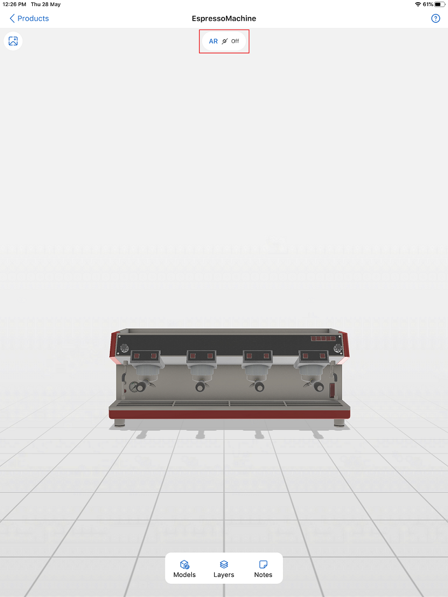
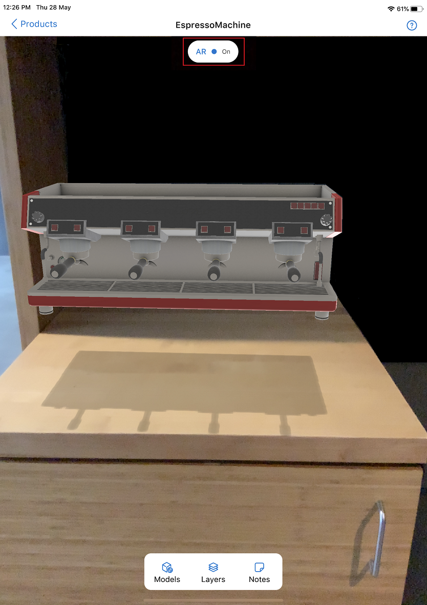

# View 3D models without using your device's camera

[!INCLUDE [cc-beta-prerelease-disclaimer](../includes/cc-beta-prerelease-disclaimer.md)]

The default behavior for viewing 3D models in Dynamics 365 Product Visualize is to use your device's camera and physical environment to place a 3D model. When you enable the AR mode feature, you can turn off this default behavior, and instead place your model on a gray background or use a background image from your Photos library. When you turn AR mode back on, you can use your device's camera to place the 3D model as usual. More information: [Enable AR mode feature](enable-preview-features.md)

> [!NOTE]
> Viewing 3D models without using your device's camera is a preview feature. Preview features are experimental features that provide access to the latest innovations that the Dynamics 365 Product Visualize team is working on.

## Turn AR mode on and off

After you enable **Show AR mode toggle button**, AR mode is turned off by default. Your 3D models will be placed on a gray background that you can customize if you want by using a photo from your Photos library. As you place your model, the **AR** toggle is displayed at the top of the screen. To turn AR mode back on, tap the **AR** toggle. 

> [!div class=mx-imgBorder]
> 

When you turn on the AR mode, you can use your device's camera and augmented reality to place a 3D model.

> [!div class=mx-imgBorder]
> 

More information: [Place and manipulate 3D models](manipulate-models.md)

## Add or replace the background image

You can choose to keep the models on a gray background or add a background image by selecting an image from your Photos library.

**To add a background image**

1. Tap the background image  icon in the upper-left corner of the screen.

2. Select an image from your Photos library.

**To replace the background image**

1. Tap the background image  icon in the upper-left corner of the screen.

2. In the options dialog box, tap **Replace**.

**To remove the background image**

1. Tap the background image  icon in the upper-left corner of the screen.

2. In the options dialog box, tap **Remove**.

### See also

[Install, open, and sign in to the app](sign-in.md) 
[Place and manipulate 3D models](manipulate-models.md) 
[Add a note to a 3D model](add-note.md) 
[Show or hide layers in a 3D model](layers.md) 
[Explore sample 3D models](explore-samples.md) 
[View 3D models stored on your device](browse-models.md) 
[Download 3D models to use offline](download-models.md) 
[Enable product dimensions](product-dimensions.md)

[!INCLUDE[footer-include](../includes/footer-banner.md)]
