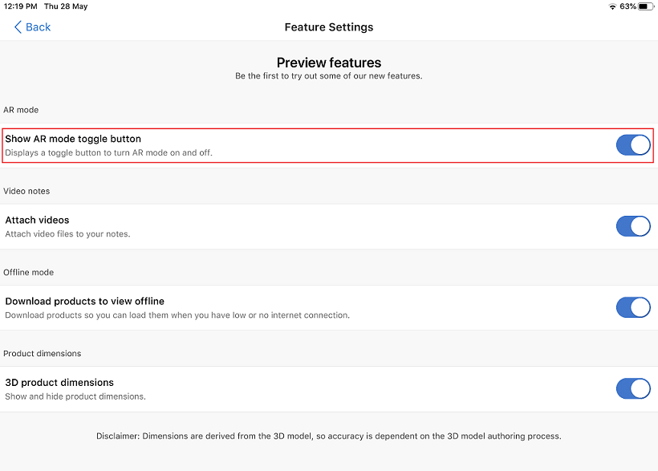

# View 3D models without using your device's camera

You can view 3D models in Product Visualize without using your device's camera and augmented reality. You can place the model on a gray background or use a background image. This feature allows you to show a toggle button that helps you turn AR mode on and off. When the AR mode is turned off, you can place a 3D model on a gray background or use a background image from your Photos library. When you turn on the AR mode, you can use your device's camera and augmented reality to place a 3D model. To view 3D models without using your device's camera, you must enable the AR mode feature.

> [!NOTE]
> Viewing 3D models without using your device's camera is a Preview feature. Preview features are experimental features that provide access to the latest innovations that the Dynamics 365 Product Visualize team is working on.

## Enable AR mode

1. Tap **Main** , and then tap **Preview features**.

    > [!div class=mx-imgBorder]
    > 

2. In the **Feature Settings** screen, move the **Show AR mode toggle button** toggle to the On position.

    

## Turn AR mode on and off

After you enable the AR mode feature, the AR mode is turned off by default and the 3D models are placed on a gray background. A toggle button is displayed at the top of the screen while placing a model. To turn on the AR mode, tap the toggle button. 

> [!div class=mx-imgBorder]
> 

When you turn on the AR mode, you can use your device's camera and augmented reality to place a 3D model.

> [!div class=mx-imgBorder]
> 

More information on placing a 3D model, see [Place and manipulate 3D models](manipulate-models.md).

## Add and replace background image

You can choose to view models on a gray background or add a background image by selecting an image from your Photos library.

**To add a background image**

1. Tap the background image  icon at the top-left corner of the screen.

2. Select an image from the Photos library.

**To replace the background image**

1. Tap the background image  icon at the top-left corner of the screen.

2. In the options dialog box, tap **Replace**.

**To remove the background image**

1. Tap the background image  icon at the top-left corner of the screen.

2. In the options dialog box, tap **Remove**.

### See also

[Install, open, and sign in to the app](sign-in.md) 
[Place and manipulate 3D models](manipulate-models.md) 
[Add a note to a 3D model](add-note.md) 
[Show or hide layers in a 3D model](layers.md) 
[Explore sample 3D models](explore-samples.md) 
[View 3D models stored on your device](browse-models.md) 
[Add your own 3D model to an existing Dynamics 365 Sales product](add-model.md) 
[Download 3D models to use offline](download-models.md) 
[Enable product dimensions](product-dimensions.md)