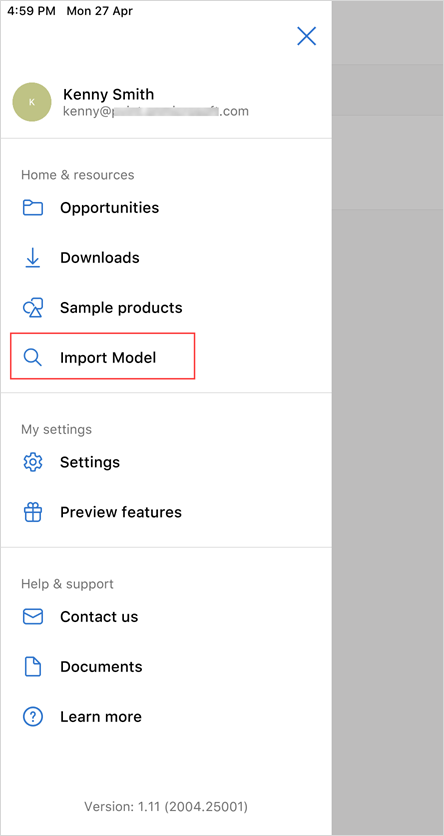
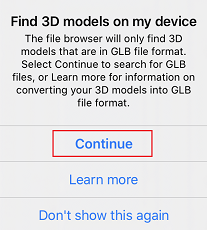

# View 3D models from device or cloud storage in Dynamics 365 Product Visualize

[!INCLUDE [cc-beta-prerelease-disclaimer](../includes/cc-beta-prerelease-disclaimer.md)]

You don't have to have a Dynamics 365 account to view 3D models in Dynamics 365 Product Visualize. If you have a 3D model in GLB file format stored on your device or in any cloud storage, you can browse to it in Dynamics 365 Product Visualize to see what the model would look like.

> [!NOTE]
> The cloud storage app must be installed on your iPhone or iPad.

1. Tap **Main** , and then tap **Import model**.

   > [!div class=mx-imgBorder]
   > 

2. Tap **Continue**.

    > [!div class=mx-imgBorder]
    > 

3.	Select a model from the list of recently used models or tap **Browse** to search for models stored on your device or in any cloud storage.

    > [!div class=mx-imgBorder]
    > 

    > [!div class=mx-imgBorder]
    > 

4.	Point your device down toward a flat surface like the floor or a desk, and then tap **Place** to place the model.

    > [!TIP]
    > If you want to see dimensions for the model, enable the **Product dimensions** feature. To enable this feature, see [Enable product dimensions](product-dimensions.md). After enabling the feature, tap **Dimensions** at the bottom of the screen to see the dimensions for the 3D model.  Preview features are experimental features that provide access to new innovations that the Dynamics 365 Product Visualize team is working on.

### See also

[Install, open, and sign in to the app](sign-in.md) 
[Place and manipulate 3D models](manipulate-models.md) 
[Add a note to your 3D model](add-note.md) 
[Show or hide layers in a 3D model](layers.md) 
[Explore sample 3D models](explore-samples.md) 
[Download 3D models to use offline](download-models.md) 
[Enable product dimensions](product-dimensions.md)

[!INCLUDE[footer-include](../includes/footer-banner.md)]