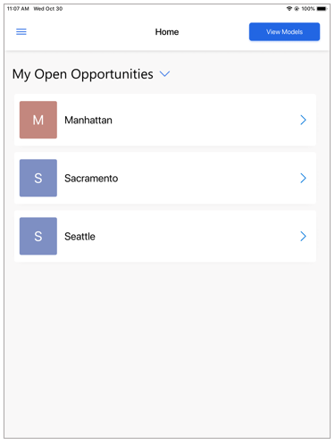

# View 3D models stored on your device in Dynamics 365 Product Visualize

You don't have to have a Dynamics 365 account to view 3D models in Dynamics 365 Product Visualize. If you have a 3D model stored on your device in GLB file format, you can browse to it in Dynamics 365 Product Visualize to see what the model would look like.

1. Go to the **My Open Opportunities** page, and then select **View Models**.

   
   
2. Select **Continue**.
   
   Dynamics 365 Product Visualize browses your device and displays any GLB files.

### See also

[Install, open, and sign in to the app](sign-in.md) 
[Place and manipulate 3D models](manipulate-models.md) 
[Add a note to your 3D model](add-note.md) 
[Show or hide layers in a 3D model](layers.md) 
[Explore sample 3D models](add-model.md) 
