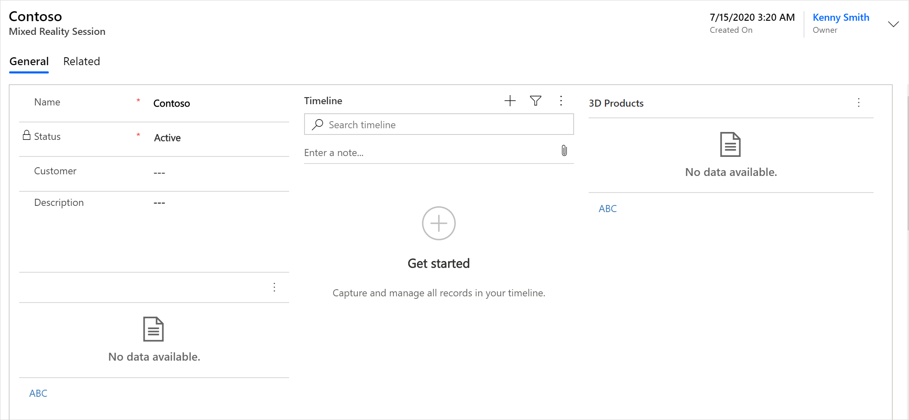

# Create a mixed-reality session

[!INCLUDE [cc-beta-prerelease-disclaimer](../includes/cc-beta-prerelease-disclaimer.md)]

A mixed-reality session represents a chance to sell your products to customers by showing them 3D models of your products. Salespeople can view their mixed-reality sessions directly from the Dynamics 365 Product Visualize iOS app, but the sessions must be added through the Dynamics 365 Product Visualize Hub interface.

**To create a mixed-reality session**

1.  [Sign in to Dynamics 365 Product Visualize Hub](sign-in-app.md).

2.  In the left pane, select **Mixed-reality sessions**.

    

3.  On the toolbar at the top of the page, select **New**.

4.  In the **Name** field, enter a name for the mixed-reality session.

5.  Select **Save**.

    

### See also

[Sign in to Dynamics 365 Product Visualize Hub](sign-in-app.md) 
[Add a 3D product](add-3d-product.md) 
[Add 3D models to a product](add-3d-model-product.md) 
[Add a note to a model](add-note-model.md) 
[Add a product to a mixed-reality session](add-product-mr-session.md) 
[Set up Microsoft Teams](setup-ms-teams.md)

[!INCLUDE[footer-include](../includes/footer-banner.md)]
