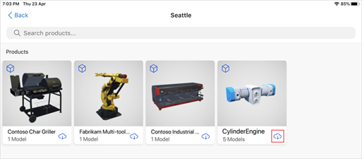
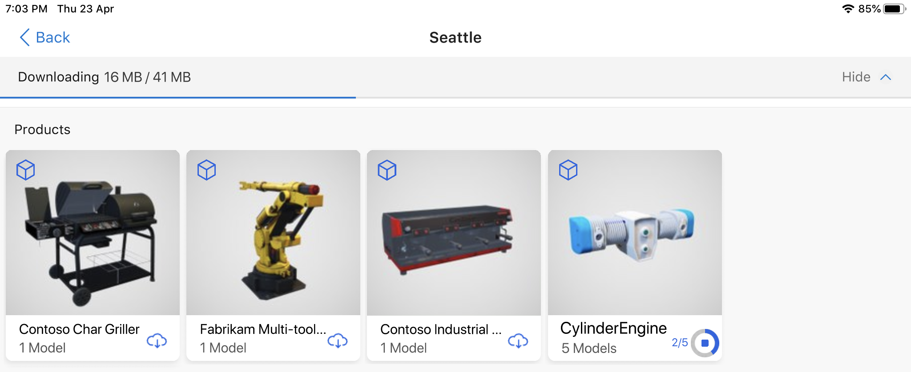
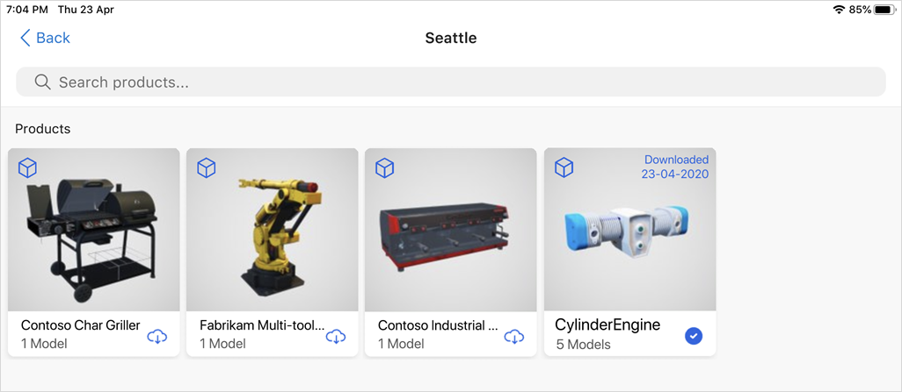
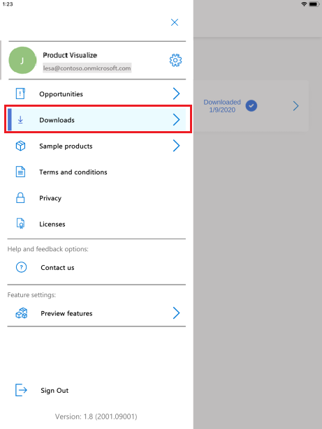
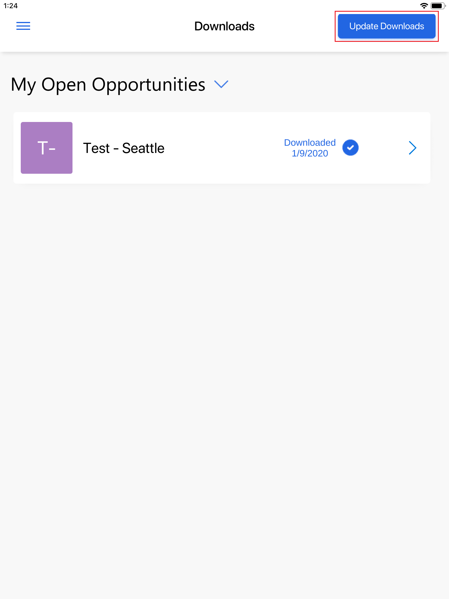
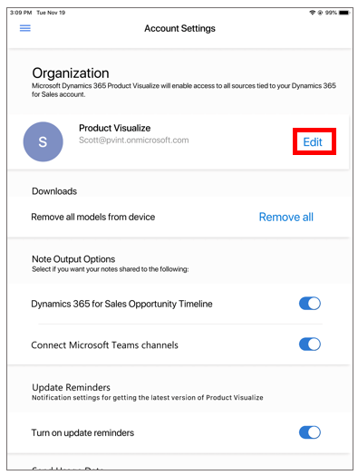

# Download 3D models to use offline with Dynamics 365 Product Visualize

[!INCLUDE [cc-beta-prerelease-disclaimer](../includes/cc-beta-prerelease-disclaimer.md)]

You can download models to use offline when you're away from a cellular network or Wi-Fi. To download models for offline use, you need to first enable the offline mode feature. More information: [Enable offline mode feature](enable-preview-features.md)

> [!NOTE]
> Downloading models for offline use is a preview feature. Preview features are experimental features that provide access to the latest innovations that the Dynamics 365 Product Visualize team is working on.

## Download a 3D model

- When viewing a product, tap the **Cloud** button next to the product name to download the model.

   

   A progress bar is displayed at the top of the screen indicating the status of downloads.

   

   When the model is downloaded, a blue check mark is displayed in place of the cloud button.

   

   > [!NOTE]
   > When you're working offline with a 3D model, the notes functionality is disabled.

## Update downloaded models

You can update all of your downloaded models at once.

1. Tap **Main** , and then tap **Downloads**.

      > [!div class=mx-imgBorder]
      > 

2. Tap **Update Downloads** at the upper-right corner of the screen.

      > [!div class=mx-imgBorder]
      > 

      A progress bar is displayed at the top of the screen indicating the status of downloads.

## Delete all downloaded models

1. Tap **Main** , and then tap the **Settings** button.

      > [!div class=mx-imgBorder]
      > 

2. Next to **Downloads**, tap **Remove all**.

      > [!div class=mx-imgBorder]
      > 

### See also

[Install, open, and sign in to the app](sign-in.md) 
[Place and manipulate 3D models](manipulate-models.md) 
[Add a note to a 3D model](add-note.md) 
[Show or hide layers in a 3D model](layers.md) 
[Explore sample 3D models](explore-samples.md) 
[View 3D models stored on your device](browse-models.md) 
[Enable product dimensions](product-dimensions.md)

[!INCLUDE[footer-include](../includes/footer-banner.md)]
