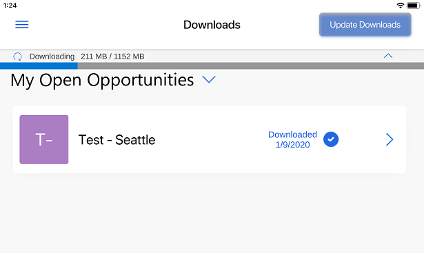

# Download 3D models to use offline with Dynamics 365 Product Visualize

You can download models to use offline when you're away from a cellular network or Wi-Fi. To download models for offline use, you need to first enable Offline mode.

> [!NOTE]
> Downloading models for offline use is a Preview feature. Preview features are experimental features that provide access to the latest innovations that the Dynamics 365 Product Visualize team is working on.

## Enable Offline mode

1. Select the **Main** menu  button, and then select **Preview features**.

   

2. In the **Feature Settings** screen, under **Preview features**, slide the **Offline mode** toggle to On.

   
   
3. Close the Dynamics 365 Product Visualize app, and then restart it.

## Download a 3D model

- When viewing a product, tap the **Cloud** button next to the product name to download the model.

   
   
   When the model is downloaded, it looks like this:
   
   
   
   > [!NOTE]
   > When you're working offline with a 3D model, the notes functionality is disabled.

## Update downloaded models

You can update all of your downloaded models at once.

1.	Select the **Main** menu  button, and then select **Downloads**.

      > [!div class=mx-imgBorder]
      > 

2.	Select **Update Downloads** at the upper-right corner of the screen.

      > [!div class=mx-imgBorder]
      > 

      A progress bar is displayed at the top of the screen indicating the status of downloads.

      > [!div class=mx-imgBorder]
      > 

## Delete all downloaded models

1. Select the **Main** menu  button , and then select the **Settings** button.

   

2. Next to **Remove all models from device**, select **Remove all**.

   

### See also

[Install, open, and sign in to the app](sign-in.md) 
[Place and manipulate 3D models](manipulate-models.md) 
[Add a note to a 3D model](add-note.md) 
[Show or hide layers in a 3D model](layers.md) 
[Explore sample 3D models](explore-samples.md) 
[View 3D models stored on your device](browse-models.md) 
[Add your own 3D model to an existing Dynamics 365 Sales product](add-model.md)
