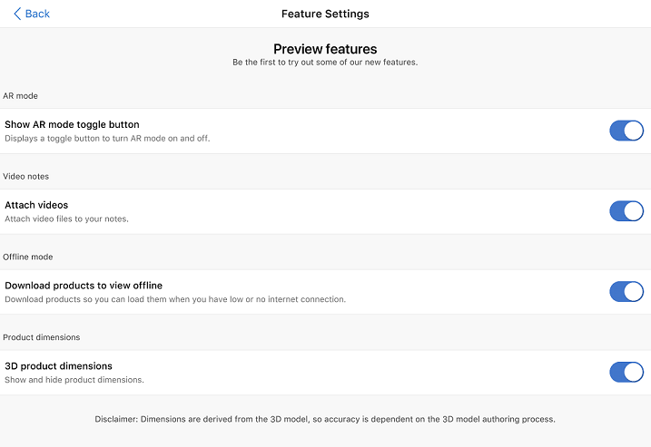

# Enable preview features

[!INCLUDE [cc-beta-prerelease-disclaimer](../includes/cc-beta-prerelease-disclaimer.md)]

Preview features are experimental features that provide access to the latest innovations that the Dynamics 365 Product Visualize team is working on.

Following are the preview features available in Product Visualize:

- **AR mode**: Select whether to see 3D models using your device's camera or on a custom background. More information: [View 3D models without using your device's camera](ar-mode.md)

- **Video notes**: Attach video files to the notes you add to a 3D model. More information: [Attach a video to the note](add-note.md#view-the-notes-added-to-a-model)

- **Offline mode**: Download 3D models to use offline when you're away from a cellular network or Wi-Fi. More information: [Download 3D models to use offline](download-models.md)

- **Product dimensions**: Display measurements of your 3D model in imperial or metric units. More information: [Enable product dimensions](product-dimensions.md)

**To enable preview features**

1. Tap **Main** , and then tap **Preview features**.

    > [!div class=mx-imgBorder]
    > 

2. In the **Feature Settings** screen, turn on the preview feature toggle.

    > [!div class=mx-imgBorder]
    > 

### See also

[View 3D models without using your device's camera](ar-mode.md) 
[Attach a video to the note](add-note.md#view-the-notes-added-to-a-model) 
[Download 3D models to use offline](download-models.md) 
[Enable product dimensions](product-dimensions.md)
