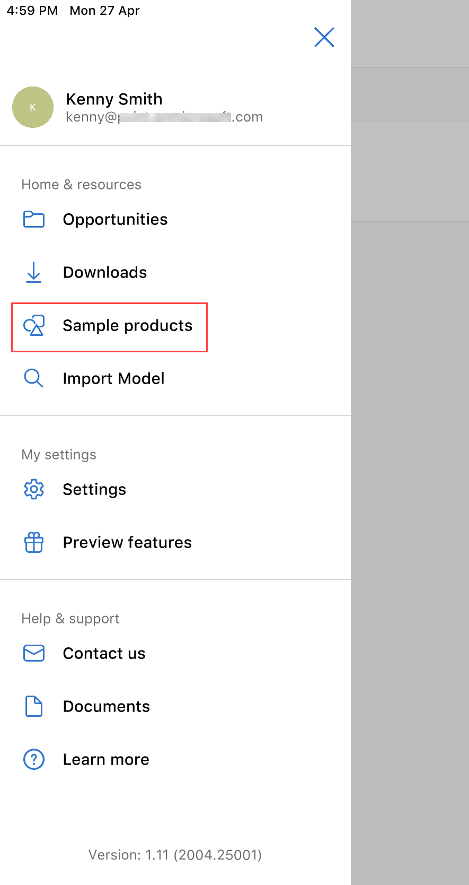
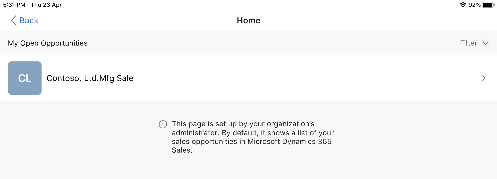

# Explore sample 3D models in Dynamics 365 Product Visualize

[!INCLUDE [cc-beta-prerelease-disclaimer](../includes/cc-beta-prerelease-disclaimer.md)]

Dynamics 365 Product Visualize comes with sample 3D models you can try out even if you don't have a Dynamics 365 subscription. Use the sample content to try the Dynamics 365 Product Visualize app and play with 3D models. When you explore a 3D model this way, you place it just like you would any other 3D model, and you can also add notes to the model. However, any notes you add to a sample model won't be saved when you close Dynamics 365 Product Visualize.

**To open a sample 3D model**

1. Open the Dynamics 365 Product Visualize app.

2. On the welcome screen, tap **Try it**.

     > [!div class=mx-imgBorder]
     > 

     You can also tap **Main** , and then tap **Sample products** to see samples.

     > [!div class=mx-imgBorder]
     > 
 
3. On the **My Active Mixed Reality Sessions** screen, select the **Contoso, Ltd. Mfg Sale**. 

     > [!div class=mx-imgBorder]
     > 

4. Tap a product you want to open.

     > [!div class=mx-imgBorder]
     > 

5. Place the model as described in [Place and manipulate 3D models](manipulate-models.md), and then size, rotate, move, or lift the model.

6. Add notes as described in [Add a note to your 3D model](add-note.md). Notes added to sample models aren't saved when you close Dynamics 365 Product Visualize or replace the model.

    > [!TIP]
    > If you want to see dimensions for the model, enable the **Product dimensions** feature. To enable this feature, see [Enable product dimensions](product-dimensions.md). After enabling the feature, tap **Dimensions** at the bottom of the screen to see the dimensions for the 3D model.  Preview features are experimental features that provide access to new innovations that the Dynamics 365 Product Visualize team is working on.  

### See also

[Install, open, and sign in to the app](sign-in.md) 
[Place and manipulate 3D models](manipulate-models.md) 
[Add a note to your 3D model](add-note.md) 
[Show or hide a layer in a 3D model](layers.md) 
[View 3D models stored on your device](browse-models.md) 
[Download 3D models to use offline](download-models.md) 
[Enable product dimensions](product-dimensions.md)

[!INCLUDE[footer-include](../includes/footer-banner.md)]