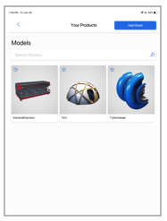

# Explore sample 3D models in Dynamics 365 Product Visualize (in preview)

[!INCLUDE [cc-beta-prerelease-disclaimer](../includes/cc-beta-prerelease-disclaimer.md)]

Microsoft Dynamics 365 Product Visualize (in preview) comes with sample 3D models you can try out even if you don’t have a Dynamics 365 subscription. Use the sample content to try out the Product Visualize app and play with 3D models. When you explore a 3D model this way, you place it just like you would any other 3D model, and you can also add notes to the model. Notes you add to a sample model aren't saved, however, when you close Product Visualize.

## Open a sample 3D model

1.	Open the Product Visualize app.

2.	In the **Welcome** screen, select **Explore Sample 3D Models**. 

     
  
3.	In the **Sample 3D Models** screen, select the 3D model you want to open.

     
 
4.	Place the model as described in [Place and manipulate 3D models](manipulate-models.md), and then size, rotate, move, or lift the model.

5.	Add notes as described in [Add a note to your 3D model](add-note.md). Notes will not be saved when you close the Product Visualize app. 

### See also

[Open the app and sign in](sign-in.md) 
[Place and manipulate 3D models](manipulate-models.md) 
[Add a note to your 3D model](add-note.md) 
