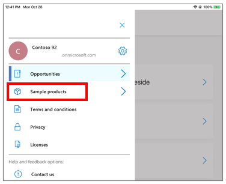

# Explore sample 3D models in Dynamics 365 Product Visualize

[!INCLUDE [cc-beta-prerelease-disclaimer](../includes/cc-beta-prerelease-disclaimer.md)]

Microsoft Dynamics 365 Product Visualize comes with sample 3D models you can try out even if you don’t have a Dynamics 365 subscription. Use the sample content to try the Dynamics 365 Product Visualize app and play with 3D models. When you explore a 3D model this way, you place it just like you would any other 3D model, and you can also add notes to the model. Notes you add to a sample model aren't saved, however, when you close Dynamics 365 Product Visualize.

## Open a sample 3D model

1.	Open the Dynamics 365 Product Visualize app.

2.	On the **Welcome** screen, scroll down to the sample 3D models, and select the 3D model that you want to open.

     

     You can also select the **Main**  menu button, and then select **Sample products** to see samples.
     
     
 
3.	Place the model as described in [Place and manipulate 3D models](manipulate-models.md), and then size, rotate, move, or lift the model.

4.	Add notes as described in [Add a note to your 3D model](add-note.md). Notes made on sample models are not saved when you close Dynamics 365 Product Visualize or replace the model. 

### See also

[Install, open, and sign in to the app](sign-in.md) 
[Place and manipulate 3D models](manipulate-models.md) 
[Add a note to your 3D model](add-note.md) 
[View layers of your 3D model](layers.md) 
[View 3D models stored on your device](browse-models.md)
