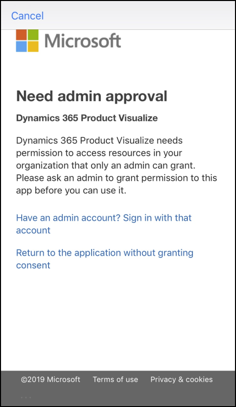

# FAQ: Dynamics 365 Product Visualize

[!INCLUDE [cc-beta-prerelease-disclaimer](../includes/cc-beta-prerelease-disclaimer.md)]

## What are the requirements for running Dynamics 365 Product Visualize, and what platforms does it support?

For information about platforms and requirements, check out our [Requirements page](requirements.md).

## What kind of 3D content can I add?

Dynamics 365 Product Visualize supports GLB files only.

## How do I get my content in the right format?

To learn how to format your content, see the following page on the Khronos website: [Art Pipeline for glTF](https://go.microsoft.com/fwlink/p/?linkid=2083000). 

## How does Dynamics 365 Product Visualize connect with Dynamics 365 Sales?

After you sign in with your Azure Active Directory credentials, Dynamics 365 Product Visualize displays organizations associated with your Dynamics 365 Sales account. Opportunities and products associated with your organizations automatically show up in the app, as do 3D models attached to your products.

## Can I use Dynamics 365 Product Visualize to do remote sales?

At this time, Dynamics 365 Product Visualize doesn't support remote capabilities.

## Why is the "Need admin approval" message displayed after I sign in?

This message indicates that your organization requires administrator approval before any new apps can be used to access organizational resources. Talk to your system administrator to get approval to use Dynamics 365 Product Visualize in your organization. In the meantime, you can set up a [free trial version](setup.md).

## Why don't I see my Dynamics 365 instances?
 
Dynamics 365 Product Visualize can connect to instances of Sales version 9.0 or later. It doesn't support on-premises Dynamics 365 solutions or older instances of Sales. Make sure your instance meets the [minimum requirements](requirements.md) for using Dynamics 365 Product Visualize. If your instance meets the requirements, make sure you're signed in to the app with the same credentials you use to access Sales.

## Why am I getting a message that says my organization isn't set up to use Dynamics 365 Product Visualize?

This message indicates that the Sales instance you selected doesn't meet the [minimum requirements](requirements.md) for using Dynamics 365 Product Visualize. If you have access to more than one Sales instance, make sure you selected the correct one.

## How do I find my mixed-reality sessions?

Dynamics 365 Product Visualize helps you stay organized by focusing only on the mixed-reality sessions that are important to you. From the **My Active Mixed Reality Sessions** view, there are three options for viewing your mixed-reality sessions:

- **My Active Mixed Reality Sessions**: Active mixed-reality sessions where you're listed as the owner.
- **My Inactive Mixed Reality Sessions**: Inactive mixed-reality sessions where you're listed as the owner.
- **Inactive Mixed Reality Sessions**: All inactive mixed-reality sessions that have been marked as **Inactive** in Product Visualize Hub.
- **Active Mixed Reality Sessions**: All active mixed-reality sessions in Product Visualize Hub.

If a mixed-reality doesn't show up in the app, go to Product Visualize Hub and ensure that at least one of these criteria is met.

## Why doesn't my model load?

Models with very high polygon counts might take a long time to load, especially over slower connections. If the model doesn't load at all, the GLB file might not be valid. A corrupt or invalid GLB file can appear as if it were loading but it will never actually load. If this happens, restart the app and try again. If, after restarting, the model still fails to load, try re-exporting the GLB from your authoring software and upload it again to SharePoint. If that doesn't work, try loading the model in a different glTF viewer, such as [sandbox.BabylonJS.com](https://sandbox.babylonjs.com/).

Larger models might exceed the memory of the mobile device you're using. This is especially true for previous-generation iPhones. To reduce the model's memory requirements, reduce the size of any textures associated with the model and decimate the model to use fewer polygons.

## How far away from the object must I stand to see it?

Initially, you must be 3 to 4 feet away from the location where you want to place the model. When the model appears and you place it on a surface, the model size should initially be contained within the device's screen. Depending on the size of the model, if you scale it up you might have to move back several feet to see the object in its entirety again.

## What's the best way to obtain tracking?

Point the device down so that it's parallel to the surface you want. Hold it there momentarily, and then slowly tilt the device up so that it's close to a 45-degree angle with the floor. If you still haven't obtained tracking, point the device toward the surface again, and slowly raise it and lower it while keeping it parallel to the surface. When tracking is gained, tilt the device up to the desired angle pointing it at the desired placement location on the surface. 
 
## What should I do if I lose tracking during a presentation? 

Initially, you should try pointing the device down so it's parallel to the surface, and then slowly tilting it up. If that doesn't restore tracking, tap **Main**  in the upper-left corner of the screen, and then tap **Mixed Reality Sessions**. Tap the mixed-reality session that contains the product, and then tap the product that contains the model you were viewing. You'll then need to go through the placement process again by using the initial model in the product. After placing the initial model, tap **Models** on the right side of the screen to open the model menu. From the model menu, find the model you want, and then tap it to place it on the selected surface. 
 
## What surfaces and locations are best to track on? 

Low contrast, non-reflective surfaces that have non-repeating patterns with good lighting are ideal. 
 
## Are there any known problematic tracking locations? 

You'll want to avoid using any surface that has large, high-contrast repeating patterns like a checkerboard pattern with high-contrast light and dark squares. This can make it difficult for the device to establish an even surface to place the model on. Highly reflective surfaces also can cause unwanted behavior and should be avoided if possible. Areas that have little or dim lighting should be avoided as well.
 
## Can I automatically scale an object to 100 percent? 

Yes. If you double-tap the model, it expands to 100 percent. If you double-tap the model again, it reverts to the previous scale. 
 
## How do I switch between objects during a presentation? 

If the model you want is in the current product:
1. Tap **Models** to open the model browser. 
2. Scroll left or right to find the model you want (you can also use search if there are a large number of models in the browser). Tap the model to load it. 
 
If the model you want is in another product or mixed-reality session: 
1. Tap **Main**  in the upper-left corner of the screen, and then tap **Mixed Reality Sessions**.
2. Tap the mixed-reality session. 
3. Tap the product that includes the model you want.  
4. Go through the placement process, and place the initial model. 
5. Tap **Models** to open the model browser.
6. Scroll left or right to find the model (you can also use search if there are a large number of models in the browser). Tap the model to load it. 
 
## How do I export the text and image in my note to send in email? 

Go to the note you want to export. Tap the overflow menu  on the note. Tap **Export note** on the pop-up menu, and then tap **Email**. Tap the app that you use for email.  
 
## How do I download and retain a model locally? 

First, you must enable offline mode. Tap **Main**  in the upper-left corner of the screen. Tap **Preview features**. Turn on the **Download products to view offline** toggle. 

Go to your mixed-reality session, and tap the one that has the product you want to save. Locate the icon that shows a cloud with a down-pointing arrow in the lower-right corner of each product. Tap the cloud icon in the product that has the model you want. This starts a download process that changes the icon to a square and a loading circle. After every model in the product has been downloaded, a blue circle with a check mark will appear. Those models are now available on your device. 
 
If you lose network connectivity and want to view the downloaded files, restart the app, and then go to the mixed-reality session and product as before. The models that were downloaded should appear and be accessible from the product.  
 
## Will my notes be visible to other users? 

Notes are currently saved to the mixed-reality session they were made in. If someone with another account also has access to that mixed-reality session, they can see the notes on that model. 
 
## Can I update product notes during a meeting? 

Currently, you can only make new notes or delete notes.

-  To make a new note, on the **Notes** menu, tap **Add**.
-  To delete a note, tap the overflow menu  in the upper-right corner of the note, tap **Delete note**, and then confirm.

## If I delete a note, how can I recover it? 

You can't recover a deleted note by using the app. However, the note is saved in Dynamics 365 even if it has been deleted, so you can recover the text and image and use them in the app again. 
 
## Can I walk away from my model and come back later? 

The iOS device uses a camera to orient to the world. If you place the device so that the camera is covered or leave it idle until the screen turns off, the device is likely to lose its world information and lose where it placed the object. If this happens, you'll need to redo the placement process for the model. 
 
## How can I help ensure success when manipulating my model?

Be aware of the positioning of the hand that holds the device. A stray finger on the screen might cause unintended movement of the model when you're trying to manipulate it through gestures.

### See also

[Requirements for setting up Dynamics 365 Product Visualize](requirements.md) 
[Set up Dynamics 365 Product Visualize](setup.md) 
[Product Visualize Hub user guide](hub-user-guide.md) 
[Product Visualize iOS app user guide](user-guide.md)

[!INCLUDE[footer-include](../includes/footer-banner.md)]
