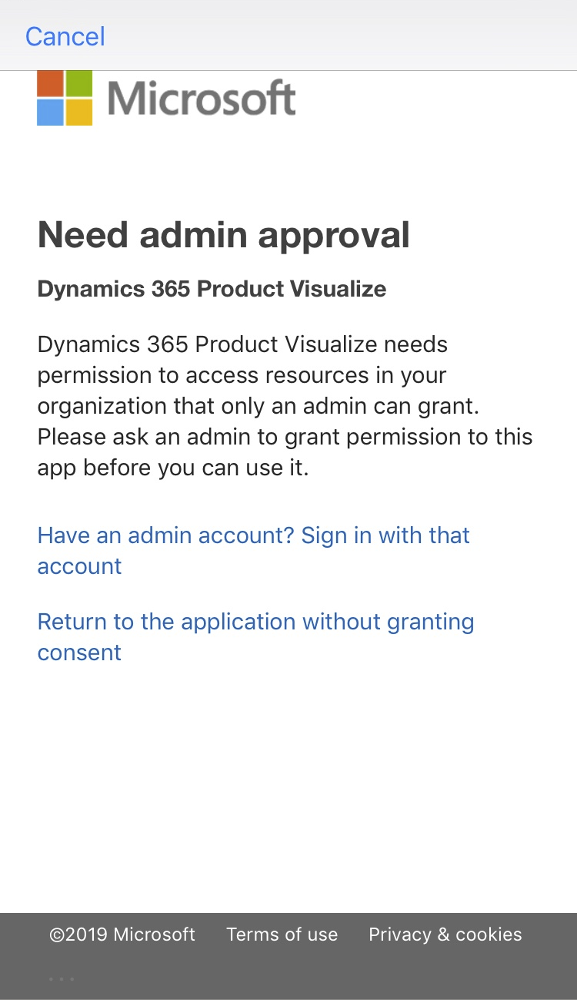

# FAQ: Dynamics 365 Product Visualize

[!INCLUDE [cc-beta-prerelease-disclaimer](../includes/cc-beta-prerelease-disclaimer.md)]

### What are the requirements for running Microsoft Dynamics 365 Product Visualize and what platforms does it support?

For information on platforms and requirements, check out [our Requirements page](requirements.md).

### What kind of 3D content can I add?

Product Visualize supports GLB files only.

### How do I get my content in the right format?

To learn how to format your content, see the following page on the Kronos website: [Art Pipeline for glTF](https://go.microsoft.com/fwlink/p/?linkid=2083000). 

### How does Product Visualize connect with Dynamics 365 for Sales?

After logging in with your Azure Active Directory credentials, Product Visualize diplays organizations associated with your Dynamics 365 for Sales account. Opportunities and products associated with your organizations will automatically show up in the app, as will 3D models attached to your products.
	
### Can I use Product Visualize to do remote sales?

At this time, Product Visualize does not support remote capabilities.

### "Need admin approval" after Sign-In

 This message indicates that your organizations requires administrator approval before any new apps can be used to access organizational resources. You will need to talk to your System Administrator to grant approval for Product Visualize before it can be used with your organization. In the mean time, you can still try Dynamics 365 Product Visualize by setting up a [trial version of Dynamics 365 For Sales](setup.md). 

 ### Why don't I see my Dynamics Instances here?
 Product Visualize is able connect to instances of Dynamics 365 for Sales version 9 or above. It does not support On-Premises Dynamics solutions or older instances of Dynamics 365 for sales. Ensure your instance meets the [minimum requirements](requirements.md) for using Product Visualize. If your instance meets the requirements ensure you are signed-into the app with the same credentials you use to access Dynamics.

 ### Why does it say my organization isn't setup to use Product Visualize?
 This indicates the Dynamics instance you selected doesn't meet the [minimum requirements](requirements.md) for using Product Visualize. If you have access to more than one Dynamics instance, ensure you selected the correct one.

 ### How do I find your opportunities?
Product Visualize helps you stay organized by focusing only on the opportunities that are important to you. From the Opportunity Selection view there are three options for viewing your opportunities:

1. **My Open Opportunities** - Open Opportunities where you are listed as the __owner__
2. **My Connected Opportunities** - Open Opportunities where you have been added to the __Sales Team__
3. **My Followed Opportunities** - Open Opportunities that have marked as __Followed__

If an opportunity doesn't show up in the application, visit the Dynamics 365 Sales Hub and ensure one at least one of these criteria is met.

### Why doesn't my model load?
Models with very high polygon counts may take a long time to load, especially over slower connections. If the model never succesfully loads the GLB file may not be valid. A corrupt or invalid GLB may appear as loading but it will never actually ever load. If this happens you should first restart the app and try again. If, after restarting, the model still fails to load, try re-exporting the GLB from your authoring software and re-upload to SharePoint. If the problem is still not mitigated you can try loading the model in a different GLTF viewer like the [BabylonJS Sandbox](https://sandbox.babylonjs.com/). 

Larger models may exceed the memory of the mobile device you are using. This is especially true on previous generation iPhones. To reduce the memory requirements of a model you can reduce the size of any textures associated with the model and decimate the model to use fewer polygons.

### See also

[Requirements for setting up Dynamics 365 Product Visualize](requirements.md) 
[Setup](setup.md) 
[Administrator Guide](admin-guide.md) 
[User Guide](user-guide.md) 
