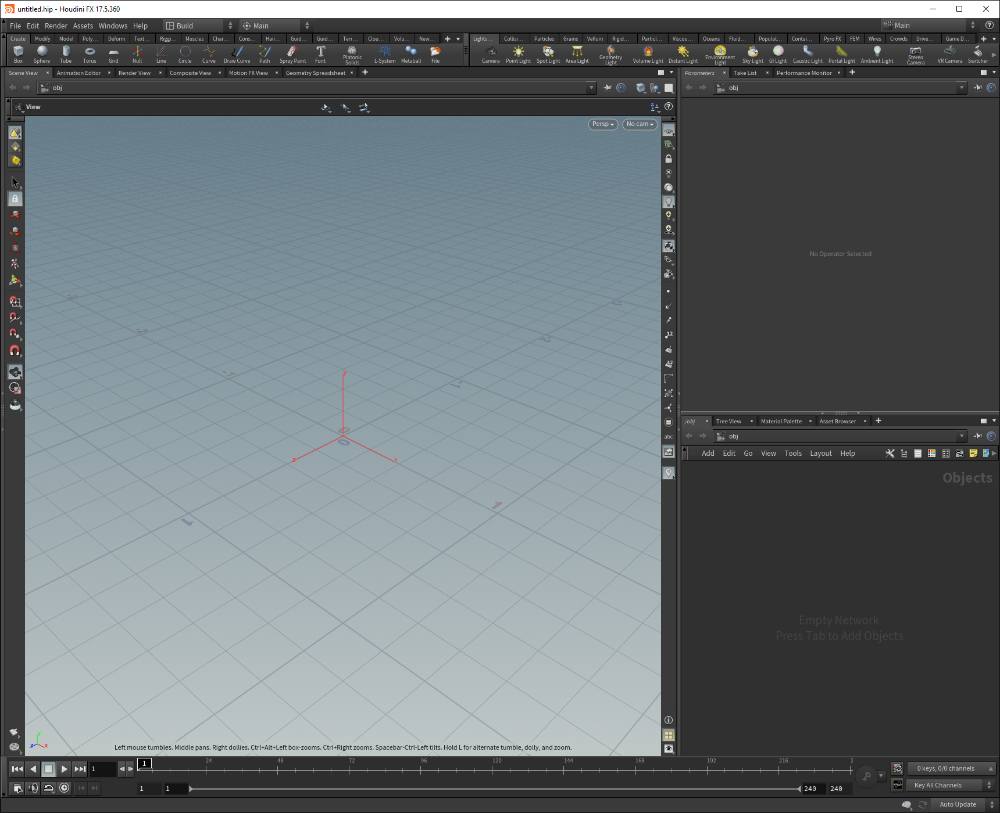
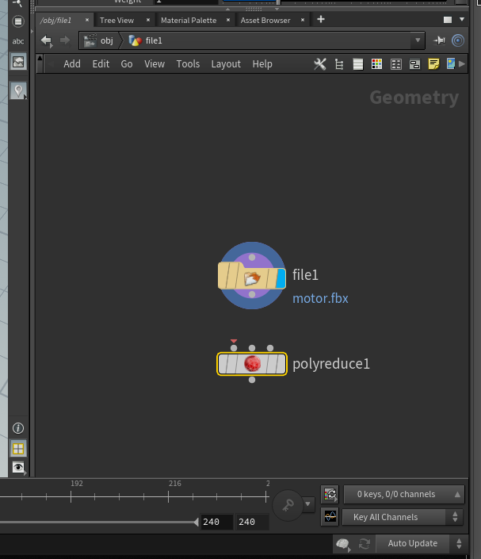
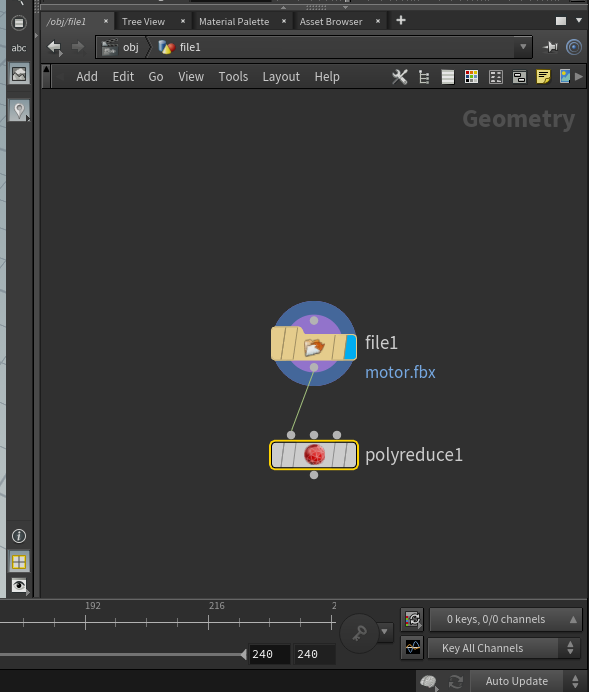
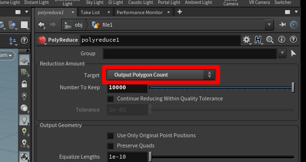
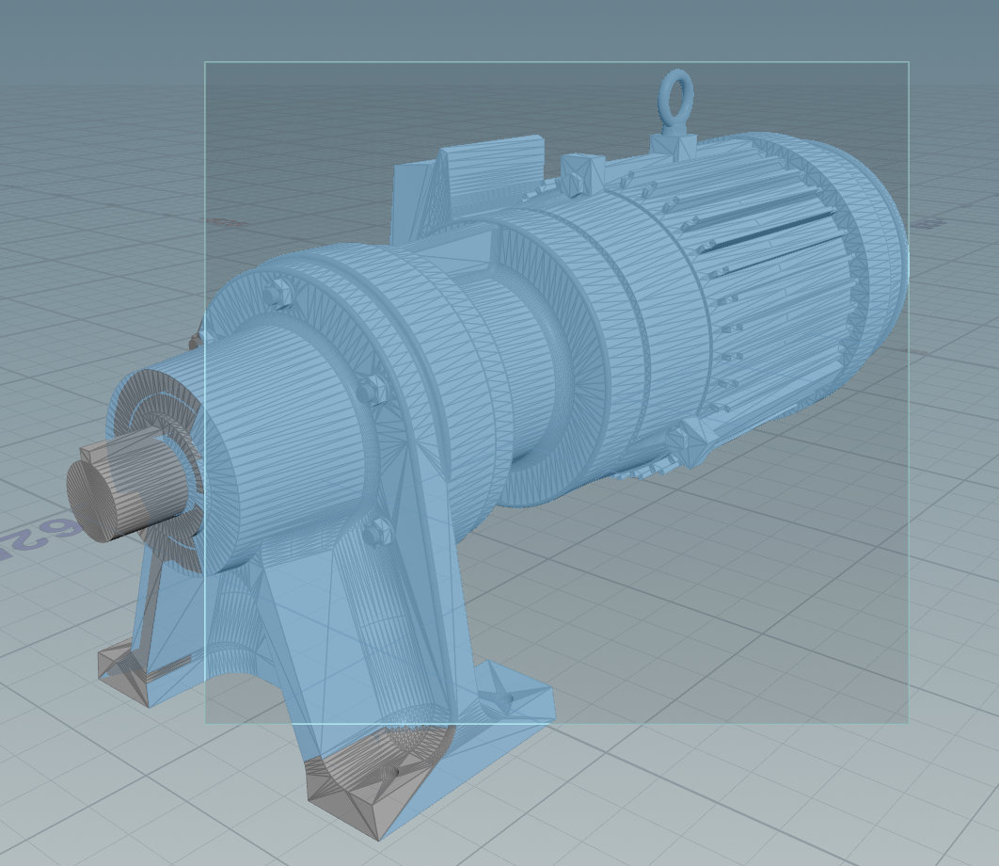
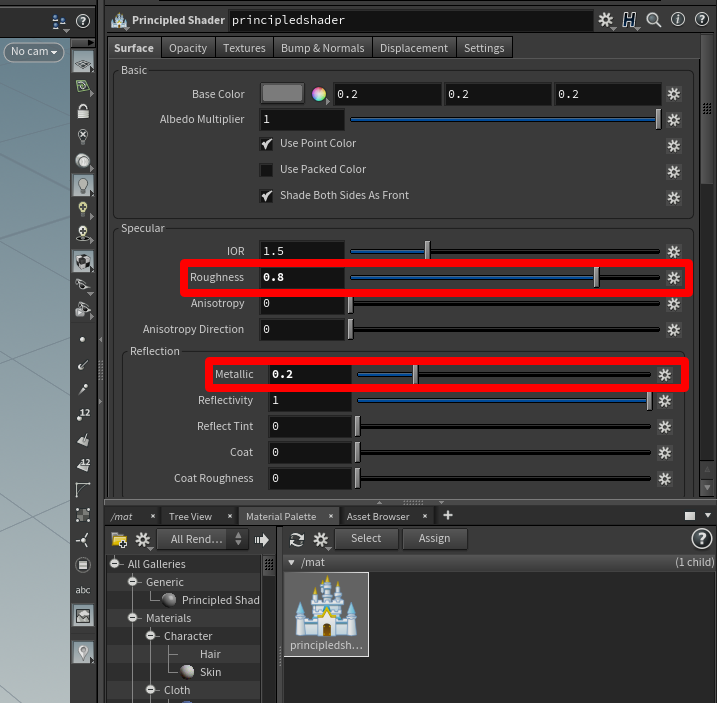
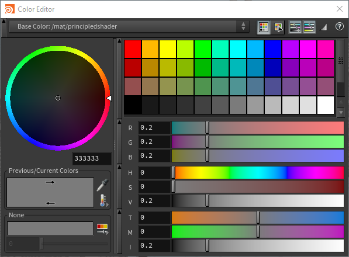
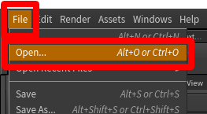
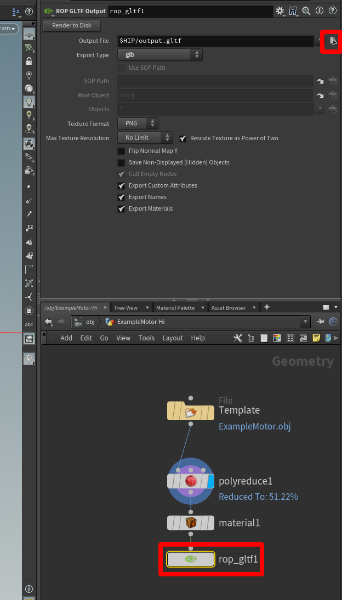

# Use SideFX Houdini to prepare 3D models for use in Dynamics 365 mixed-reality applications

This tutorial provides step-by-step instructions that show you how to:

- Optimize a 3D model by reducing the polygon count so that it matches [performance targets](optimize-models.md#performance-targets) for Microsoft Dynamics 365 mixed-reality apps.  

- Add the correct material to a 3D model.

- Export an optimized 3D model as a GLB file that you can use in Dynamics 365 mixed-reality apps.

- Create a template, so you can quickly optimize other 3D models in the future.

>[!IMPORTANT]
> This document is created strictly for informative purposes to demonstrate how SideFX Houdini works with Dynamics 365 mixed-reality apps. Your use of third-party applications is subject to terms between you and the third party. Microsoft Corporation is not affiliated with, is not a partner to, and does not endorse or sponsor SideFX or any of SideFX's products. There are [other content-creation apps](convert-models.md#tools-for-exporting-cad-models) you can use to prepare your 3D models.

## What is Houdini?

[Houdini](https://www.sidefx.com/) is a procedural system that empowers artists to work freely, create multiple iterations, and rapidly share workflows with colleagues.

## Import a 3D model into Houdini

1. Open Houdini 17.5.

   

   A new scene is automatically created.

2. Right-click in the lower-right window pane to open the **TAB Menu** (or select the **Tab** key).

3. On the **TAB Menu**, select **Import**, and then select **File** to place a **File** node in the **Geometry** pane.

   

4. Double-click the **file1** icon (or press **I**) to drill down to the file selection part of this node. Select the **Open floating file chooser** button, and then choose the file you want to import.

   

5. In the pop-up window, browse to the file you want to import, select it, and then select **Accept**.  

   

   The model appears in the viewport.

   

## Decimate a 3D model

To reach application-specific goals, you might need to "decimate" your 3D models. _Decimation_ is the process of recomputing the surface polygons of the model to create a similar shape with fewer polygons. This reduces visual fidelity, but increases performance. The example images below show the difference between a high-quality model used for scenes of low complexity on Microsoft HoloLens, and a low-quality model used for scenes of high complexity.

**To decimate a 3D model**

1.	In the **Geometry** pane on the lower right, press the **Tab** key to open the **TAB Menu**.

2. Select **Polygon** > **PolyReduce**, and then press **Enter** to select the **PolyReduce** node. Select or click in the area beneath the **File** node to place a **PolyReduce** node.

    

   A new node named **polyreduce1** appears in the **Geometry** pane near the imported geometry node.

    

3.	Select the bottom gray dot on the node of the imported geometry, and then drag a connection line to the leftmost top dot on the **polyreduce1** node. A red arrow appears on the dot on the **polyreduce1** node.

    

5. Select the center of the **polyreduce1** node, and look at the options available in the tab above the **Geometry** pane.

     

6.	Next to **Target**, select **Output Polygon Count**. This enables you to specify a polygon count that meets the polygon targets you want.

    

7.	To see the results, select the **polyreduce1** node, and then select the **Template** (pink) and **Display** (blue) bars on the right side of the node.

    The model changes to show much less detail.

    

    There is some room to experiment with the polygon counts for use on mixed-reality devices. You can use the **Number To Keep** slider to fine-tune the look of the model. Experiment with this slider to get the look you like with the polygon count you need.

## Add a material with a principled shader

To give the model a more realistic appearance, you can add a shader to the model to define how shiny and smooth the model appears.

1.	Open the **Material Palette** tab (in the same window pane as the node system), select **Principled Shader**, and then drag it to the open space in the pane to the right.

    

2.	Right-click **Principled Shader**, and then select **Assign to Selected Objects or Geometry**.

    

3.	Highlight the entire model. To do this, select the window, and then select **Assign**.

    

4.	In the **Geometry** pane, you'll see that a **material1** node has been created and linked below the **polyreduce1** node.

    
  
5.	Select the open **Open floating file chooser** button in the upper pane, select **principledshader**, and then select **Accept**.

    

### Adjust material properties

You can adjust visible properties like the color of the material in the window pane above the **Material Palette** when you have the **Principled Shader** highlighted. For example, start with **Roughness** at **0.8** and **Metallic** at **0.2** for CAD models.

**To change the color of the 3D model**

1. Select the color swatch button located to the right of **Base Color**.

    

2. In the **Color Editor** dialog box, pick a color. You can pick from previous colors, the mixer wheel, or from the sliders.

    

3. When you're satisfied with the colors, close the **Color Editor** dialog box.

## Export the model to a GLB file

You need to export the model to a GLB file to use it with Dynamics 365 mixed-reality apps.

1.	In the **Geometry** pane, press the **Tab** key to open the **TAB Menu**.

2. Select **Export** > **ROP GLTF Output**, press the **Enter** key, and then select below the **material1** node to place the **rop_gltf1** node.

    

3.	Drag a connection from the **material1** node to the **rop_gltf1** node.

    
  
4.	In the top pane, in the **Export Type** field, select **glb**.

    

5.	Next to the **Output File** field, select the **File Chooser** button, and then choose a name and destination for the GLB file.  Make sure to add **.glb** to the end of the file name.

    

6.	Select **Render to Disk** to finish the export and create the GLB file.

    

## Create a template

Now that the node tree is set up, you can use it as a template to quickly prepare 3D models.

The first thing you need to do is replace whatever geometry is currently being used with a default geometry. This makes the template file lightweight so that it loads quickly when you open it.

1.	Select the file icon to activate the geometry file menu in the upper pane.

2.	Change the **Geometry File** field to **default.bgeo**, and then select **Reload Geometry**.

    

    This refreshes the geometry so that it's a generic cube.

3.	Change the file name to something generic like **Template**.

4.	On the **File** menu, select **Save**, and then save the file as something memorable like **Prep_Template**.  

    

The template is ready. Close Houdini to try it out.

### Use a template

1.	Launch Houdini, open the template file by selecting **File** > **Open**, and then select the template.

    

2.	Select the center of the geometry file node to switch to the **File** context menu, and then select the **Open floating file chooser** button to select the 3D model you want to prepare.  

    

3.	When the geometry is loaded, select the red sphere on the **polyreduce1** node, and then the blue tab to the far right of the **polyreduce1** node.

    

    This shows you what the reduced poly model looks like in the view window, and provides access to the reduction tools.

4.	When the model reaches a quality that meets your requirements, select the **rop_gltf1** node, select the **Open floating file chooser** button, and then choose a location and name for the file you're exporting. Be sure to include the .glb extension in the file name.

    

5.	Select **Render to Disk** to create the 3D model.

    

Repeat this process with the rest of your 3D models to rapidly produce optimized models ready for use in Dynamics 365 mixed-reality apps.

## View a 3D model in a Dynamics 365 mixed-reality application

After preparing your 3D models, you can learn more about using the following Dynamics 365 apps to view your 3D models in mixed reality:

[Dynamics 365 Product Visualize](../product-visualize/index.md)  
[Dynamics 365 Guides](../guides/index.md)

### More information

Several screenshots in this document were taken from the Houdini software program in order to provide clear instructions on how to use Houdini's software. [Learn more about SideFX Houdini](https://www.sidefx.com/).

Microsoft Corporation is not responsible for, and expressly disclaims all liability for damages of any kind arising out of the use of Houdini, or reliance on these instructions. This document is created only to provide general information to our customers and does not take into consideration any individualized business plans or specifications.  

The use in this document of trademarked names and images is strictly for informative and descriptive purposes, and no commercial claim to their use, or suggestion of sponsorship or endorsement, is made by Microsoft.
