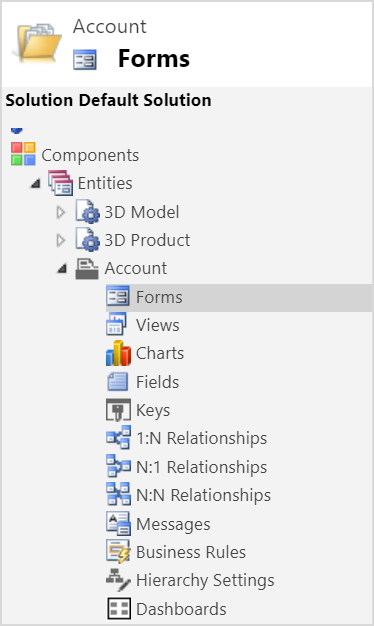

# Integrate Dynamics 365 Sales with Dynamics 365 Product Visualize Hub

New entities are introduced in Product Visualize Hub to provide your business with the flexibility it needs to use Product Visualize in a variety of scenarios. For the existing Product Visualize users or anyone new to Dynamics 365 Sales, we recommend connecting the Product Visualize entities to the existing Opportunity and Product entities you already use. This will let you quickly transition to the new Product Visualize workflow without significantly changing how your salespeople work. This topic will guide you through the steps to setup Product Visualize for a standard Dynamics 365 Sales scenario and assumes you already have Dynamics 365 Sales enabled. The same steps could be used to customize any existing Dynamics 365 entities, or even your own custom entities. For this example, we will add the Mixed Reality Session entity to the main form of the Account entity.

1. Open a web browser, and enter the URL to your Dynamics 365 instance in the following format: &lt;domain\_name&gt;.crm.dynamics.com. For example, `https://productvisualize.crm.dynamics.com`

2. Enter your Dynamics 365 instance credentials, and sign in to see a list of published apps. The **Sales Hub** app must be listed to continue.

    

3. Select the **Settings** icon, and then select **Advanced Settings**.

    

    The **Business Management** page opens in a new browser tab.

4. On the navigation bar, select **Settings**, and then under **Customization**, select **Customizations**.

5. Select **Customize the System**.

6. Under **Components** in the solution explorer, expand **Entities**, then expand an entity to you want to connect to, and then select **Forms**. For example, **Entities** > **Account** > **Forms**.

    

7. Select the default form to open it.

    

8. In the **Field Explorer** pane, select **New Field**.

    

9. Enter the required details for the new field and select **Save and Close**.

    

10. Go the entity's form you opened in step 7 and refresh the page. The new field is displayed in the **Field Explorer** pane.

    

11. Select the field and drag it to the desired location on the form.

    

12. Save and publish the changes.

13. Open Sales Hub, and select **Accounts** in the left pane.

14. Edit an existing account or create a new account.

15. In the **Mixed-reality session** field, search for the mixed-reality session to link and select it.

16. Follow steps 6 through 15 to add and link to other Product Visualize entities.

