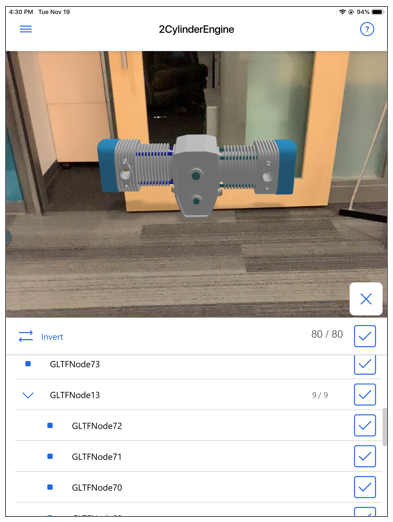
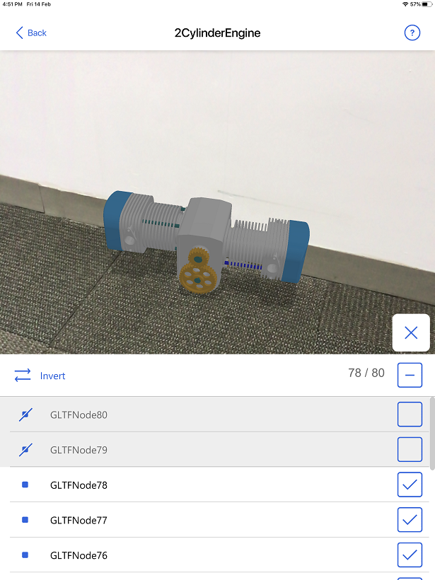
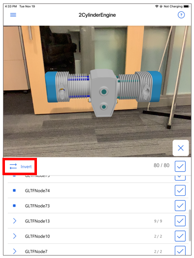
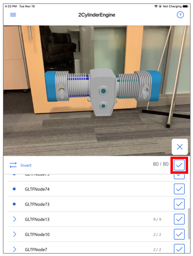

# Show or hide layers in a 3D model in Dynamics 365 Product Visualize

[!INCLUDE [cc-beta-prerelease-disclaimer](../includes/cc-beta-prerelease-disclaimer.md)]

A single 3D model in Dynamics 365 Product Visualize consists of one or more layers, which you can think of as categorized objects often grouped by function or location. A single layer can also act as a folder that includes other layers.

> [!div class=mx-imgBorder]
> 

You can create layers in a flattened or nested format by using CAD model design software tools. For more information about converting CAD models to use with Dynamics 365 Product Visualize, see [Convert your 3D (CAD) models](convert-models.md).

## Show or hide a layer

1. After placing a model, tap **Layers** at the bottom of the screen. 

   > [!div class=mx-imgBorder]
   > 

2. Tap the check box for the layer you want to show or hide.

    > [!div class=mx-imgBorder]
    > 

## Some tips for working with layers

- To expand or collapse a layer, tap the arrow button. 

    > [!div class=mx-imgBorder]
    > 

- To select all unselected layers, tap **Invert**.

    > [!div class=mx-imgBorder]
    > 

- To show or hide all layers, select the uppermost check box. 

    > [!div class=mx-imgBorder]
    > 

### See also

[Install, open, and sign in to the app](sign-in.md) 
[Place and manipulate 3D models](manipulate-models.md) 
[Add a note to your 3D model](add-note.md) 
[Explore sample 3D models](explore-samples.md) 
[View 3D models stored on your device](browse-models.md) 
[Download 3D models to use offline](download-models.md) 
[Enable product dimensions](product-dimensions.md)
