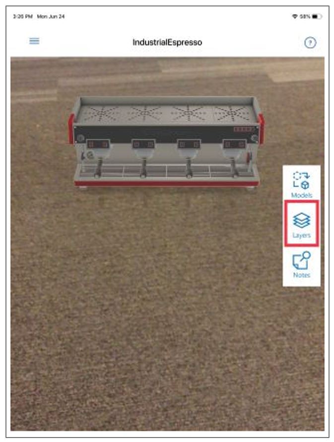
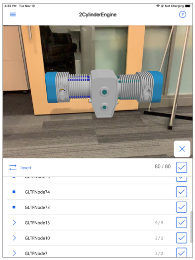
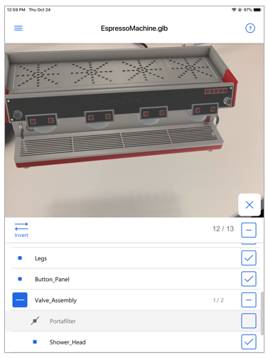
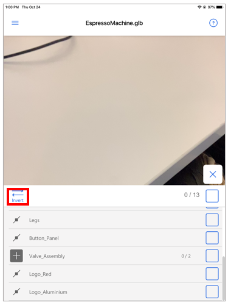

# Show or hide layers in a 3D model in Dynamics 365 Product Visualize 

[!INCLUDE [cc-beta-prerelease-disclaimer](../includes/cc-beta-prerelease-disclaimer.md)]

A single 3D model in Microsoft Dynamics 365 Product Visualize consists of one or more layers, which you can think of as categorized objects often grouped by function or location. 

You can create layers in model design software tools, such as CAD. You can build layers in a nested or flattened format. 

## Use the Layers tool

In Dynamics 365 Product Visualize, you use the Layers tool to show or hide layers in a 3D model that has been placed in a scene. 

 

When you select the **Layers**, you'll see a list of all the layers in the model.  

 

A single layer can also act as a folder that includes other layers.

## Show or hide a layer

1. After placing a model, select **Layers** on the right side of the screen. 

   

2. Tap the check box for the layer you want to show or hide. 

   

   > [!TIP]
   > To select all your unselected layers or vice versa, tap **Invert**.

   

## Show or hide all layers 

1. After placing a model, select **Layers** on the right side of the screen. 

   

2. Tap the check box in the toolbar above the other check boxes to select or clear all layers for the model. 

   

### See also

[Install, open, and sign in to the app](sign-in.md) 
[Place and manipulate 3D models](manipulate-models.md) 
[Add a note to your 3D model](add-note.md) 
[Explore sample 3D models](explore-samples.md) 
[View 3D models stored on your device](browse-models.md) 
[Add your own 3D model to an existing Dynamics 365 Sales product](add-model.md)
