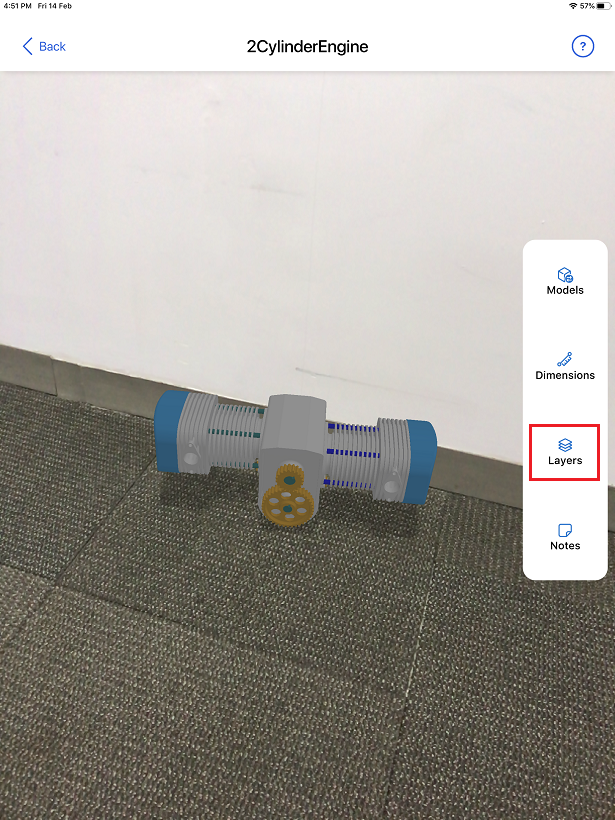
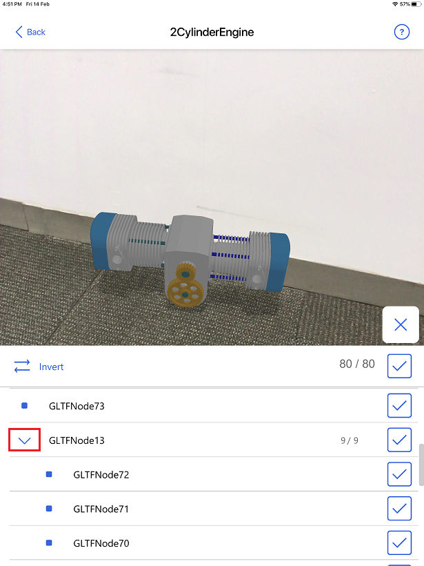

# Show or hide layers in a 3D model in Dynamics 365 Product Visualize 

[!INCLUDE [cc-beta-prerelease-disclaimer](../includes/cc-beta-prerelease-disclaimer.md)]

A single 3D model in Microsoft Dynamics 365 Product Visualize consists of one or more layers, which you can think of as categorized objects often grouped by function or location. 

 

A single layer can also act as a folder that includes other layers.

You can create layers in a flattened or nested format by using CAD model design software tools. For more information on converting CAD models to use with Dynamics 365 Product Visualize, see [Convert your 3D (CAD) models with the Dynamics 365 Import Tool (Preview)(https://docs.microsoft.com/dynamics365/mixed-reality/import-tool/convert-models).

## Show or hide a layer

1. After placing a model, select **Layers** on the right side of the screen. 

   

2. Tap the check box for the layer you want to show or hide. 

   
   
   The following table shows some tips for working with layers:
   
   |To expand or collapse a layer|To select all unselected layers|To show or hide all layers|
   |--------------------------------------------|----------------------------------------|-----------------------------------------|
   |- Select the arrow button. |- Select **Invert**. |- Select the top check box. |   

### See also

[Install, open, and sign in to the app](sign-in.md) 
[Place and manipulate 3D models](manipulate-models.md) 
[Add a note to your 3D model](add-note.md) 
[Explore sample 3D models](explore-samples.md) 
[View 3D models stored on your device](browse-models.md) 
[Add your own 3D model to an existing Dynamics 365 Sales product](add-model.md)
