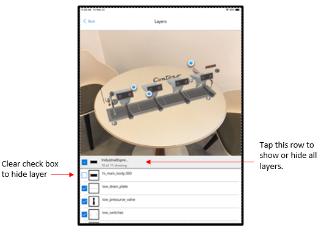

# Toggle visibility of layers on a 3D model in Dynamics 365 Product Visualize 

[!INCLUDE [cc-beta-prerelease-disclaimer](../includes/cc-beta-prerelease-disclaimer.md)]

## What is a layer? 

A single 3D model consists of one or more layers which can be thought of as categorized objects often grouped by function or location. 

Layers are created in model design software tools such as CAD and can be built in a nested or flattened format. 

## Introduction to the Layers tool

In Dynamics 365 Product Visualize, the Layers tool allows you to toggle the visibility for any existing layer(s) in a 3D model. 

After a model is placed in the scene, you can enter the Layers tool by tapping on the toolbar button on the right side labeled Layers. 

The Layers tool presents a list of the placed 3D model's layers where each row can be selected to toggle the visibility of that layer. 

A layer that contains one or more other layers acts as a folder that can be expanded or collapsed by tapping on the [+] or [-] button respectively. 

By default, all layers in the model are visible. 

## Icon Legend

Each layer can be selected by pressing on the checkbox placed to the right of each layer. 

*  
* 

Additionally, each layer has an indicator of whether it is a folder or individual layer placed to the left of each layer. 

* 
* 
*  Individual Invisible Layer")
*  Individual Visible Layer")

## Toggle a layer's visibility off 

1. After placing a model, select **Layers** on the right side of the screen. 

2. Tap on the right checkbox of the desired layer(s) you would like to toggle the visibility of. The layers you select will be visibily outlined in white. 

* 

3. Tap the **Hide** button to turn the visibility of the selected layer(s) off 

## Show or Hide all layers 

1. After placing a model, select **Layers** on the right side of the screen. 

2. Tap on the right checkbox on the layers toolbar to select all layers belonging to the placed model. 

3. Do one of the following: 

- To show all layers, tap on **Show**

- To hide all layers, tap on **Hide** 

