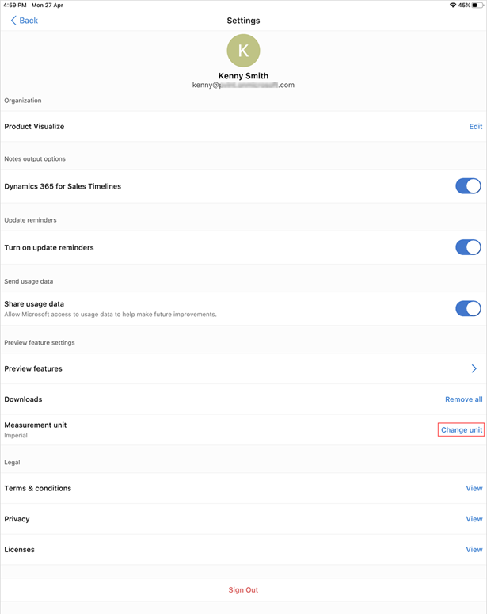
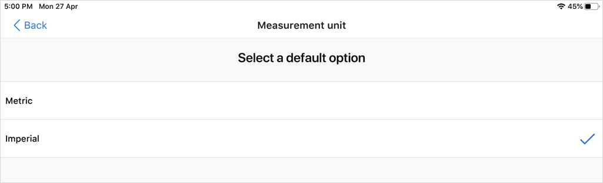
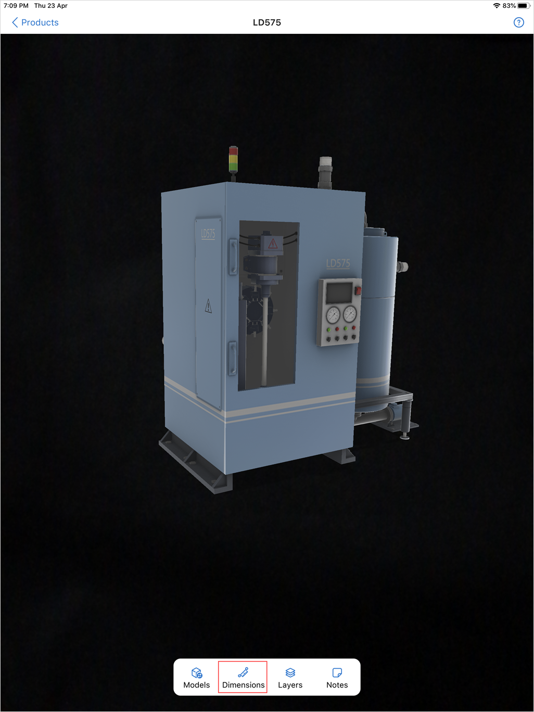

# Enable product dimensions in Dynamics 365 Product Visualize

[!INCLUDE [cc-beta-prerelease-disclaimer](../includes/cc-beta-prerelease-disclaimer.md)]

Dynamics 365 Product Visualize includes a tool to display your model measurements in imperial or metric units. To display model dimensions, you must enable the product dimensions feature. More information: [Enable product dimensions feature](enable-preview-features.md)

> [!NOTE]
> Product dimensions is a preview feature. Preview features are experimental features that provide access to the latest innovations that the Dynamics 365 Product Visualize team is working on.

## Set measurement units

1. Tap **Main** , and then tap **Settings**.

    > [!div class=mx-imgBorder]
    > 

2. Next to **Measurement unit**, tap **Change unit**.

     > [!div class=mx-imgBorder]
     > 

3. On the **Measurement unit** screen, tap either **Metric** or **Imperial**.

    > [!div class=mx-imgBorder]
    > 

## Display model dimensions

1. Place the model as described in [Place and manipulate 3D models](manipulate-models.md), and then tap **Dimensions** at the bottom of the screen.

    > [!div class=mx-imgBorder]
    > 

2. The model dimensions are displayed in accordance with the measurement units you selected.

    > [!div class=mx-imgBorder]
    > 

### See also

[Install, open, and sign in to the app](sign-in.md) 
[Place and manipulate 3D models](manipulate-models.md) 
[Add a note to a 3D model](add-note.md) 
[Show or hide layers in a 3D model](layers.md) 
[Explore sample 3D models](explore-samples.md) 
[View 3D models stored on your device](browse-models.md) 
[Download 3D models to use offline](download-models.md)

[!INCLUDE[footer-include](../includes/footer-banner.md)]
