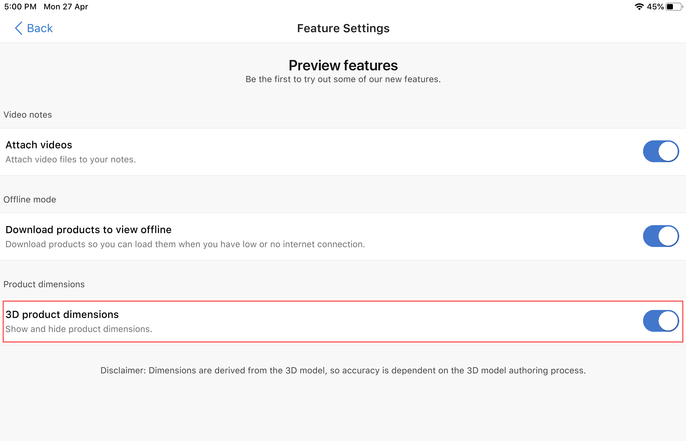

# Enable product dimensions

[!INCLUDE [cc-beta-prerelease-disclaimer](../includes/cc-beta-prerelease-disclaimer.md)]

Dynamics 365 Product Visualize has a tool to display your model measurements in imperial or metric units. To display model dimensions, you must enable the Product dimensions feature. 

> [!NOTE]
> Product dimensions is a Preview feature. Preview features are experimental features that provide access to the latest innovations that the Dynamics 365 Product Visualize team is working on.

**To enable product dimensions**

1. Tap the **Main** , and then tap **Preview features**.

    > [!div class=mx-imgBorder]
    > 

2. In the **Feature Settings** screen, move the **3D product dimensions** toggle to the On position.

    > [!div class=mx-imgBorder]
    > 

## Set measurement units

1. Tap **Main** , and then tap **Settings**.

    > [!div class=mx-imgBorder]
    > 

2. Next to **Measurement Units**, tap **Change units**.

     > [!div class=mx-imgBorder]
     > 

3. On the **Measurement Units** screen, tap either **Metric** or **Imperial**.

    > [!div class=mx-imgBorder]
    > 

## Display model dimensions

1. Place the model as described in [Place and manipulate 3D models](manipulate-models.md), and then tap **Dimensions** on the right side of the screen.

    > [!div class=mx-imgBorder]
    > 

2. The model dimensions are displayed as per the selected measurement units.

    > [!div class=mx-imgBorder]
    > 
