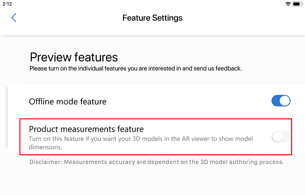

# Enable product measurements

Product Visualize has a tool to display your model measurements in Imperial or Metric units. To display model measurements, must enable the Product Measurements feature. 

> [!NOTE]
> Product measurements is a Preview feature. Preview features are experimental features that provide access to the latest innovations that the Dynamics 365 Product Visualize team is working on.

To enable product measurements:

1. Select the **Main** menu  button, and then select **Preview features**.

   

2. In the **Feature Settings** screen, under **Preview features**, slide the **Product measurements feature** setting to **On**.

    > [!div class=mx-imgBorder]
    > 

## Set measurement units

1. Select the **Main** menu  button , and then select the **Settings** button.

   

2. Scroll down to the **Measurement Units** section and then select the measurement unit.

     > [!div class=mx-imgBorder]
     > 

3. Select either **Metric** or **Imperial**.

    > [!div class=mx-imgBorder]
    > 

## Display model dimensions

1. Place the model as described in [Place and manipulate 3D models](manipulate-models.md), and then select **Dimensions** on the right side of the screen.

    > [!div class=mx-imgBorder]
    > 

2. The model dimensions are displayed as per the selected measurement units.

    > [!div class=mx-imgBorder]
    > 
