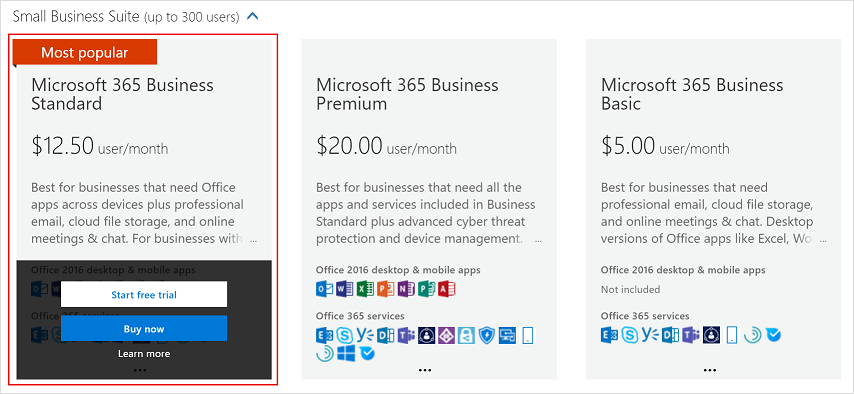
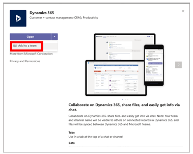
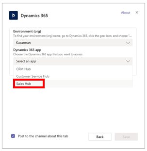

# Set up Microsoft Teams

[!INCLUDE [cc-beta-prerelease-disclaimer](../includes/cc-beta-prerelease-disclaimer.md)]

Teams is the best way to collaborate with your team, manage files, and have conversations in one easy-to-use location. You can connect Dynamics 365 Product Visualize to Teams to make collaboration with your sales team even easier.

## Sign up for Microsoft Teams

1. In a private browser window, go to the Microsoft 365 admin center at [https://admin.microsoft.com](https://admin.microsoft.com).

2. Sign in with the administrator credentials you created.

3. In the left pane, select **Billing**, and then select **Purchase services**.

4. Search for **Microsoft 365 Business Standard**, and hover over the **Microsoft 365 Business Standard** tile, and then select **Start free trial**.

    

5. Verify yourself and start the free trial. 

## Create a team

1. In a private browser window, go to teams.microsoft.com to launch Teams.

2. When prompted, select **Use the web app instead**.

3. Select **Get Started**.

4. After the app has loaded, you should see an option to join or create a team. Select **Create Team**.

5. When you see the option to build a team from scratch or create one from an existing team, select **Build a team from scratch**.

6. Make the group **Org-Wide**.

7. Give the group a name and a description.

8. Select **Create**.

## Add channels to the team

1. In the **Teams and Channels** list, select the **More Information** button next to the team you just created.

2. Select **Add Channel**.

3. Give the channel a name related to the mixed-reality session you want to connect to it (for example, **Seattle-area**).

4. Select **Add**.

## Connect Teams to Dynamics 365

1. In the lower-left corner of the Teams client, select **Apps**.

2. Search for **Dynamics 365**.

3. Select the icon for Dynamics 365 to open the installation dialog box.

4. Ensure that the **Add for You** option is set to **Yes**.

5. Select the **Open** menu, and then select **Add to a team.**

   

    a. Select an environment. This will be the organization name for the instance.

    b. Select **Sales Hub**.

      

    c. Select a mixed-reality session, and then select **Save**.

6. In the **Add to a team** section, search for your team's name, which will also set the second option to **Yes**.

7. Select **Install**.

8. On the next page, select the channel you just created, and then select **Set up**.

9. On the **Setup** page, set the following:

   - Select your Dynamics 365 organization from the **Org** list.

   - Select **Sales Hub** from the **App Module** list.

10. Select **Select**.
   
11. From the list of Dynamics 365 entities, select a mixed-reality session, and then select **Save**.

For more information about setting up Teams, see [Install and set up Microsoft Teams integration](/dynamics365/teams-integration/teams-install-app).

## Post notes from Dynamics 365 Product Visualize

Dynamics 365 Product Visualize makes your customers' needs part of the conversation by posting any notes you make in the app back to a connected Teams channel. The text and mixed-reality image get posted to Teams, giving your team the information and context they need to make smart decisions. This feature is enabled by default, but can be turned off through the in-app **Settings** menu.

## What's next?

You now have everything you need to start using Dynamics 365 Product Visualize. New mixed-reality sessions, products, and models will show up automatically in the application after they've been added to Sales. For help or feedback, use the **Feedback** button in the Dynamics 365 Product Visualize app.

### See also

[Sign in to Product Visualize Hub](sign-in-app.md) 
[Add a 3D product](add-3d-product.md) 
[Add 3D model to a product](add-3d-model-product.md) 
[Add a note to a model](add-note-model.md) 
[Create a mixed reality session](create-mr-session.md) 
[Add a product to a mixed reality session](add-product-mr-session.md)

[!INCLUDE[footer-include](../includes/footer-banner.md)]
