# Set up Dynamics 365 Product Visualize on a new Dynamics 365 instance

[!INCLUDE [cc-beta-prerelease-disclaimer](../includes/cc-beta-prerelease-disclaimer.md)]

Dynamics 365 Product Visualize requires an active Dynamics 365 instance. This topic provides step-by-step instructions for setting up a new Dynamics 365 trial instance and installing the Dynamics 365 Product Visualize app.

> [!NOTE]
> If you have an existing Dynamics 365 instance, you can skip to [Step 2: Install the Dynamics 365 Product Visualize app](#step-2-install-the-dynamics-365-product-visualize-app) and start working with the app immediately.

## Step 1: Get a Dynamics 365 trial instance

1. Go to [https://trials.dynamics.com/](https://trials.dynamics.com/).

2. Scroll down and select **Sign up here**.

    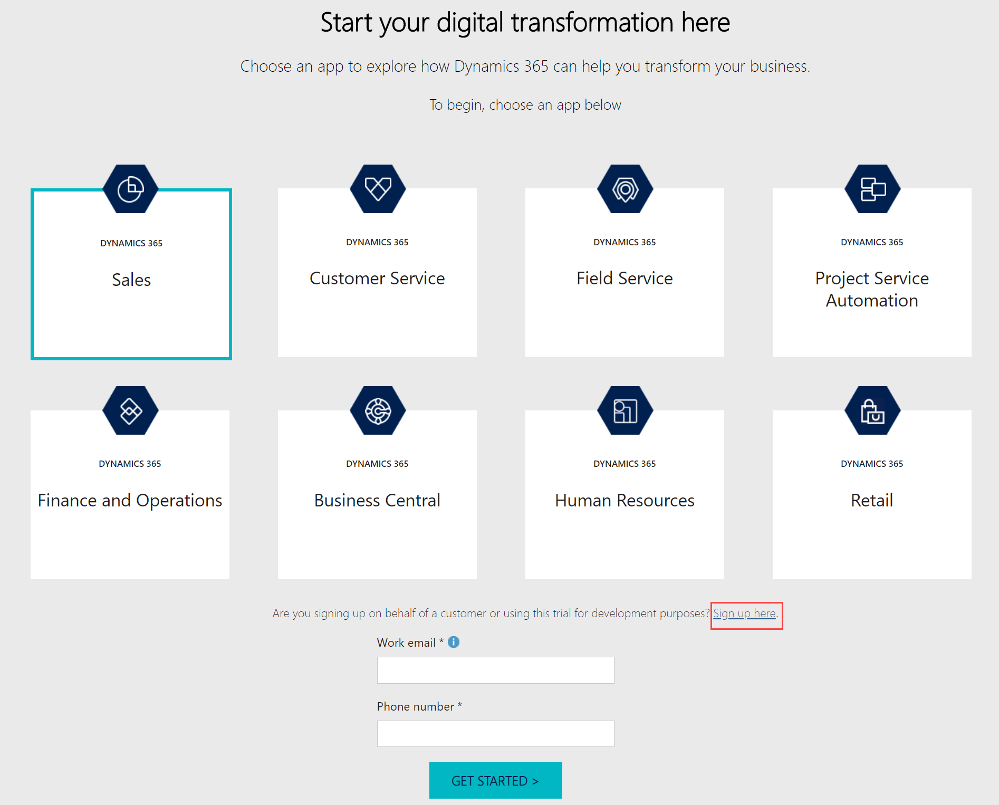

3. In the pop-up window, select **No, continue signing up**.

    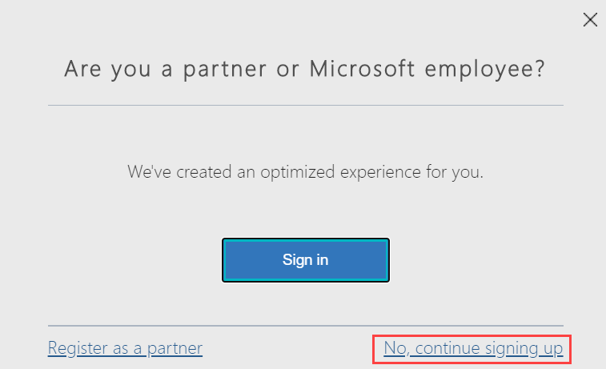

4. In the **Let's set up your account** step, enter your email address, and then select **Next**.

    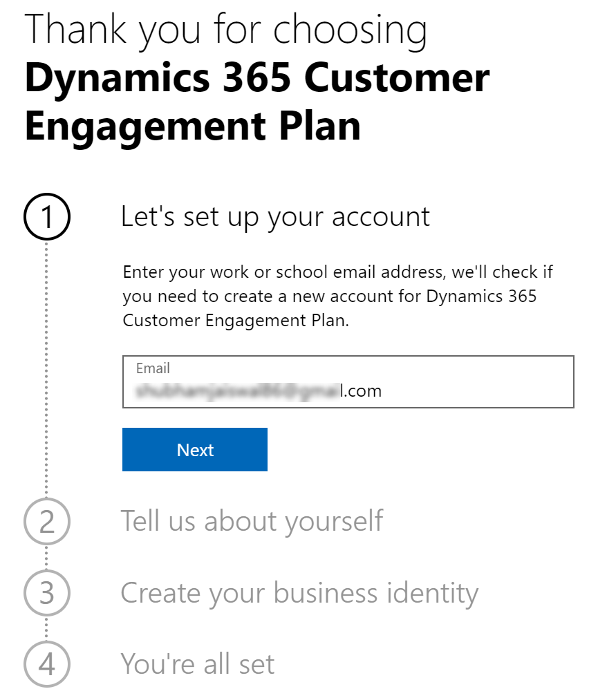

5. Select **Set up account**.

    

6. In the **Tell us about yourself** step, enter your personal details and verify your phone number.

7. In the **Create your business identity** step, enter a domain name&mdash;for example, **productvisualize**&mdash;and check its availability. If the domain name is available, select **Next**.

    

8. Create a user ID and password to sign in to your account, and then select **Sign up**.

    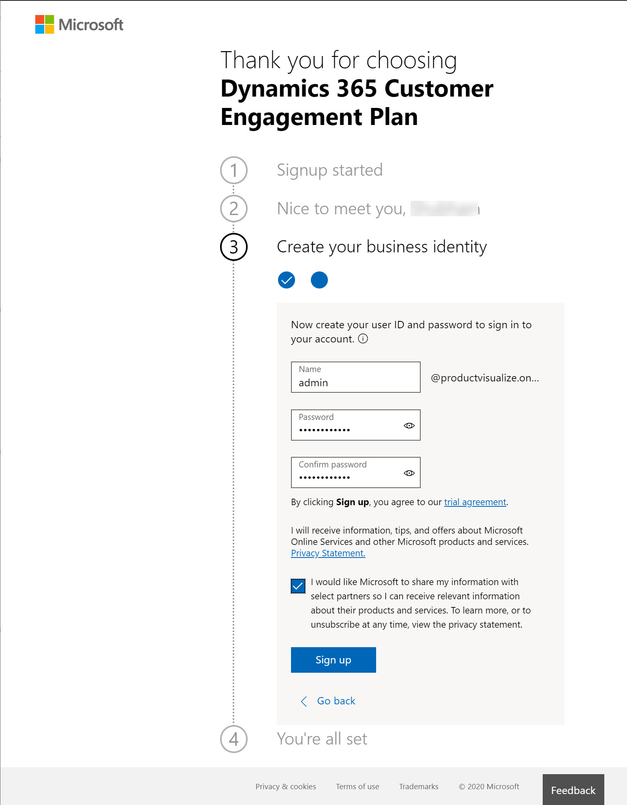

    > [!NOTE]
    > Store the user ID and password in a safe place; you'll need them later.

9. As soon as your account is set up, select **Let's go**.

    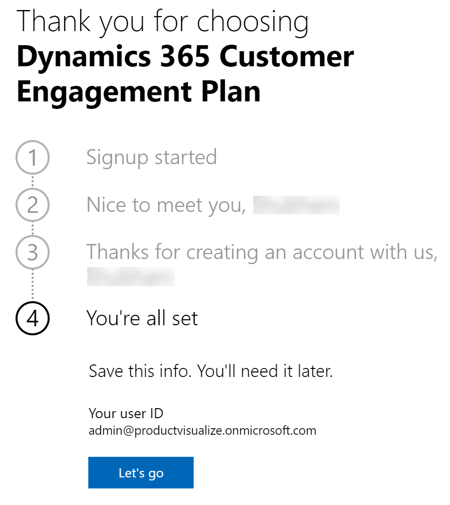

    After your account is created, you'll be redirected to [Power Platform admin center](https://admin.powerplatform.microsoft.com) to create a new environment.

10. In the **New environment** panel, enter the required information and select **Next**.

    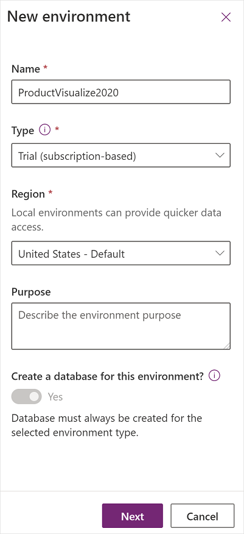

11. In the **Add database** panel, verify the information, and select **Save**.

    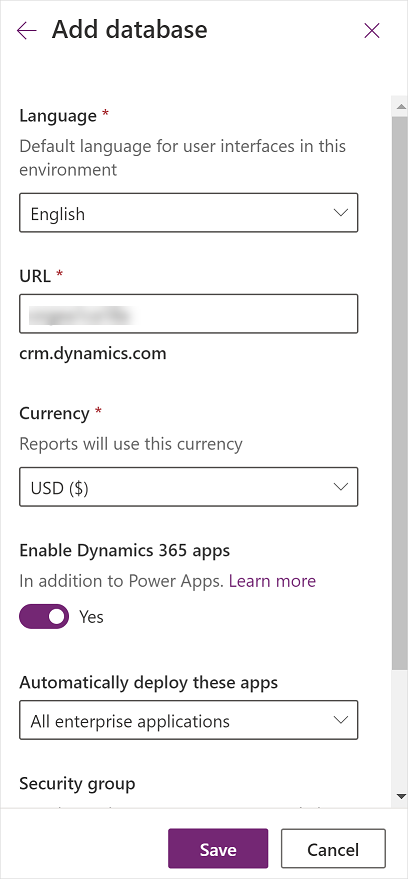

    The environment and the database creation will take some time. When the environment is being created, the state of the environment will be **PreparingInstance**. 

    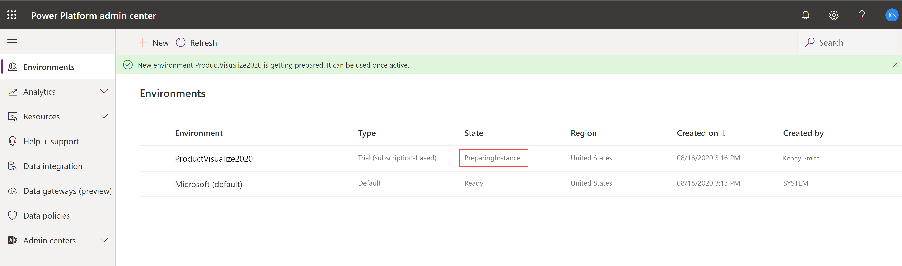
    
    You must wait until it changes to **Ready**.

    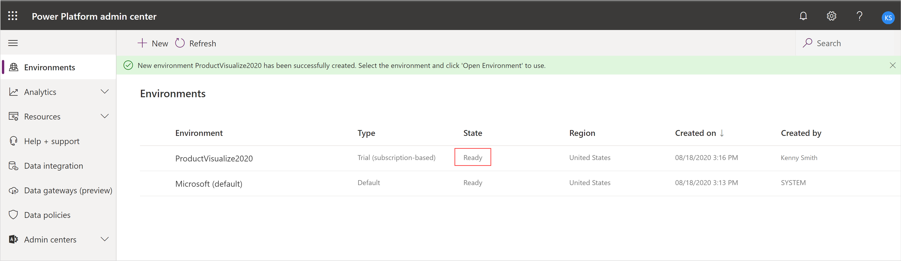

 > [!IMPORTANT]
 > In the following steps, you must use the credentials you created for your Dynamics 365 instance, if asked.

## Step 2: Install the Dynamics 365 Product Visualize app

1. Go to the [Dynamics 365 Product Visualize app](https://appsource.microsoft.com/en-us/product/dynamics-365/mscrm.d365_product_visualize?tab=Overview) on Microsoft AppSource.

2. Select **Get it now**.

3. In the **One more thing...** pop-up window, select **Continue**.

    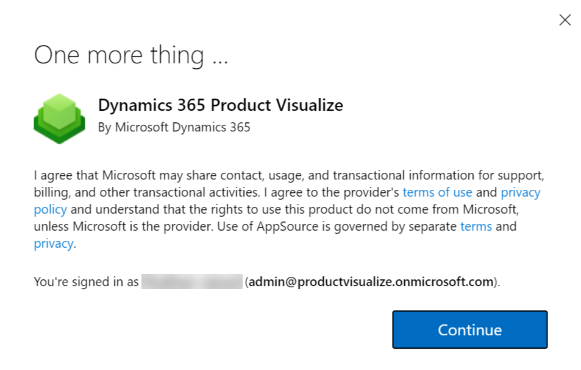

    You'll be redirected to [Power Platform admin center](https://admin.powerplatform.microsoft.com).

4. In the **Install Dynamics 365 Product Visualize** panel, select the environment you created in Step 1, select both check boxes, and then select **Install**.

    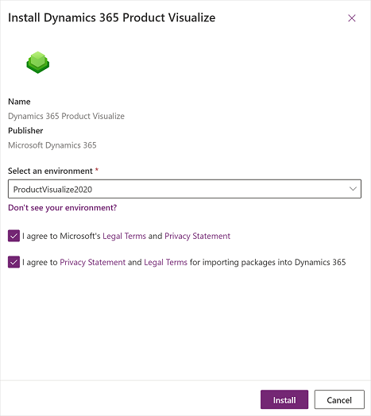

    You'll be redirected to the **Dynamics 365 apps** page.

5. Find the **Dynamics 365 Product Visualize** app, and check the status of it. If the status says **Installing**, wait until the status is changed to **Installed**.

    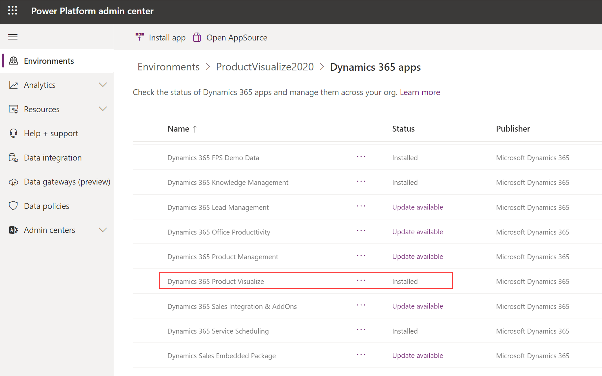

## What's next

After you've finished the setup process, you'll have a Dynamics 365 trial instance with the Dynamics 365 Product Visualize Hub app installed. You can sign in to the Dynamics 365 Product Visualize Hub app and start adding products and 3D models, and creating mixed-reality sessions. More information: [Dynamics 365 Product Visualize Hub user guide](hub-user-guide.md)

### See also

[Product Visualize Hub user guide](hub-user-guide.md) 
[Dynamics 365 Product Visualize iOS app user guide](user-guide.md) 
[FAQ](faq.md)

[!INCLUDE[footer-include](../includes/footer-banner.md)]