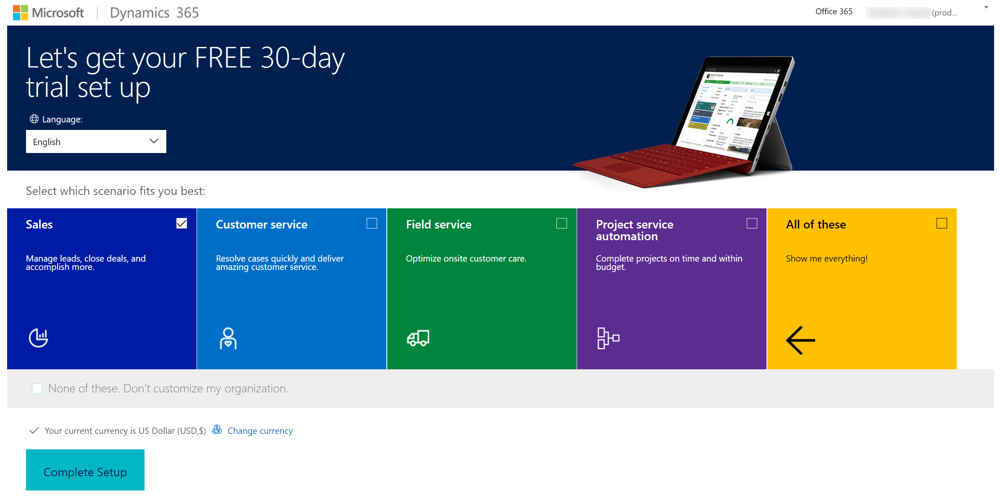

# Set up Product Visualize on a new Dynamics 365 instance

Product Visualize requires an active Dynamics 365 instance. This topic provides step-by-step instructions for setting up a new Dynamics 365 trial instance and installing the Product Visualize solution.

## Step 1: Get Dynamics 365 trial instance

Go to <https://trials.dynamics.com/>.

1.  Scroll down and select **Sign up here**.

    

2.  In the pop-up window, select **No, continue signing up**.

    

    A wizard starts to help you create your account.

3.  In the **Let's setup your account** step, enter your email address, and select **Next**.

    

4.  Select **Set up account**.

    

5.  In the **Tell us about yourself** step, enter your personal details and verify your phone number.

6.  In the **Create your business identity** step, enter a domain name and check for its availability. For example, **productvisualize**. If the domain name is available, select **Next**.

    

7.  Create user ID and password to sign in to your account., and select **Sign up**.

    

    > [!NOTE]
    > Store the user ID and password in a safe place, as you will need them later.

8.  Once your account is setup, select **Let's go**.

    

9.  On the **Let's get your FREE 30-day trial set up** page, select the required scenario, and then select **Complete Setup**.

    

    Once the setup is complete, you are redirected to your new Dynamics 365 instance. The URL is in the following format: &lt;custom\_domain\_name&gt;.crm.dynamics.com. In our example, the URL is <https://productvisualize.crm.dynamics.com>.

 > [!IMPORTANT]
 > In the following steps, you must use the credentials you created for your Dynamics 365 instance, if asked.

## Step 2: Install the Product Visualize solution

1.  Go to [Microsoft AppSource](https://appsource.microsoft.com) and search for Dynamics 365 Product Visualize.

2.  Select **Get it now**.

3.  In the **One more thing…** pop-up, select **Continue**.

    

    You are redirected to the <https://port.crm.dynamics.com> page.

4.  Under **Add the application to Dynamics 365**, select both the check boxes, and then select **Agree**.

    

    You are redirected to **Dynamics 365 Administration Center**.

5.  Under the **Instances** tab, find the **Dynamics 365 Product Visualize** solution.

6.  Check the status of the solution. If it says **Installation pending**, refresh the page until the status is changed to **Installed**.

> [!NOTE]
> If you have an existing Dynamics 365 instance, you can perform only [Install the Product Visualize solution](#step-2-install-the-product-visualize-solution) and start working with Product Visualize.

## What's next

After you've finished the setup process, you'll have a Dynamics 365 trial instance with Product Visualize Hub app installed. You can login to the Product Visualize Hub app and start adding products, 3D models, and creating mixed reality sessions. More information: Administrator guide

### See also

[Product Visualize iOS app user guide](user-guide.md) 
[FAQ](faq.md)
