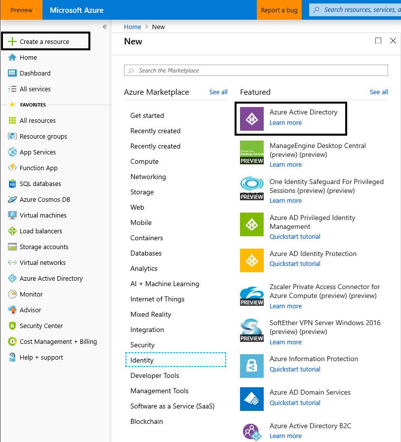
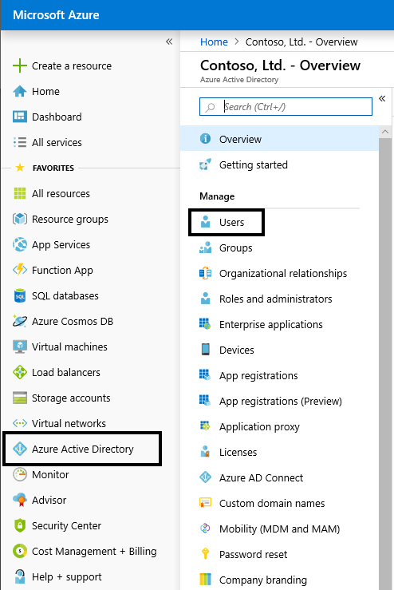
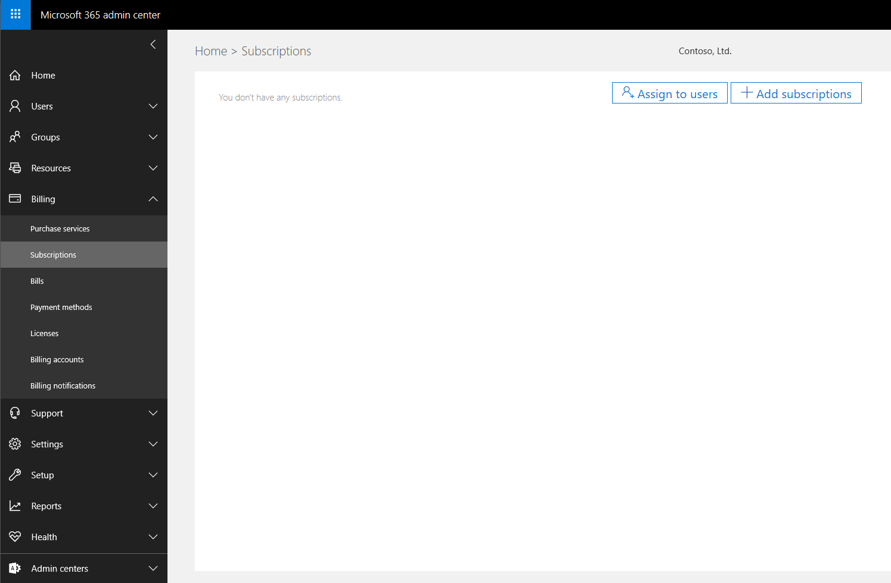
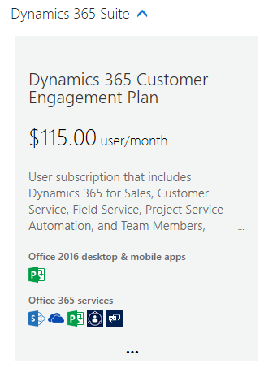
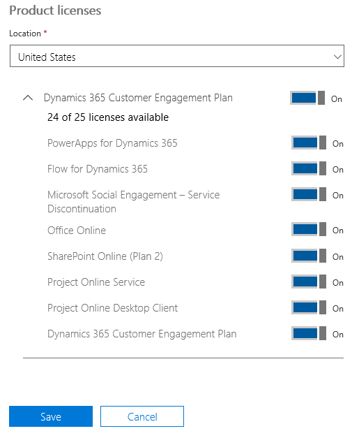
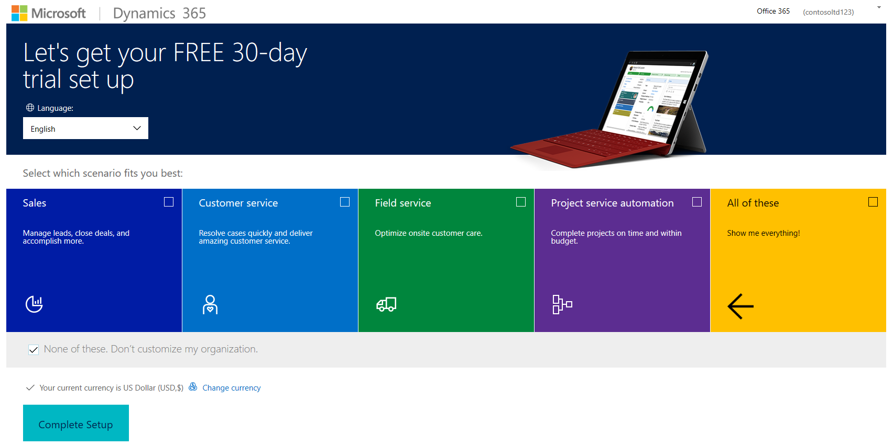
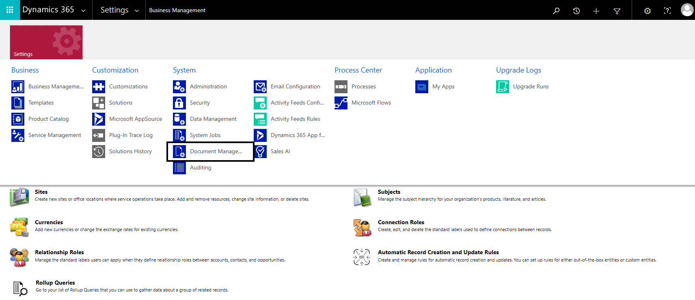

# Set up Dynamics 365 Product Visualize (in preview)

Microsoft Dynamics 365 Product Visualize (in preview) requires an active Dynamics 365 for Sales instance that's associated with a Microsoft SharePoint site. This document provides step-by-step procedures for setting up a new Dynamics 365 for Sales trial instance. Once the instance is running, see the [Administrator Guide](admin-guide.md) for instructions on adding users, products, opportunities, and models.

## Create a new organization
This section provides step-by-step instructions for creating a new Azure Active Directory organization. This gives you a safe environment to try out Product Visualize that won't interfere with any existing Dynamics 365 instances. This new organization allows you to create and manage users separate from your business organization.

1. Sign in to the Azure portal at \([https://ms.portal.azure.com](https://ms.portal.azure.com)).

2. If your organization has multiple Azure subscriptions, you can select which subscription you are viewing from the **Subscriptions** drop-down in the **Directory & Subscriptions** menu in the upper-right corner of the page.

>  

The __Directory & Subscriptions__ can be accessed by clicking this icon

3. From the navigation menu on the left click __Create a Resource__.

4. In the __New Resource__ window select __Identity > Azure Active Directory__.

   

5. Give the Organization a __Name__ and __Initial Domain Name__.

6. Click __Create__ and wait several minutes until the __Success__ message pops up.

7. Follow the link that says __Click here to manage your new directory__.

## Add an admin user

With the Active Directory Tenant now created, the next step is to add an administrative user to the tenant. The admin user will be responsible for creating additional users, assigning licenses, and initializing Dynamics 365. As the creator of this Tenant, you could continue to use your work account to manage the system, but we have found it easier to have a separate administrator account for each Tenant.

1. From the navigation menu on the left click __Azure Active Directory__ and then select __Users__

   

2. Click __New User__ at the top of the page and fill in the following fields:

    * Name - Can be anything
    
    * Username - must be fully qualified (username@\<tenant>.onmicrosoft.com)
    
    * Directory Role - Global Administrator
    
3. Click __Show Password__ and write down the temporary password

4. At the bottom of the page click __Create__ to finish creating the user.

## Add a Dynamics 365 Customer Engagement trial

Product Visualize integrates directly into Dynamics 365 for Sales, allowing your salespeople to seamlessly transition from the vital customer data into an engaging sales experience that will change the way customers think about your products.

1. In a private browser window, return to [https://admin.microsoft.com](https://admin.microsoft.com)

2. Sign in with the administrator credentials you just created and, if prompted, set a new password

3. From the navigation menu on the left click __Billing > Subscriptions__ and click __Add Subscription__

   

4. Find the subscription __Dynamics 365 Customer Engagement Plan__, click the three dots (...) at the bottom, and select __Start Free Trial__

   

5. At the summary page double-check  that you are signing-up for a __Dynamics 365 Customer Engagement Plan__ trial and click __Try Now__

6. Click __Continue__ from the confirmation page

## Assign licenses

Before continuing we should make sure the Dynamics 365 Customer Engagement license has been assigned to our admin user

1. In the microsoft Admin Portal \([https://admin.microsoft.com](https://admin.microsoft.com)) select __Users > Active Users__ from the navigation menu on the left

1. Edit the properties for your admin user created earlier by double clicking the name 

2. On the __Product Licenses__ line click __Edit__

3. __Enable__ the License for __Dynamics 365 Customer Engagement Plan__

   

4. Save the changes and close the user dialog

## Set Up the Dynamics 365 for Sales trial

It is time to finally set up your instance of Dynamics 365 Customer Engagement. This guide walks you through the manual installation of the Dynamics for Sales app, which generates a completely empty instance of the Dynamics CDS. If you would prefer for a simpler set up procedure, refer to the note below.

1. In the Microsoft Admin Portal \([https://admin.microsoft.com](https://admin.microsoft.com)) find the dropdown for __Admin Centers__ in the navigation menu on the left.

> It may take a minute or two for this option to show up in the __Admin Centers__ list

2. Select __Dynamics 365__ from the __Admin Centers__ to open the Dynamics 365 Admin Center

3. A new page is brought up that asks you to set up your Dynamics 365 Trial.

    * Set the language to your preferred language
    
    * Under __Select which scenario fits you best__ check __None of these__ (See note below)
    
    * Set the currency to your preferred currency
    
4. Click __Complete Setup__ and wait for the initial setup process to complete

   

5. Return to the Dynamics 365 Admin Portal via the __Admin Centers__ list

6. From the __Instances__ page you should see your newly created instance selected and some properties in a gray box on the right. Your new solution is still being setup, wait for it complete before moving on to the next step.

> It can take around 10 minutes for the setup process to finish. You will know the process is complete when you see __Crm Hub__ listed under the __Solutions__ for your instance. Refresh the page periodically to check on the status.

7. Click the small __Edit__ button next to the word __Solutions__ in the gray box on the right

   

8. From the list of available solutions find __Dynamics 365 Sales Application__ and click __Install__

9. Approve the __Terms of Service__ and the installation process will start

10. This process may take a while to complete. You can refresh the page to view the current status of your installation.

**NOTE:** In step 2 you could optionally select __Sales__ for your scenario which would allow you to skip everything past step 5. However, this will install some additional sample data that may not be relevant to your organization. 

## Set Up a SharePoint site

1. Navigate to the Sales Hub of your newly created Dynamics 365 instance 

    * Click the __Open__ button next to your org name in the gray box on the Admin center page
    
    * Find __Sales Hub__ from the list of available applications
    
2. Click the __Gear__ icon in the upper-right corner of the page and select __Advanced Settings__

3. From the navigation bar on the top of the page click the down arrow next to __Settings__ and click __Document Management__

   

4. Click __Enable Server-Based SharePoint Integration__ to set up the connection to SharePoint

5. Continue through  the setup and, when prompted, enter the URL for your SharePoint ([https://\<org name>.sharepoint.com]())

> Be sure to enter the full URL of your SharePoint instance, include `https://`

6. When complete, return to the __Document Management__ settings page and click __Document Management Settings__

7. Enter the URL of your SharePoint site, if it isn't filled in by default. Then, click __Next__.

8. Continue through the setup leaving the remaining options at the default values.

9. Dynamics will automatically create SharePoint folders for the Dynamics Entities. Close the window when complete.

> If you opted to use the automated __Sales__ setup earlier you can skip the steps of Enabling Server-Based SharePoint Integration.

## What's next?
Once the setup process has finished you will have an Azure Active Directory Tenant complete with Microsoft Office 365 and Microsoft Dynamics 365 Customer Engagement. At this point you can start adding Opportunities, Products, and Models to Dynamics. This is covered in the __Product Visualize Administrator's Guide__
