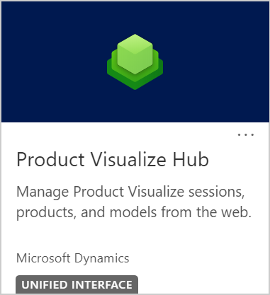

# Sign in to Dynamics 365 Product Visualize Hub

[!INCLUDE [cc-beta-prerelease-disclaimer](../includes/cc-beta-prerelease-disclaimer.md)]

1.  Go to [Power Platform admin center](https://admin.powerplatform.microsoft.com).

2.  Enter your Dynamics 365 instance credentials, and sign in.

3. In the left pane, select **Environments**.

4. On the **Environments** page, select your environment.

5. On the toolbar at the top of the page, select **Open environment**.

    

6.  From the list of apps, select **Product Visualize Hub**.

    

### See also

[Add a 3D product](add-3d-product.md) 
[Add 3D models to a product](add-3d-model-product.md) 
[Add a note to a model](add-note-model.md) 
[Create a mixed-reality session](create-mr-session.md) 
[Add a product to a mixed-reality session](add-product-mr-session.md) 
[Set up Microsoft Teams](setup-ms-teams.md)

[!INCLUDE[footer-include](../includes/footer-banner.md)]
