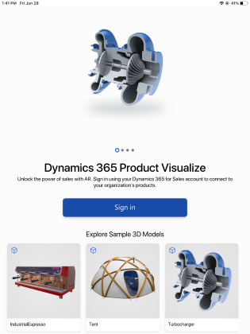
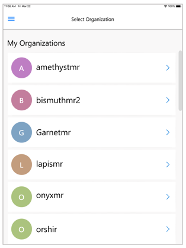
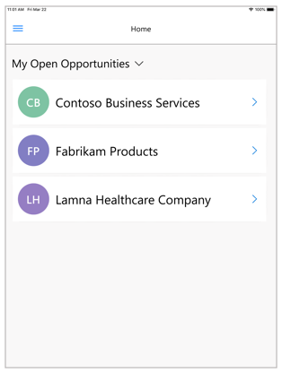

# Install, open, and sign in to Dynamics 365 Product Visualize

[!INCLUDE [cc-beta-prerelease-disclaimer](../includes/cc-beta-prerelease-disclaimer.md)]

To get the full benefits of Dynamics 365 Product Visualize, you'll need a Dynamics 365 account. When you sign in with your Dynamics 365 account, Dynamics 365 Product Visualize automatically connects to your mixed reality sessions.

> [!TIP]
> If you just want to explore sample 3D content, you don't need a Dynamics 365 account. More information: [Explore sample 3D models](explore-samples.md)
 
## Install the app

1. Go to the Apple App Store.

2. Search for **Dynamics 365 Product Visualize**.

3. Download and install the app.

> [!NOTE]
> Dynamics 365 Product Visualize is available for iOS devices only.

## Open the app on your iOS device and sign in for the first time

1.	On your iOS device, search for **Dynamics 365 Product Visualize**, and then open the app.

2.	On the welcome screen, tap **Sign in**.

    
 
3.	On the **Sign in** screen, enter your Dynamics 365 account credentials. When you're done, tap **Next**.  
 
    > [!NOTE]
    > After you sign in for the first time, this screen won't appear again.

4.	When you first sign in, you're prompted to select your Dynamics 365 organization. You can use **Settings** to change organizations later, if you want.  

     
 
5.	On the **My Active Mixed Reality Sessions** screen, tap the mixed-reality session you want to work on.  

    
 
Dynamics 365 Product Visualize pulls in your mixed reality sessions from Dynamics 365 by default.

## Switch to a different organization

If you have access to more than one Dynamics 365 organization, you can use this procedure to switch between organizations.

1.	Tap **Main** , and then tap **Settings**.

    > [!div class=mx-imgBorder]
    > 
  
2.	On the **Settings** screen, tap **Edit** next to the organization name you're signed in to.

    > [!div class=mx-imgBorder]
    > 
 
    > [!NOTE]
    > If you need to switch to a different username, tap **Sign out** on the previous screen, and then sign back in with a different username.

### See also

[Place and manipulate 3D models](manipulate-models.md) 
[Add a note to your 3D model](add-note.md) 
[Show or hide layers in a 3D model](layers.md) 
[Explore sample 3D models](explore-samples.md) 
[View 3D models stored on your device](browse-models.md) 
[Download 3D models to use offline](download-models.md) 
[Enable product dimensions](product-dimensions.md)

[!INCLUDE[footer-include](../includes/footer-banner.md)]