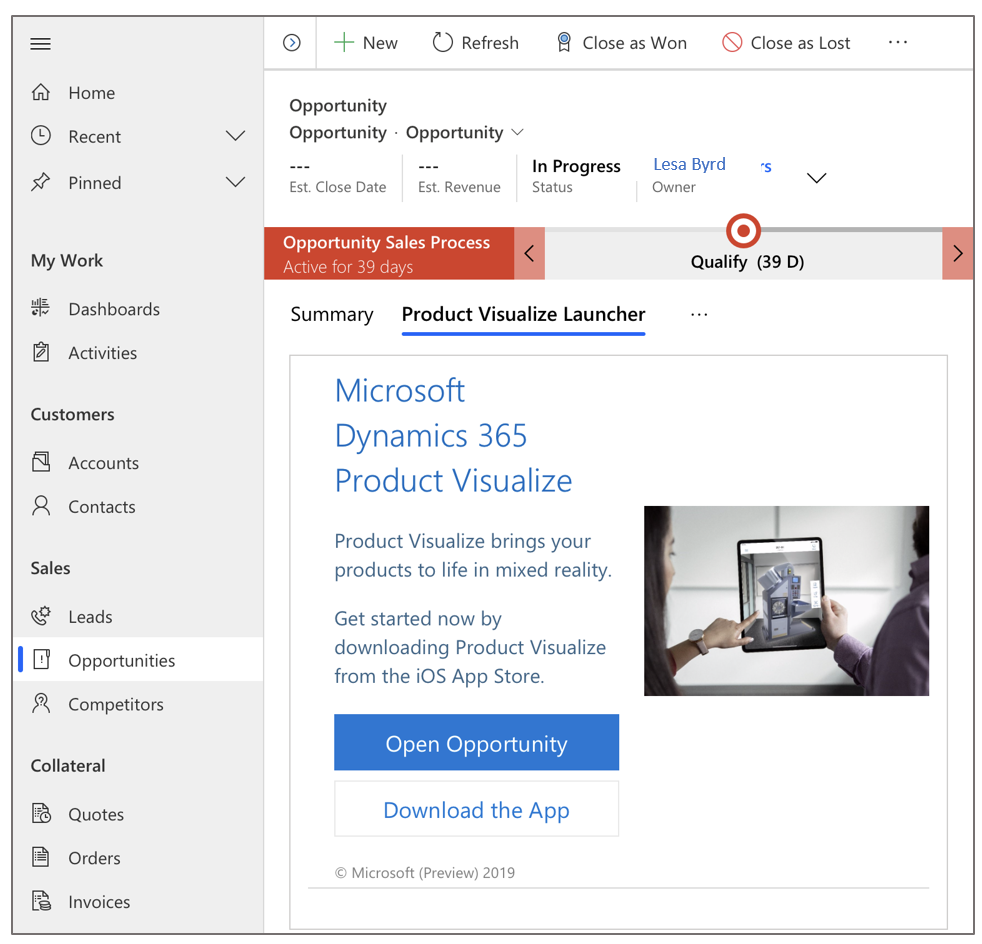

# Install, open, and sign in to Dynamics 365 Product Visualize

[!INCLUDE [cc-beta-prerelease-disclaimer](../includes/cc-beta-prerelease-disclaimer.md)]

To get the full benefits of Microsoft Dynamics 365 Product Visualize, you'll need a Dynamics 365 account. When you sign in with your Dynamics 365 Sales account, Dynamics 365 Product Visualize automatically connects to your Dynamics 365 Sales opportunities.

> [!TIP]
> If you just want to explore sample 3D content, you don't need a Dynamics 365 account. For more information, see [Explore sample 3D models](explore-samples.md).
 
## Install the app

1.	Go to the Apple App Store.

2.	Search for **Dynamics 365 Product Visualize**.

3.	Download and install the app.

## Two ways to open and sign in

You can open and sign in to Dynamics 365 Product Visualize on your iOS device in two different ways:

- Open the app on your iOS device like you would any other app, and then sign in.
- Select any 3D model (GLB file) in your Dynamics 365 Sales opportunity.

> [!NOTE]
> At this time, Dynamics 365 Product Visualize is available for iOS devices only.

## Open the app on your iOS device and sign in for the first time

1.	On your iOS device, search for **Dynamics 365 Product Visualize**, and then open the app.

2.	On the **Welcome** screen, tap **Sign in**.

    
 
3.	On the **Sign in** screen, enter your Dynamics 365 Sales account. When you're done, tap **Next**.  
 
    > [!NOTE]
    > After you sign in for the first time, this screen won't appear again.

4.	When you first sign in, you're prompted to select your Dynamics 365 Sales organization. You can change organizations later, if you want, through **Account Settings**.  

     
 
    > [!TIP]
    > If your organization isn't set up with Dynamics 365 Sales, you can explore sample models or go to the [Dynamics 365 Sales website](https://trials.dynamics.com/Dynamics365/Signup/sales) to learn how to sign up.  

5.	On the **My Open Opportunities** screen, tap the opportunity you want to work on.  

    
 
    Dynamics 365 Product Visualize pulls in your opportunities from Dynamics 365 Sales by default. You can also view followed opportunities and connect opportunities.
    
## Sign in from Dynamics 365 Sales

You can also open Dynamics 365 Product Visualize directly from Dynamics 365 Sales on your iOS device. This makes it easy to visualize your products in 3D as you work with your sales opportunities.

If you haven’t already installed Dynamics 365 Product Visualize on your iOS device, you can install it from Dynamics 365 Sales.

### Sign in from Dynamics 365 Sales for the first time

1.	Open one of your opportunities in Dynamics 365 Sales.

2.	Select the **Product Visualize Launcher** tab.

    

3.	Do one of the following:

    - If the iOS app is already installed, select **Open Opportunity** to open the app.
    
    - If you're using an iOS device but the app isn't already installed, tap **Learn More**, follow the instructions to install the app, and then sign in to the app by using the instructions in step 5 of this procedure.

    > [!NOTE]
    > If you're using a laptop or an Android device, you can't use Dynamics 365 Product Visualize at this time. You can select **Learn More** to learn more about the app.
 
5.	On the Dynamics 365 Product Visualize **Welcome** screen, tap **Sign in**.

    
 
6.	On the **Sign in** screen, enter your Dynamics 365 account. When you're done, tap **Next**.
 
    > [!NOTE]
    > After you sign in for the first time, this screen won't appear again.
    
7.	When you first sign in, you're prompted to select your Dynamics 365 Sales organization. You can change organizations later, if you want, through **Settings**.

     
 
8.	In the **My Open Opportunities** screen, select the opportunity you want to work on.

    
 
## Switch to a different organization

If you have access to more than one Dynamics 365 organization, you can use this procedure to switch between organizations.

1.	Tap the main menu  button and then tap **Settings**.

    > [!div class=mx-imgBorder]
    > 
  
2.	On the **Account Settings** screen, tap **Edit** next to the organization name you're signed in to.

    > [!div class=mx-imgBorder]
    > 
 
    > [!NOTE]
    > If you need to switch to a different username, tap **Sign out** on the previous screen, and then sign back in with a different username.
    
### See also

[Place and manipulate 3D models](manipulate-models.md) 
[Add a note to your 3D model](add-note.md) 
[Show or hide layers in a 3D model](layers.md) 
[Explore sample 3D models](explore-samples.md) 
[View 3D models stored on your device](browse-models.md) 
[Add your own 3D model to an existing Dynamics 365 Sales product](add-model.md) 
[Download 3D models to use offline](download-models.md)
