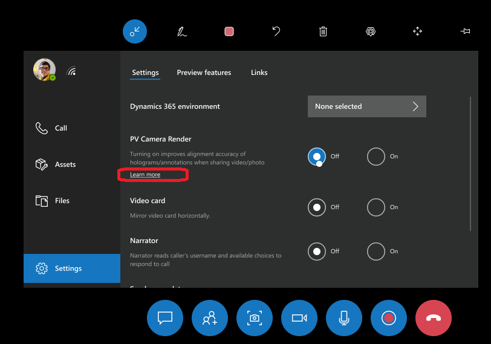

# Add annotations in Dynamics 365 Remote Assist on HoloLens

Once a video call has connected, the Microsoft Teams user will see everything the HoloLens user sees in their space – including holograms. 

Annotations are useful for pointing out different parts of your space, including parts that may be difficult or dangerous to reach. All call participants can see each others’ additions, and can make annotations of their own. Once an annotation is placed, it will remain anchored in your space until the person who placed the annotation deletes it. Adding annotations to files works the same way.

The gestures for adding arrows or drawing are the same for HoloLens and HoloLens 2.

> [!Note]
> Multiple Teams users (desktop or mobile) can join a Dynamics 365 Remote Assist call, but only Teams desktop users can add annotations, regardless of whether the Dynamics 365 Remote Assist user is using HoloLens, HoloLens 2, or the mobile app.
>
> The following combinations are supported:
>
> - One-to-one call with one Dynamics 365 Remote Assist HoloLens user and one Teams desktop user
> - One-to-one call with one Dynamics 365 Remote Assist HoloLens user and one Teams mobile user
> - One-to-one call with one Dynamics 365 Remote Assist HoloLens user and one Dynamics 365 Remote Assist mobile user
> - Group call with one or more Dynamics 365 Remote Assist HoloLens users and one or more Teams desktop or mobile users
> - Meetings with one or more Dynamics 365 Remote Assist HoloLens users and one or more Teams desktop or mobile users

## Add an arrow 

1. Select the **Arrow** tool (). 

2. To position the arrow in space:

    - If you're using HoloLens, use your gaze cursor to position the arrow. You'll see a ghost arrow on your gaze cursor.  

    - If you're using HoloLens 2, use your hand ray to position the arrow. You'll see a ghost arrow at the end of your hand ray.

    > [!NOTE]
    > If [hand rays are turned off](hololens-hand-rays.md) in the HoloLens app, they're automatically turned back on again when you select the **Arrow** tool.

3. To control the direction of the arrow, air tap, hold, and move your hand in a circle until the ghost arrow appears at the desired direction. Release the air tap to place the arrow.

4. Once you place the arrow, you can't adjust its location or direction. To redo, select **Undo**, and then place the arrow again.

> [!TIP]
> To use voice commands, select the arrow tool by saying "Remote Assist, Arrow." Then say "Remote Assist, Place arrow". You can't use voice commands to rotate the arrow before placing it. To redo, say "Remote Assist, Undo", and then place the arrow again.

 

<iframe src="https://www.microsoft.com/videoplayer/embed/RE2F9qy" frameborder="0" allowfullscreen=""></iframe>

 

The above video shows how to place an arrow using HoloLens gestures. If you’re using HoloLens 2, remember that you can select the **Arrow** tool by touching it directly, and  position the arrow in space by using your hand ray. 

## Draw in your space

1. Select the **Ink tool** ().

2. To determine where to start drawing: 

   - If you're using HoloLens, use your gaze cursor.

   - If you're using HoloLens 2, use your hand ray.  

    > [!NOTE]
    > If [hand rays are turned off](hololens-hand-rays.md) in the HoloLens app, they're automatically turned back on again when you select the **Ink** tool.

3. Air tap, keep your index finger and thumb together, and start drawing in space. Release the air tap to stop drawing. 

> [!TIP]
> To use voice commands, select the **Ink** tool by saying "Remote Assist, Ink." Then say "Remote Assist, Start inking" and "Remote Assist, Stop inking" to start and stop inking with your head gaze. 

 

<iframe src="https://www.microsoft.com/videoplayer/embed/RE2F9qs" frameborder="0" allowfullscreen=""></iframe>

 

The above video shows how to draw using HoloLens gestures. If you’re using HoloLens 2, remember that you can select the **Ink tool** by touching it directly, and you can use your hand rays to determine where to start your drawing. 

## Change arrow or ink color

Select Colors  (or say “Remote Assist, colors”), and then select the color you want (or say “Remote Assist, <color>”, for example, say "Remote Assist, Red"). The next annotation you place will be that color.

## Erase annotations

To erase all the arrows and ink you add during a video call, select **Erase all** () at the top of the call window (or say "Erase all").

To undo your most recent action, including **Erase All**, select **Undo**  at the top of the call window (or say "Undo").

## PV camera render

Enabling the **PV Camera Render** setting improves the alignment accuracy of annotations as seen by Microsoft Teams users. This ensures that annotations placed by the HoloLens 2 Remote Assist user are represented accurately in their environment for the remote expert. When this setting is turned off, annotations placed by the HoloLens 2 user might appear slightly out of place to the Microsoft Teams user.

.

To accommodate the additional system resources required for utilizing the PV camera render, turning on the **PV Camera Render** setting limits the maximum outgoing video resolution of the HoloLens 2 to 720p. Turning off the **PV Camera Render** setting increases the maximum outgoing video resolution to 1080p.

[Learn more about rendering from the PV camera](/windows/mixed-reality/develop/platform-capabilities-and-apis/mixed-reality-capture-for-developers#render-from-the-pv-camera-opt-in).

[!INCLUDE[footer-include](../includes/footer-banner.md)]
