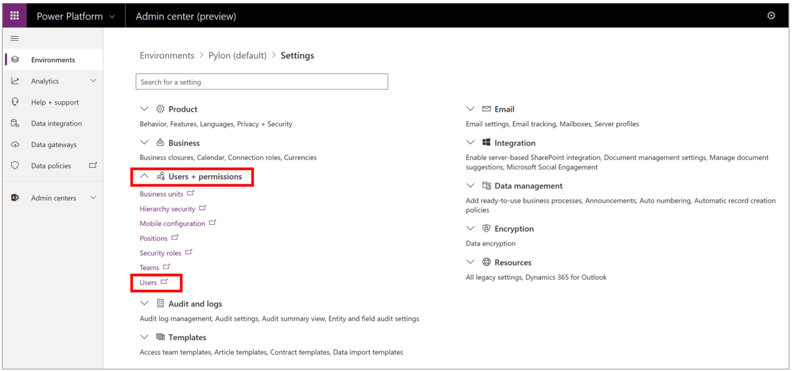
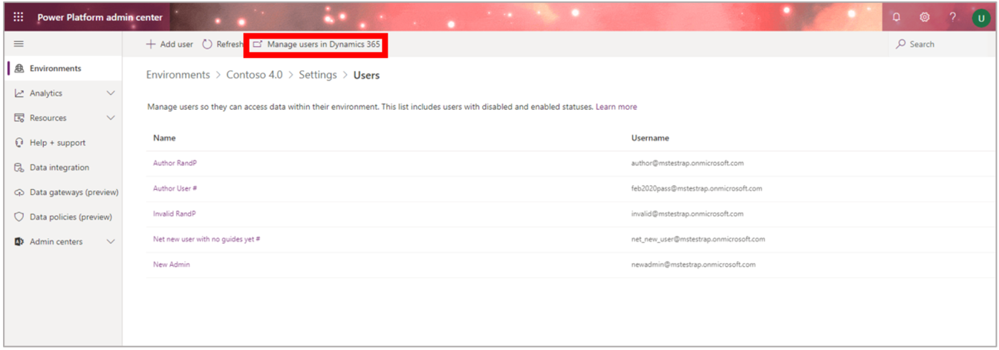
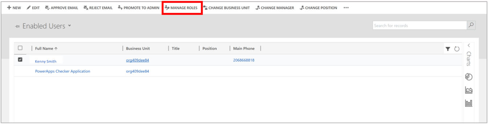
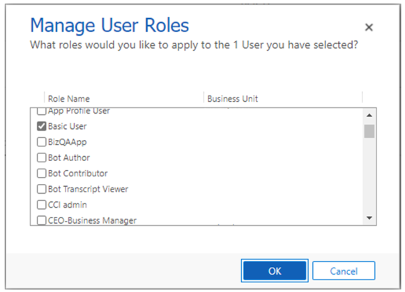

# Add users to the Dynamics 365 Remote Assist model-driven app

After you [install the Microsoft Dynamics 365 Remote Assist model-driven app](ra-webapp-install.md), you'll need to add users so they can use the Dynamics 365 Remote Assist client app on HoloLens or mobile to:

- [Capture and view asset data](./asset-capture-overview.md).

- Create and share [one-time call links](./one-time-call.md).

- Record call metrics for the [Calls dashboard](./calls-dashboard.md).

This article shows you how to assign a Dynamics 365 Remote Assist license to users and set up security roles.

## Prerequisites

To complete the steps in this article, you need:

- **A Dynamics 365 Remote Assist subscription**. The subscription enables you to assign licenses to users.

- **The ability to manage user licenses in the Microsoft 365 admin center**. To manage user licenses, you need to have an admin role for the Microsoft 365 admin center.

- **Admin access to the environment that Dynamics 365 Remote Assist is installed in**. You manage security roles for users in the environment. A system administrator role (typically a Power Apps admin, Global admin, or Dynamics 365 admin) is required for the environment you're managing.

## Assign Dynamics 365 Remote Assist licenses

Anyone who will be using Dynamics 365 Remote Assist client app on HoloLens or Mobile or accessing the Dynamics 365 Remote Assist model-driven app will need a Dynamics 365 Remote Assist license. If these users already have a Dynamics 365 Remote Assist license, you can skip this step.

1. Sign in to the [Microsoft 365 admin center](https://admin.microsoft.com) as an admin (User admin or Global admin).

2. Go to **Billing** > **Licenses**.

3. Select **Dynamics 365 Remote Assist**.

4. Select **Assign licenses**.

5. In the **Assign licenses to users** pane, begin typing a name, and then choose it from the results to add it to the list. You can add up to 20 users at a time.

6. When you're finished, select **Assign**, and then select **Close**.

More information: [Assign licenses to users](/microsoft-365/admin/manage/assign-licenses-to-users)

## Assign Dynamics 365 security roles

> [!NOTE]
> Users can take up to one hour to appear in the Dynamics 365 admin center after the licenses are added in the Microsoft 365 admin center.

1. Open the [Power Platform admin center](https://admin.powerplatform.microsoft.com/environments), and sign in using your admin credentials.

2. If the **Environments** page doesn't appear, select **Environments** in the left pane to open it.

3. Select the environment that you want to work with, select the **More environment actions** (**...**) button, and then select **Settings**.

    

4. Select **Users + permissions** to expand the list of options, and then select **Users**. If you're prompted to sign in to Dynamics 365, be sure to use your admin credentials.

    
    
5. Follow one of these steps:

    - If the users are already in the list, skip ahead to step 6 to assign user roles.
    
    - If you need to add one or more users, select **Add user** at the top of the page, enter the account details in the **Add user** dialog box, and then select **Add**. For more information, see the "Troubleshooting" section later in this topic.

        > [!NOTE]
        > When you add a user in this way, you trigger synchronization. The user is added to the instance within a few minutes.  
    
6. Select **Manage users in Dynamics 365** at the top of the page. 

   

7. Select one or more users, and then select **Manage Roles** at the top of the page.

    

8. In the **Manage User Roles** dialog box, select the **Basic User** check box.

    
    
    > [!NOTE]
    > You may see a **Common Data Service** check box instead of a **Basic User** check box. If so, select that check box. 

9. Select the check box for **Remote Assist - App User**.
        
10. For supervisors, service managers, and other users who may need access to advanced features, such as the [Calls dashboard](./calls-dashboard.md), select the check box for the **Remote Assist - Administrator** role. When you're finished, select **OK**.
    
### Troubleshooting security roles

If users don't appear on the **Security** page (**Dynamics 365** \> **Settings** \> **Security**), in the [Power Platform admin center](https://admin.powerplatform.microsoft.com/environments), select **Add user**. In the **Add user** dialog box, enter the account details, and then select **Add**. This operation triggers synchronization, so the user is added to the instance within a few minutes.

## Manage app roles

The necessary security roles are automatically associated with the model-driven app. Depending on your organization's setup, you may not need to set up security roles. If you can't access the model-driven app, check security roles as described below.

The **Remote Assist - App User** and the **Remote Assist - Administrator** roles must be enabled for the Dynamics 365 Remote Assist app. The following table describes the two roles.

|Security role|Description|
|-----------------------------------|----------------------------------------------------------------------------------|
|**Remote Assist - App User**|Provides access to assets, one-time calling, and settings in the model-driven app. This role is assigned automatically to all users who have a Dynamics 365 Remote Assist license. Admins typcially don't have to assign this role manually.|
|**Remote Assist - Administrator**|Provides additional access to the Calls Dashboard. This role is not recommended as a replacement for the **Remote Assist - App User** role.|

### Assign a security role

1. Sign in to the [Power Platform admin center](https://admin.powerplatform.com) as an admin (Dynamics 365 service admin, Global admin, or Power Platform service admin).

2. Select **Environments**, find the environment that Dynamics 365 Remote Assist is installed in, and then select .

3. Select **Open environment**.

4. If you see a list of **Published Apps**, proceed to step 5. Otherwise, select **Settings** from the upper-right toolbar, select **Advanced Settings**, and then select the drop-down menu next to **Settings** > **Apps**.

    :::image type="content" source="media/06.24-d365-settings-my-apps.png" alt-text="Screenshot of the Dynamics 365 environment.":::

5. On the Dynamics 365 Remote Assist app tile, select **More options**, and then select **Manage Roles**.

    :::image type="content" source="media/06.25-d365-settings-manage-roles.png" alt-text="Screenshot of the Dynamics 365 Manage Roles for app menu.":::

6. In the right side panel, select the **Remote Assist - Administrator** and **Remote Assist - App User** roles from the list, and then select **Save**.

    :::image type="content" source="media/06.26-d365-settings-manage-roles-set.png" alt-text="Screenshot of Dynamics 365 assigning app role.":::

## Selecting the right environment from the client app

After end users have been assigned licenses and security roles, they must also select the correct environment with the Dynamics 365 Remote Assist model-driven app installed to use related features within the HoloLens or mobile app. You can do this by selecting the **Settings** menu of the respective client apps and selecting the environment. By default, there is no environment associated with the client app.

### Select the right environment in HoloLens

1. Go to the **Settings** menu and select the **Dynamics 365 environment**.

    :::image type="content" source="media/HololensSettingsEnvironmentSelection01.png" alt-text="Remote Assist settings in the HoloLens.":::

2. You'll see a list of environments with either Dynamics 365 Remote Assist or Dynamics 365 Field Service (or both) installed. To use Dynamics 365 Remote Assist related features, such as [asset capture](./asset-capture-photos.md) and the [Calls dashboard](./calls-dashboard.md), you'll need to select an environment with Dynamics 365 Remote Assist installed. To update [Field Service bookings](./update-field-service-booking-hololens.md), you'll need to select an environment with Dynamics 365 Field Service installed.

    :::image type="content" source="media/HololensSettingsEnvironmentSelection02.png" alt-text="List of environments in Remote Assist settings menu on the HoloLens.":::

### Select the right environment on Android or iOS

1. Go to the **Settings** menu and select the **Dynamics 365 environment**.

    :::image type="content" source="mobile-app/media/RAMSettingsEnvironmentSelection01.png" alt-text="Remote Assist settings in the Mobile app.":::

2. You'll see a list of environments. To use Dynamics 365 Remote Assist related features, such as [asset capture](./asset-capture-photos.md) and the [Calls dashboard](./calls-dashboard.md), you'll need to select an environment with Dynamics 365 Remote Assist installed. Select **Confirm** after selecting the right environment.

    :::image type="content" source="mobile-app/media/RAMSettingsEnvironmentSelection02.png" alt-text="List of environments in Remote Assist settings menu in the Mobile app.":::

## Next steps

After assigning security roles, check out the following articles to use the model-driven app:

- [Create asset records and import your existing asset catalog](./asset-capture-create-asset.md)
- [Get insights with the Calls dashboard](./calls-dashboard.md)

[!INCLUDE[footer-include](../includes/footer-banner.md)]
