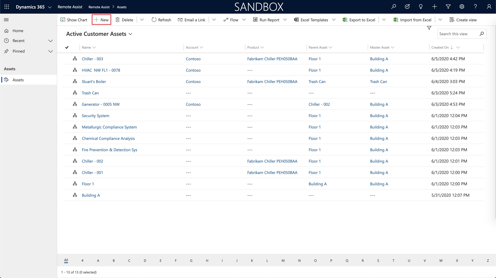
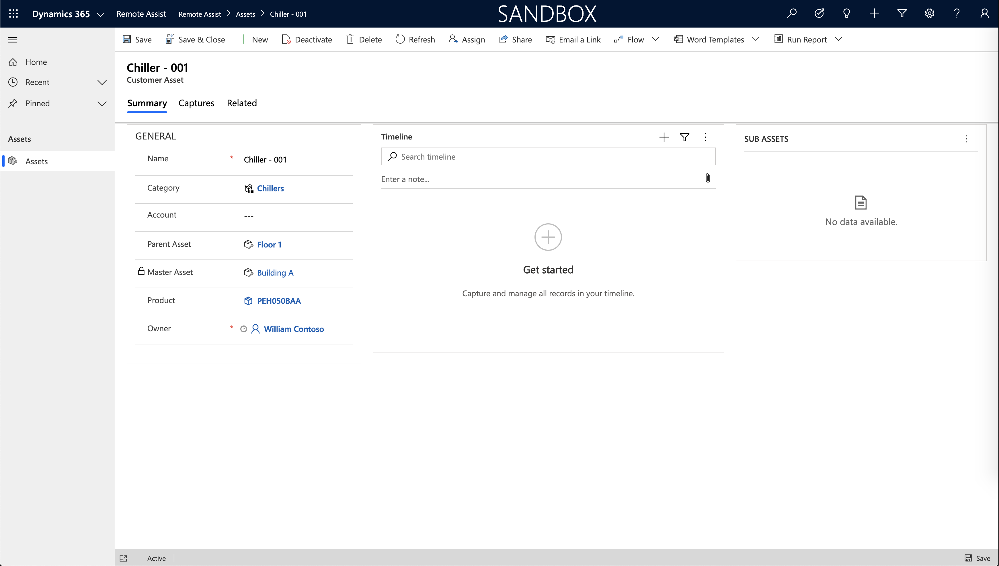

---
title: Create a new asset record in Dynamics 365 Remote Assist
author: dhgoelmsft
description: Learn how to create new asset records in Dynamics 365 Remote Assist.
ms.author: dhgoel
ms.date: 08/19/2020
ms.service: crm-online
ms.topic: article
ms.reviewer: krbjoran
--- 

# Create asset records

Assets let you track the equipment you operate, inspect, maintain, and repair. They provide a simple and organized way for technicians to capture data in the field through Dynamics 365 Remote Assist, such as capturing annotated photos of a generator asset during an inspection. By guiding technicians to capture data to an asset record, you can ensure data is captured to the right place, in a consistent way, so people in your organization can easily locate and use that data. With continued use over time, the asset record becomes a historical record and audit trail showing how an asset changed over time, along with the work performed on the asset.

In this article, you'll learn how to create new asset records, import assets records from another system, and view asset records in the Dynamics 365 Remote Assist model-driven app (on the web).

## Prerequisites

To complete the steps in this article, you need:

- **Access to the environment Dynamics 365 Remote Assist is installed in**. You'll be accessing the Dynamics 365 Remote Assist app to create a new record.
- (Optional) **Access to the system where your asset data is currently stored**. This system could be a database, Excel workbook, or other software.

## Create assets

Assets can be created:

- Manually, through the Dynamics 365 Remote Assist app.
- By importing data:
  - From an Excel workbook.
  - Through a Microsoft Power Platform data integration project. (This option isn't covered in this tutorial.)

### Manually create customer assets

From the main menu of your environment, select **Remote Assist** > **Assets** > **+ New**.

For these fields, do the following:

- **Name**: Enter a reference name or title for the asset. This name can be the make and model of the asset, the name of the product in the product catalog, a general name like **HVAC Unit**, or it can even be descriptive information like **HVAC Unit 2nd Floor**.
- **Category**: Add or create an asset category that serves as a label to organize assets into useful groups by function, model, and so on, based on your business needs.
- **Service Account**: If you maintain the asset on behalf of a customer, choose an account from the lookup to represent the location and customer who owns the asset.
- **Product**: Add the product that the asset correlates to, for example the make and model of a specific generator you maintain and operate.
- **Parent Asset**: Dynamics 365 Remote Assist supports hierarchical asset structures. For example, a part can be the child of a widget, which is the child of a machine. You can have as many parent/child relationships as needed. Use this field to identify the direct parent of this asset. The **Master Asset** automatically shows the top-level parent in the relationship. Additionally, you can use the **Sub Asset** grid on the form to add child assets.

When you're done, select **Save**.

### Import assets

There are two ways to integrate your existing asset catalog for use in Dynamics 365 Remote Assist and in other Dynamics 365 applications:

- Export your existing asset data to a CSV or Excel workbook and import the data to Common Data Service for use in Dynamics 365 Remote Assist.
- Set up a data integration project to enable the flow of data between Dynamics 365 Remote Assist and your external data source (which automatically updates asset data).

This tutorial will go through the steps exporting existing asset data into Common Data Service to use in Dynamics 365 Remote Assist. If you want to learn more about data integration projects, see [Integrate data into Common Data Service](https://docs.microsoft.com/power-platform/admin/data-integrator).

#### Download the template

1. Sign in to the [Power Platform admin center](https://admin.powerplatform.com) as an admin (Dynamics 365 service admin, Global admin, or Power Platform service admin).
2. Select **Environments**, find the environment that Dynamics 365 Remote Assist is installed in, and then select **More environment actions** .
3. Select **Settings**, and then select **Templates** > **Data import templates**.
4. From the drop-down menu, select the **Customer Asset** record type.
5. Select **Download**.

#### Import data to Common Data Service

In the downloaded template file, you'll find a set of fields. The only required field is the **Name** field. This field is the name of the asset (for example, **Fabrikam Generator - 0039 - 4th Floor NW**) and is the primary way you'll search for and identify asset records. Other optional fields include account, product, and category. To use these fields in the template, the data must already exist in Common Data Service. For example, if you import an asset record with a category called **Pump**, the **Pump** category record must already exist; otherwise, the record won't be imported.

For this tutorial, we'll leave fields blank and only use the asset name field. You can always go back and add or import the data later. More information: [Import data](https://docs.microsoft.com/powerapps/developer/common-data-service/import-data)

1. Open the downloaded Excel (.xlsx) file.
2. Insert your existing asset record data into the sheet, and then save the file.
3. From the main menu of your environment, select **Remote Assist** > **Assets** > **Import from Excel**.
4. Select the template file, and then select **Next**.
5. Select **Finish Import**.

Depending on the number of records you're importing, this process might take a while. Periodically refresh the page to see your records start to populate the asset list.

## Next steps

In this tutorial, you learned how to create asset records and import an existing asset catalog to Common Data Service.
You can follow these next steps to learn how to view these assets in Dynamics 365 Remote Assist on HoloLens or Mobile and capture asset data with spatial markup.

After assigning security roles, you can check out the following articles to use the model-driven app:

- [Capture asset data in HoloLens](./asset-capture-photos.md)
- [Capture asset data on Mobile](./mobile-app/asset-capture-mobile.md)
