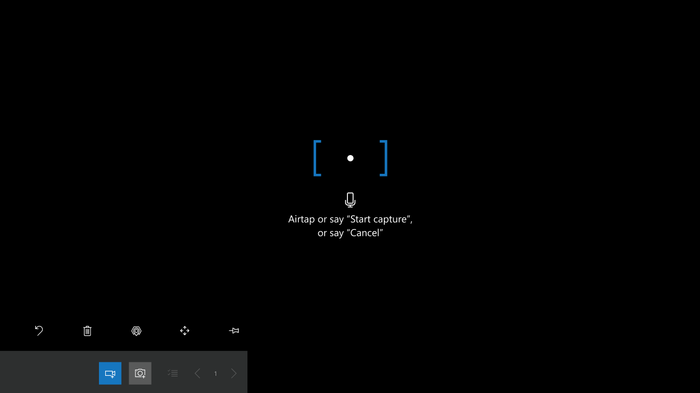
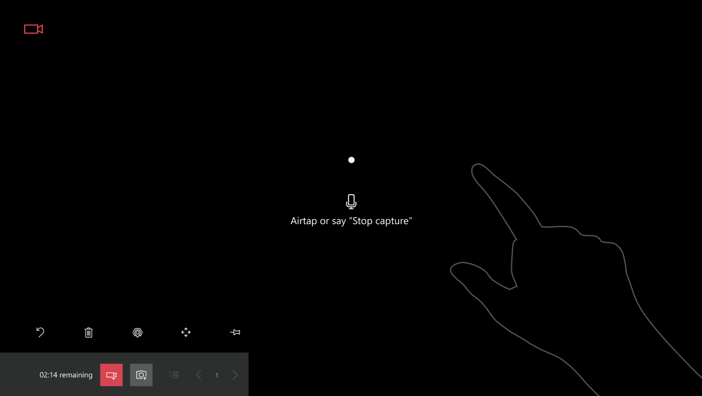

# Capture asset conditions with spatial markup in HoloLens

[!include [rename-banner](~/includes/cc-data-platform-banner.md)]

You can use Dynamics 365 Remote Assist to capture procedures and defects during jobs such as an inspections or repairs. For example, a technician can use Dynamics 365 Remote Assist on HoloLens to capture photos or videos of the equipment they're inspecting, to highlight defects like wear and corrosion. The captures can then be viewed and downloaded from the Dynamics 365 Remote Assist model-driven app by stakeholders within the organization, such as a service manager or site superintendent.

In this tutorial, you'll learn how to use HoloLens to view asset records created from the Dynamics 365 Remote Assist model-driven app and capture photos and videos of assets with spatial markup.

## Prerequisites

To complete this tutorial, you need:

- **Access to the environment Dynamics 365 Remote Assist is installed in**. The account you used to sign in to Dynamics 365 Remote Assist needs access to the environment created in the first step and an active Dynamics 365 Remote Assist license.
- **Dynamics 365 Remote Assist app on HoloLens**. Ensure you have downloaded the latest update to Dynamics 365 Remote Assist through the Microsoft Store. Ensure that you've selected the [correct environment from the app settings](./asset-capture-add-users.md#selecting-the-right-environment-in-hololens).

## Capture asset conditions

### View the asset list

Select the **Assets** tab. The list of assets entered through the Dynamics 365 Remote Assist model-driven app are displayed in descending order by the last-modified date. At the bottom of the window, you can search for assets by using the **Name** field.

> [!NOTE]
> The **Assets** tab is also accessible during a call. For example, while performing a real-time remote inspection, you can capture photos of the assets being inspected to the asset record from the **Assets** tab.

### Capture photos or videos with spatial markup

1. On the **Assets** tab, select an asset from the list. You can also use the search bar at the bottom of the window.

2. Select the ink or arrow tools to mark up the asset in your environment. For example, you can circle an area of corrosion on a pipe.

3. Enable the **Camera** tool to start capturing photos or the **Video** tool to start capturing videos. The camera or video tool remains enabled after you take a photo or video.

4. If taking a photo capture, Air-tap or say the **Snap** voice command to take a picture of the asset with the spatial markup. The photo will be previewed for several seconds, and then saved to Common Data Service.

If taking a video capture, Air-tap or say the **Start capture** voice command to take a picture of the asset with the spatial markup. There will be a timer displayed counting down from the maximum video-length available. There will also be a red video icon to indicate that a video is being recorded. To stop recording the video capture, Air-tap or say the **Stop capture**.

Any existing photo can be selected in the asset view to preview in the HoloLens environment. If the current user took the photo, they can also delete that photo in the preview window.

Currently, captured video playback is not supported in the Dynamics 365 Remote Assist app on HoloLens.

> [!NOTE]
> Captured photos and videos are saved both locally to HoloLens and to Common Data Service, where they're viewable from the Dynamics 365 Remote Assist model-driven app.

## Next step

In this tutorial, you learned how to view assets in HoloLens and capture photos and videos to the asset record with spatial markup. In the next tutorial, you'll learn how to review the captured data from the Dynamics 365 Remote Assist model-driven app.

> [!div class="nextstepaction"]
> [Review asset captures](./asset-capture-review.md)

## Troubleshooting

### No assets appear when I select the Assets tab

1. Ensure that the environment you're using has asset records created in it. More information: [Create asset records](./asset-capture-create-asset.md)
2. Try selecting **Retry** if you're prompted to on the **Assets** tab.
3. If you added the asset records from the model-driven app while Dynamics 365 Remote Assist was already open on HoloLens, close the app on HoloLens and reopen it to pull the latest updates.

### Dynamics 365 Remote Assist says to contact my IT admin on the Assets tab

1. Ensure the app was installed to the right environment. More information: [Install Dynamics 365 Remote Assist model-driven app](./ra-webapp-install.md#install-dynamics-365-remote-assist-model-driven-app)
2. Verify that the user has the **Common Data Service User** and **Remote Assist - App User** or **Remote Assist - Administrator** security roles assigned. More information: [Assign Dynamics 365 security roles](./asset-capture-add-users.md#assign-dynamics-365-security-roles)
3. After following these steps, close the app and the live tile, and then reopen it.

### The asset records I see aren't what I expected to see

The user account might have access to more than one environment with Dynamics 365 Remote Assist installed. If this is the case, you need to select the correct environment you want to use.

1. Select **Settings** > **Dynamics 365 environment**.
2. Select the environment you want from the list.
3. Select the **Assets** tab. You might need to select **Retry**, if prompted.
