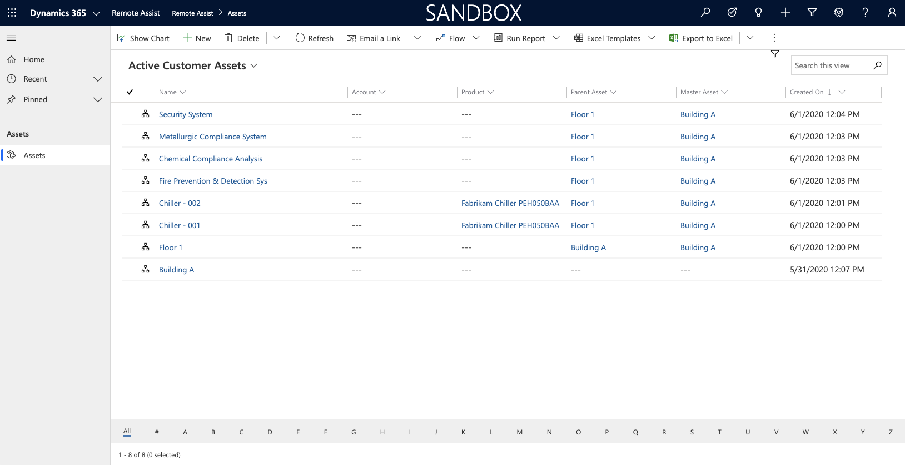
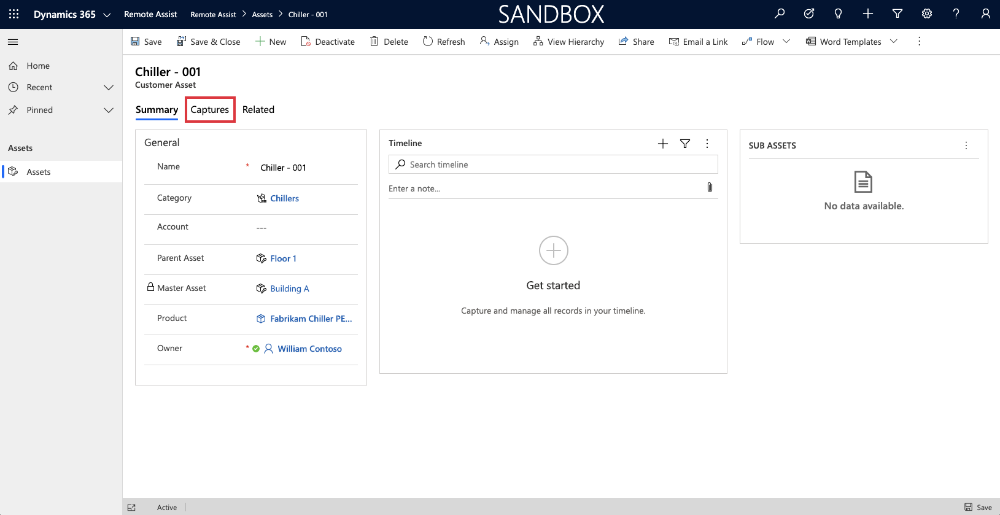
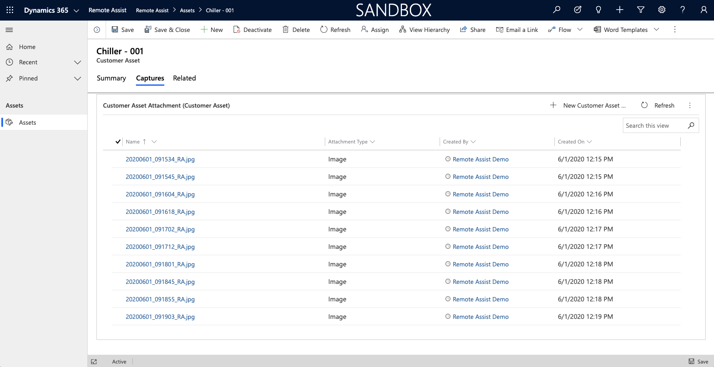
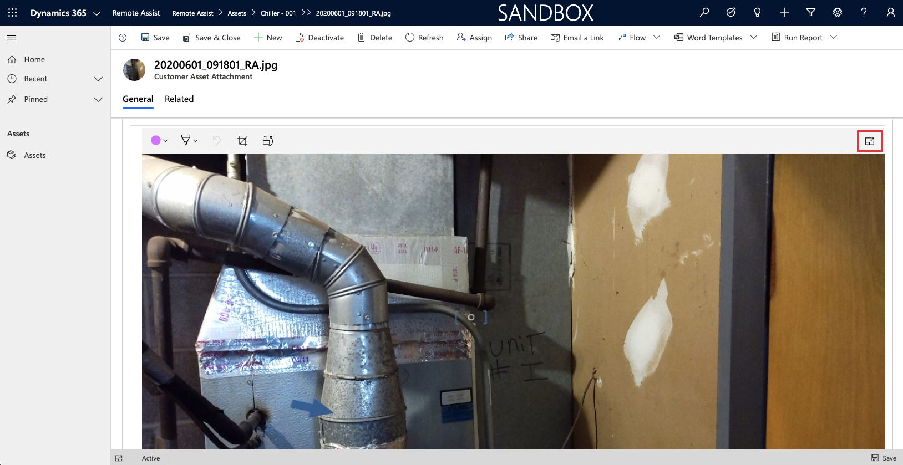
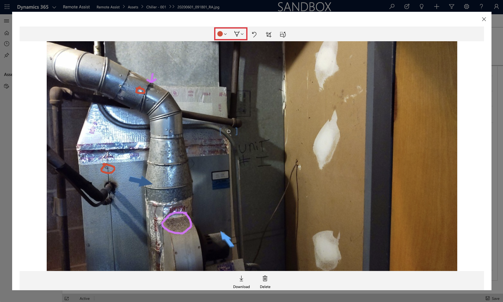
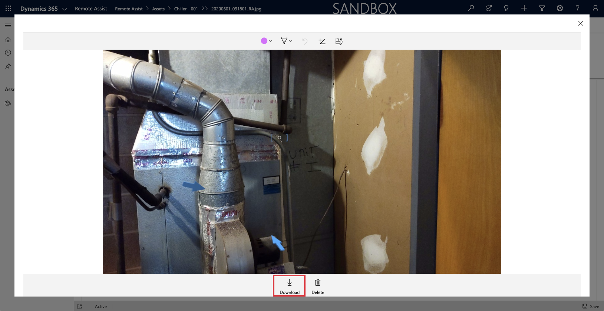
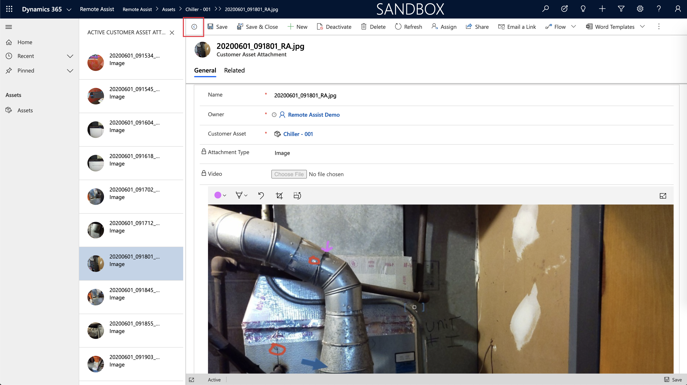

# Review data from asset captures in the Dynamics 365 Remote Assist model-driven app

Captured asset data from HoloLens or the mobile app is saved to Microsoft Dataverse. From there, the data can be viewed from the Microsoft Dynamics 365 Remote Assist model-driven app for validating work performed by technicians in the field, generating reports, and downloading artifacts like photos or videos for use in other applications.

In this tutorial, you'll learn how to access captured asset data through the Dynamics 365 Remote Assist model-driven app and download that data to your computer.

## Prerequisites

To complete this tutorial, you need:

- **Access to the environment Dynamics 365 Remote Assist is installed in**. You'll access the Dynamics 365 Remote Assist model-driven app to view asset data.

## View asset captures

1. From the main menu of your environment, select **Remote Assist** > **Assets**, and then select an existing asset.

    

2. Select the **Attachments** tab on the asset form.

    

3. Select a capture record from the captures subgrid.

    

4. Scroll down to view the image preview. The image can be expanded by selecting the **Full-screen view** button in the upper-right corner of the image preview control.

    

5. The image can be annotated by drawing directly on the image with your mouse. This is helpful for calling attention to objects or defects in the scene.

    

6. Captures can be downloaded by selecting **Download** below the image preview control.

    

7. Quickly switch between captures by selecting the **Open Record set** button to the left of the **Save** button. The captures related to the asset appear on the left.

    

## Next step

In this tutorial, you learned how to view asset captures in the Dynamics 365 Remote Assist model-driven app. Next, learn how to use Power Automate flows to automate your business processes, like generating reports with asset captures or sending an email notification when new asset data is captured.

> [!div class="nextstepaction"]
> [Automate asset capture data](./integrate-power-automate.md)

## Troubleshooting

### Can't find the Dynamics 365 Remote Assist model-driven app

1. Check to see whether you're accessing the right environment by checking the environment name in the URL.

2. Ensure that the app was installed to the right environment. More information: [Install the Dynamics 365 Remote Assist model-driven app](./ra-webapp-install.md#install-the-dynamics-365-remote-assist-model-driven-app)

3. Verify that the user has the **Remote Assist - App User** or the **Remote Assist - Administrator** and **Basic User** security roles assigned. More information: [Assign Dynamics 365 security roles](./asset-capture-add-users.md#assign-dynamics-365-security-roles)

4. Verify that the app is enabled for the **Remote Assist - App User** and **Remote Assist - Administrator** security roles. More information: [Manage app roles](./asset-capture-add-users.md#manage-app-roles)

[!INCLUDE[footer-include](../includes/footer-banner.md)]
