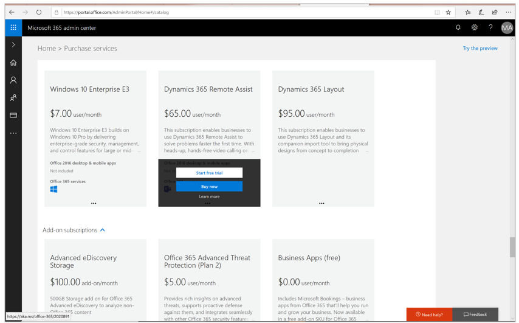
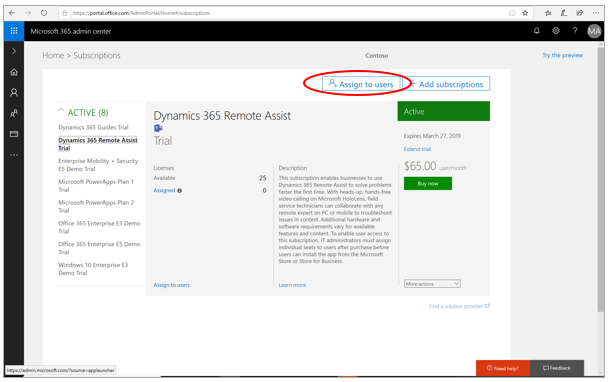
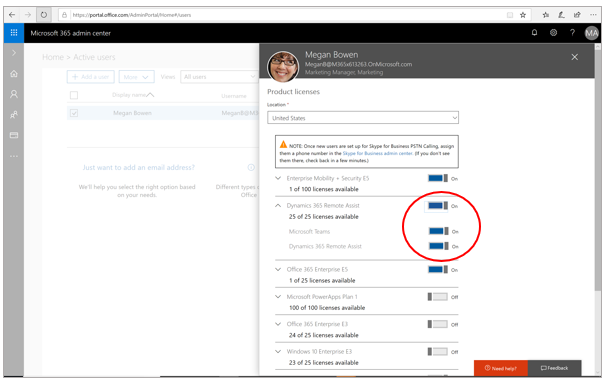

# Buy and deploy Dynamics 365 Remote Assist

With [!include[cc-microsoft](../includes/cc-microsoft.md)] [!include[pn-dyn-365-remote-assist](../includes/pn-dyn-365-remote-assist.md)], you can bridge the gap between the real and digital worlds to complete crucial tasks faster, safer, and more efficiently, and create new ways to connect with customers and partners.

## Subscribe to Dynamics 365 Remote Assist

> [!TIP]
> Did you know you can try [!include[pn-dyn-365-remote-assist](../includes/pn-dyn-365-remote-assist.md)] for free for up to 90 days? [Learn more about the free 90-day trial](try-remote-assist-free.md).

You can subscribe to [!include[pn-dyn-365-remote-assist](../includes/pn-dyn-365-remote-assist.md)] in any of the following ways:

-   Contact a [!include[cc-microsoft](../includes/cc-microsoft.md)] representative by: 
    - Calling us at 1-888-477-7989, or
    
    - Requesting to be contacted at https://aka.ms/getRemoteassist.
    
-   Through the [Microsoft 365 Admin Center](https://admin.microsoft.com/AdminPortal/Home#/catalog). Step-by-step instructions for logging in to the [!include[pn-microsoft-365-admin-center](../includes/pn-microsoft-365-admin-center.md)] and subscribing are provided below.

-   [Enterprise agreements (Volume Licensing Portal)](https://www.microsoft.com/licensing/servicecenter/default.aspx)

-   [Cloud Service Provider (Partner Center Portal)](https://partner.microsoft.com/cloud-solution-provider/csp-partner)

## Subscribe through the Microsoft 365 Admin Center

1. Go to https://admin.microsoft.com/AdminPortal/Home#/catalog.

   
   
2. Log in under your company's admin account.

3. If you don't know who your admin is, contact the IT help desk at your company to find out. [Get more advice on admin accounts](https://support.office.com/article/office-365-admin-overview-c7228a3e-061f-4575-b1ef-adf1d1669870?ui=en-US&rs=en-US&ad=US).

4. Under **Billing** in the left navigation, select **Purchase services**.
   
5. Scroll down to the **Other plans** section.

   
   
6. Find the product card for [!include[pn-dyn-365-remote-assist](../includes/pn-dyn-365-remote-assist.md)].

   
           
7. To subscribe, select **Buy now**.

   > [!NOTE]
   > If you're not ready to buy yet, you can sign up for a free 30-day trial on your organization's tenant by selecting **Start free trial**. The 30-day free trial includes access to [!include[cc-microsoft](../includes/cc-microsoft.md)] Teams for [!include[pn-HoloLens](../includes/pn-HoloLens.md)] users. 
   
8. Assign licenses to users as described in the next procedure.

## Assign licenses to users

After subscribing (or signing up for a free 30-day trial), you’ll need to assign licenses to users in the [!include[pn-microsoft-365-admin-center](../includes/pn-microsoft-365-admin-center.md)] or [Partner Center](https://partner.microsoft.com/cloud-solution-provider/csp-partner). Each user you
assign a license to will need an [!include[pn-azure-active-directory](../includes/pn-azure-active-directory.md)] ([!include[pn-azure](../includes/pn-azure.md)] AD) account.

### Assign a license to a user in the Microsoft 365 Admin Center

1. In the [!include[pn-microsoft-365-admin-center](../includes/pn-microsoft-365-admin-center.md)], under **Billing** in the left navigation, select **Subscriptions**, and then select **Assign to users**.

   
   
2. Select the users you'd like to assign the trial or subscription to, and then in the **Bulk actions** menu on the right side of the screen, select **Edit product licenses**. 

   
   
3. In the **Assign products** screen, select the **Add to existing product license assignments** option, and then select **Next**.

   
   
4. Select the licenses you want to enable for the selected users, and then select **Add**.

   

## Make the Dynamics 365 Remote Assist app available to your users

After you’ve subscribed and assigned licenses to your users through the [!include[pn-microsoft-365-admin-center](../includes/pn-microsoft-365-admin-center.md)] or Partner Center, you can make the [!include[pn-dyn-365-remote-assist](../includes/pn-remote-assist.md)] app available through one of the following:

-   [!include[cc-microsoft](../includes/cc-microsoft.md)] Store for Consumers
-   [!include[cc-microsoft](../includes/cc-microsoft.md)] Store for Business

If you use the [!include[cc-microsoft](../includes/cc-microsoft.md)] Store for Business, you can have users install the app
in any of the following ways:

-   From your organization’s private store
-   From an email link that you send
-   Through mobile device management (MDM)

### Install Dynamics 365 Remote Assist from the Microsoft Store for Consumers

For information on installing the [!include[pn-dyn-365-remote-assist](../includes/pn-dyn-365-remote-assist.md)] app from the [!include[cc-microsoft](../includes/cc-microsoft.md)] Store for Consumers, see the [Dynamics 365 Remote Assist user guide](../remote-assist/user-guide.md). 

> [!NOTE]
> When users launch the [!include[pn-dyn-365-remote-assist](../includes/pn-dyn-365-remote-assist.md)] app, they’ll need to use the same [!include[pn-azure](../includes/pn-azure.md)] AD account that the admin assigned in the [!include[pn-microsoft-365-admin-center](../includes/pn-microsoft-365-admin-center.md)].

### Distribute the app through the Microsoft Store for Business

1.  Go to the [Store for Business](https://businessstore.microsoft.com/store).

2.  [Acquire the app](https://docs.microsoft.com/microsoft-store/acquire-apps-microsoft-store-for-business).

3.  Choose one of the following distribution methods:

    -   [Private store](https://docs.microsoft.com/microsoft-store/distribute-apps-from-your-private-store)
    -   [Email link](https://docs.microsoft.com/microsoft-store/assign-apps-to-employees)
    -   [Mobile device management](https://docs.microsoft.com/microsoft-store/configure-mdm-provider-microsoft-store-for-business)

### See also
[Try Dynamics 365 Remote Assist for free for up to 90 days](try-remote-assist-free.md) 
[Overview of Dynamics 365 Remote Assist](../remote-assist/index.md) 
[Dynamics 365 Remote Assist user guide](../remote-assist/user-guide.md) 

