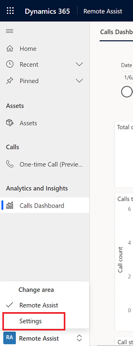
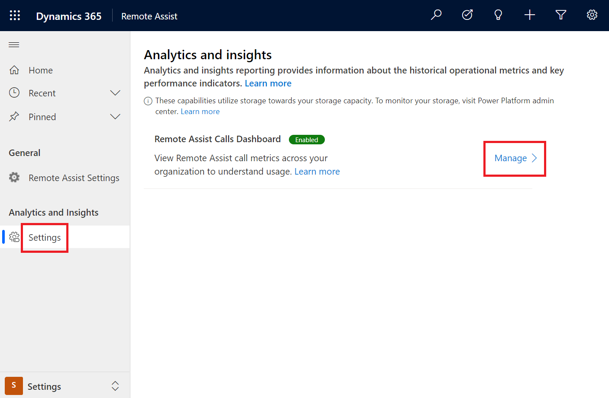
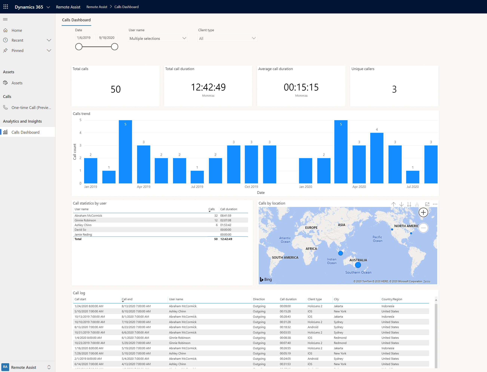

# Dynamics 365 Remote Assist Calls Dashboard

[!INCLUDE[cc-data-platform-banner](../includes/cc-data-platform-banner.md)]

Supervisors and operations managers need to be able to monitor key operational metrics for their organization. Such metrics are critical to get insights such as potential areas of operational efficiencies and efficacy of the various tools and processes within the technician community.

This article walks through the setup and usage of the Calls Dashboard available in the Dynamics 365 Remote Assist model-driven app. The Calls Dashboard is an opt-in feature available only to users with the security role of **Remote Assist - Administrator** or **System Administrator**.

> [!Note]
> This feature is intended to help supervisors and managers derive insights regarding operational efficiencies and usage of Dynamics 365 Remote Assist. This feature is not intended for use in making — and should not be used to make — decisions that affect the employment of an employee or group of employees, including compensation, rewards, seniority, or other rights or entitlements. Customers are solely responsible for using Dynamics 365, this feature, and any associated feature or service in compliance with all applicable laws, including laws relating to accessing individual employee analytics and monitoring. End users will need to enable access from their device to phone call records and specifically consent to sharing location information before that information is shared and available through the dashboard. However, customers are also encouraged to have a mechanism in place to inform their users that analytics (such as call duration and location) relating to their communications are collected.

## Prerequisites

To have access to the Calls Dashboard, you must have:

1. Completed the steps described in the following articles:

    - [Installing the model-driven app](./ra-webapp-install.md)
    
    - [Adding users to the environment](./asset-capture-add-users.md#assign-dynamics-365-security-roles)
    
    - Hello Dataverse nice 

2. Access to the environment that Dynamics 365 Remote Assist is installed in, with the **Remote Assist - Administrator** security role assigned to you.

## Enabling the Calls Dashboard

1. In the Dynamics 365 Remote Assist model-driven app, under **Change area**, select **Settings**.

    .

2. Under **Analytics and Insights**, select **Settings**, and then select **Manage**.

    .

3. Move the slider to the right to enable the dashboard.

    .

### Notes

- The dashboard is built on Microsoft Power BI. It may take some time for the dashboard to get provisioned.

- As a **Remote Assist - Administrator**, you can always go back and disable/re-enable the dashboard by turning it off/on from the **Settings** area as described above. Disabling the dashboard will remove the resources that it depends on.

- The dashboard uses the [phone call entity type](https://docs.microsoft.com/dynamics365/customer-engagement/web-api/phonecall) to generate analytics. End users must [select the right Dynamics environment](./asset-capture-add-users.md#selecting-the-right-environment-from-the-client-app) from their device to send the phone call record to the Common Data Service. The phone call data will not be available in the Calls dashboard if the user hasn't selected the correct environment.

- End users may or may not give location permissions to the Hololens or mobile app. If permission is not granted, for call records from those specific users, location information will be missing.

## Understand the Dynamics 365 Remote Assist Calls Dashboard

.

### Dashboard filters

All visuals described are governed by the filters available at the top of the report. Let's understand what these filters do.

| Filter | Description |
| --- | --- |
| Date | Filters the dashboard to only show metrics for phone call records falling within the specified duration. |
| User name | Select specific users to view only metrics related to them. |
| Client type | Filter the dashboard to only show metrics for phone call records coming from a specific device type. |

Additionally, when you select a slice of data from any of the visuals described below, it will temporarily filter all visuals to that specific set of records. For e.g., if you click on a specific month from the **calls trend** visual, all visuals will be filtered to that month. You can click on that data item again to remove that filter.

### Metrics available in the calls dashboard

Let's take a look at what information is provided by each of the visuals in the calls dashboard.

| Visual | Description |
| --- | --- |
| Total calls | Total number of **unique** Dynamics 365 Remote Assist calls made. There is a phone call record generated for each Dynamics 365 Remote Assist user participating in each call. There is no phone call record generated for Microsoft Teams participants. Call records are disambiguated by the **RemoteAssistCallId** field in the phone call entity. Thus group calls, with three or more Dynamics 365 Remote Assist users are **not** counted multiple times. |
| Total call duration | Total time spent in Dynamics 365 Remote Assist calls aggregated across all phone call records. If there are multiple Dynamics 365 Remote Assist participants in the same call, the time spent by each participant in the call will be added to the total. |
| Average call duration | Average time spent in Dynamics 365 Remote Assist calls, averaged across all phone call records. |
| Unique callers | Total number of **unique** users that participated in a call from the Dynamics 365 Remote Assist app on HoloLens or Mobile. This does not include the number of Microsoft Teams participants. |
| Calls trend | Number of calls made over the selected duration. You can use the drill down capabilities of the visual to see the data by year, month, week or day. |
| Call statistics by user | The number of calls made by and time spent in Dynamics 365 Remote Assist calls per user. |
| Calls by location | Map view of the phone call records, available if the end user has granted permission to share location from their device. You can use the drill down capabilities of the visual to see number of calls by country, state or city. |
| Call log | Details of each phone call record, including call start and end times, owner of the phone call record, direction of the call, time spent by the specific participant in the call, client device type, and location of the call participant if shared. |

## Additional notes

* **SLA**: Data is refreshed every 24 hours. Dashboard will continue to be available during the refresh. If the dashboard is not refreshed within 24 hours, you can contact Microsoft Support. Please note that currently, we do not support a custom refresh schedule.

* **Data Refresh for Inactive environments**: If an organization has no active usage of the dashboard for two continuous weeks, the data refresh will be paused. When a user opens the dashboard, the data will get refreshed in the next refresh cycle.

* Data is retained for 24 months.

* The calls dashboard feature uses storage capacity in the Common Data Service. If this increase in capacity consumption causes issues or concerns, contact Microsoft Support.
