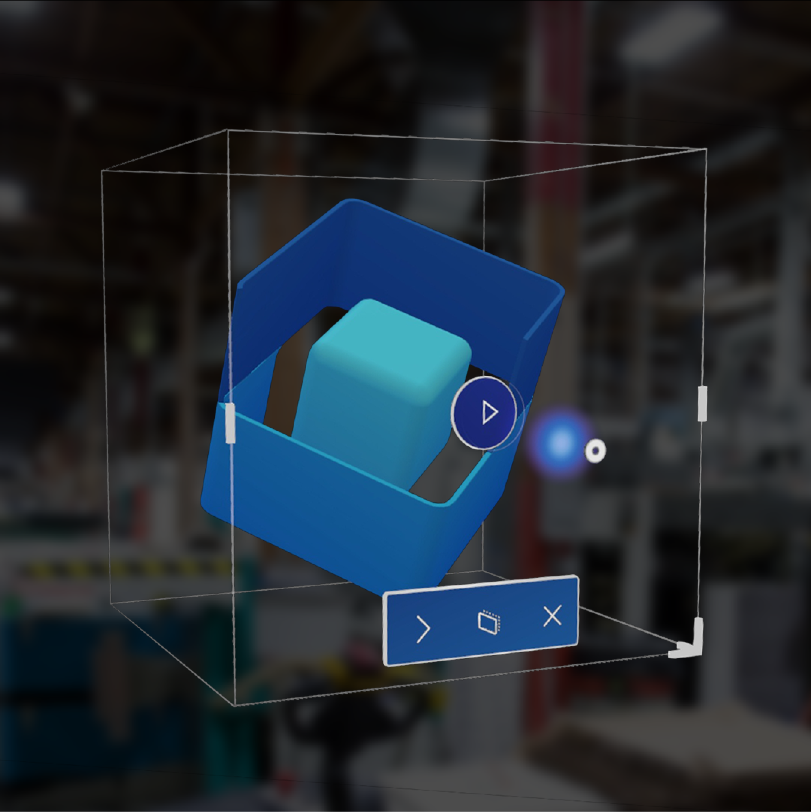

# Close Dynamics 365 Remote Assist on HoloLens

To fully close the app: 

1. Go to the **Start menu**.
2. Select **Home** at the bottom.
3. Look around your space for the 3D app viewer, and press the **X** under the 3D app viewer.

If you want to use Dynamics 365 Remote Assist to show a remote collaborator what you are seeing in another app, see our article about [using Dynamics 365 Remote Assist to get help in a different HoloLens app](get-help-holoLens-app-hololens.md).
