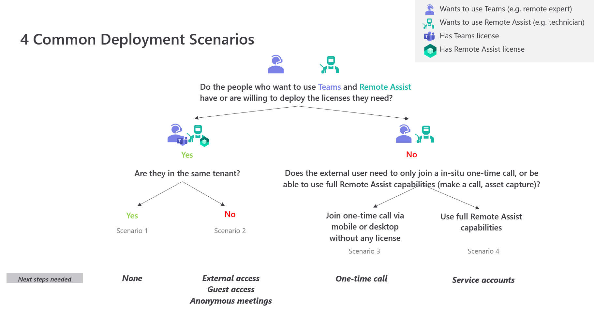

# Deployment scenarios overview 

There are [many types of Remote Assist calls](making-calls-on-remote-assist-mobile.md), some of which include only Remote Assist app users (e.g., a call between two Remote Assist mobile users), and some of which include Remote Assist app users and Teams app users (e.g., a meeting between one Remote Assist HoloLens user and two Teams desktop users). The deployment required to enable users to join the same Remote Assist call depends on several factors. This article describes four common deployment scenarios and the deployment required for each.

 

## Key terms: 
-	Remote Assist user: Someone who uses the Remote Assist app on HoloLens or mobile devices.
-	Teams user: Someone who uses the Teams app on desktop or mobile devices.
-	User with a Remote Assist license: User who has been assigned the service plans that come with a Remote Assist license. [Learn more about licenses](https://docs.microsoft.com/dynamics365/mixed-reality/remote-assist/requirements#licensing-requirements-per-role). 
-	User with a Teams license: User who has been assigned a Teams service plan, which is available through many different licenses. [Learn more about licenses](https://docs.microsoft.com/dynamics365/mixed-reality/remote-assist/requirements#licensing-requirements-per-role). 

## Scenario 1: Call participants have licenses in the same tenant
Remote Assist users and Teams users who want to join the same Remote Assist call already have their respective licenses in the same tenant. Or, they are willing to deploy Remote Assist licenses and Teams licenses in the same tenant. 
After a [standard deployment of Remote Assist](deploy-remote-assist.md) and a [standard deployment of Teams](https://docs.microsoft.com/MicrosoftTeams/user-access), individuals can use their respective apps to participate in a Remote Assist call.   

## Scenario 2: Multi-tenant collaboration 
A company has multiple organizations or business units, each with their own tenant, that want to collaborate via Remote Assist calls. Or, multiple companies want to collaborate via Remote Assist calls. People who want to use Remote Assist already have Remote Assist licenses, or are willing to deploy Remote Assist licenses. People who want to use Teams either already have Teams licenses, are willing to deploy Teams licenses, or are willing to be guested into the Remote Assist user’s tenant. 
Learn more about how to [set up multi-tenant collaboration](multi-tenant-deployment.md) using external access, guest access, or meetings.

## Scenario 3: Vendors and customers join one-time call 
There are several scenarios in which a Remote Assist user wants to enable an external user without a Remote Assist license or Microsoft Teams license--such as a B2B vendor, B2B customer, or B2C customer--to join a Remote Assist call on an ad-hoc, one-time basis. For example, a customer service agent wants to escalate a phone call with their customer to a mixed reality video call. Or, a technician wants to receive assistance from the Original Equipment Manufacturer (OEM) of the asset they are repairing. In these scenarios, the customer service agent or technician wants to enable the external user join a Remote Assist call only on an ad-hoc, one-time basis; they do not want to provide the external user with the ability to collaborate with them via Remote Assist calls long-term.
Learn more about how to [provide an external user with a one-time call link to join a Remote Assist call](one-time-call.md).

## Scenario 4: Vendors and customers use full Remote Assist capabilities 
There are several scenarios in which a Remote Assist user wants to enable an external user without a Remote Assist license--such as a B2B vendor or B2B customer--to use full Remote Assist capabilities. For example, an OEM may want to offer premium customer service by providing their customer with a HoloLens and enabling them to call the OEM as many times as they need to set up a complicated asset. Or, an inspector may have a long-term collaboration with a vendor. The inspector wants the vendor to [capture asset quality outside of a Remote Assist call](NEED LINK FROM DHRUV) or call the inspector so they can assess the asset’s condition together in real time.  

Scenario 4 differs from scenario 3 in several ways. In scenario 4, calls are not ad hoc: the OEM or inspector knows which external user they will be collaborating with ahead of the call. Thus, the OEM or inspector can, for example, schedule a call with the external user, send the external user a HoloLens to use, and provide Remote Assist credentials ahead of the call so the external user does not have to deploy a Remote Assist license themselves. Furthermore, because the external user is using a Remote Assist license, they can also initiate calls to recipients permitted by the OEM inspector, instead of waiting to receive a one-time call link from the OEM or inspector. In contrast, external users in scenario 3 do not want to wait for their customer service agent or the technician they’re assisting to provision a Remote Assist license that enables them to make multiple calls; the external user simply wants an easy way to join a call in-situ. Learn more about how to [deploy a Remote Assist license for external users](vendor-use-RA.md). 

