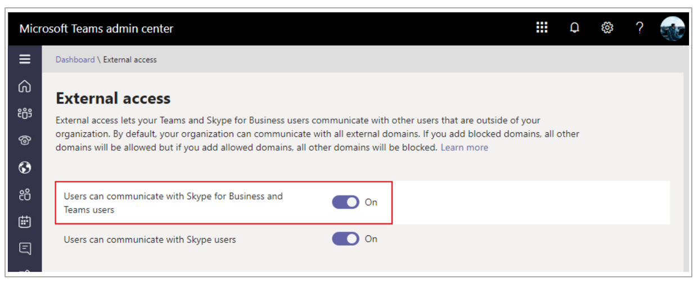
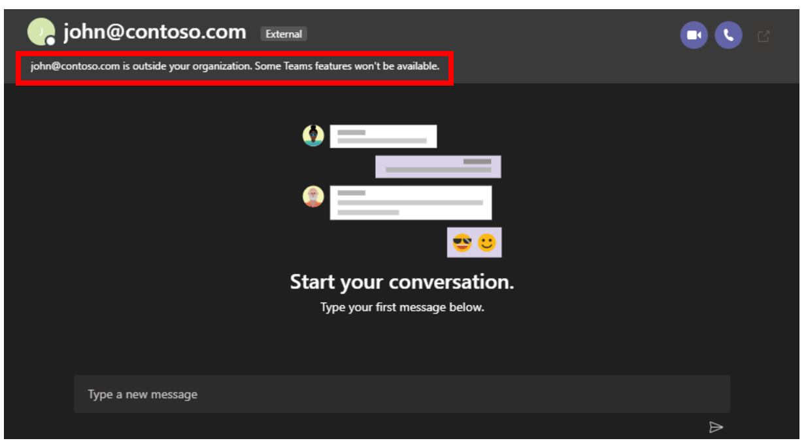

# Set up cross-company calling for Dynamics 365 Remote Assist (for admins)

Users in your organization can make or receive a one-on-one call with a [!include[pn-microsoft-teams](../includes/pn-microsoft-teams.md)] user from another company (domain) if external access is enabled in [!include[pn-microsoft-teams](../includes/pn-microsoft-teams.md)] for each domain. 

> [!NOTE]
> At this time, group calling and file sharing is not available for cross-company calling.

1.	[Enable external access](https://docs.microsoft.com/microsoftteams/manage-external-access) in your [!include[pn-microsoft-teams](../includes/pn-microsoft-teams.md)] admin center. This allows users in your organization to make calls and chat with users outside your domain.

    
 
    By default, users can communicate with users in any other domain that has external access turned on and that has allowed external access with your domain. If you want to restrict this behavior, you can add allowed or blocked domains. For more information, 
see [Manage external access (federation) in Microsoft Teams](https://docs.microsoft.com/microsoftteams/manage-external-access).

2.	To check to see if a contact in another domain has external access enabled in their company’s [!include[pn-microsoft-teams](../includes/pn-microsoft-teams.md)] admin center, try typing the contact's full email address in Teams Desktop. When external access is allowed between both domains, [!include[pn-teams](../includes/pn-teams.md)] shows the following message:

    
    
Users in your organization can also use [guest access](https://docs.microsoft.com/en-us/microsoftteams/guest-access) to allow individual users from outside your organization to join your teams and channels in [!include[pn-microsoft-teams](../includes/pn-microsoft-teams.md)] and make or receive calls. Make sure to follow the steps in this [checklist](https://docs.microsoft.com/en-us/microsoftteams/guest-access) to set up the prerequisites and so [!include[pn-microsoft-teams](../includes/pn-microsoft-teams.md)] owners can add guest users to their teams.
 
### See also

[Dynamics 365 Remote Assist user guide](https://docs.microsoft.com/dynamics365/mixed-reality/remote-assist/user-guide#make-and-receive-calls)
[Guest Access in [!include[pn-microsoft-teams](../includes/pn-microsoft-teams.md)]](https://docs.microsoft.com/en-us/microsoftteams/guest-access)
