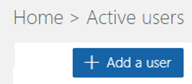

# Deploy Dynamics 365 Remote Assist on HoloLens and Mobile 

After you acquire the 30-day D365 Remote Assist trial licenses, D365 Remote Assist paid licenses, or D365 Remote Assist Attach (for Dynamics 365 Field Service customers only) paid licenses for HoloLens 1, HoloLens 2, and mobile device, IT Admins can assign licenses to users in your organization and then users in your organization can deploy D365 Remote Assist on their devices.

> [!NOTE]
> There are two users for D365 Remote Assist or D365 Remote Assist Attach: Field service technicians and Remote experts. Field service technicians require D365 Remote Assist or D365 Remote Assist Attach licenses **and** a Microsoft Teams license. When you buy D365 Remote Assist or D365 Remote Assist Attach licenses, it includes Micrsoft Teams licenses. Experts require a Microsoft Teams license only. This document only explains how to deploy D365 Remote Assist or D365 Remote Assist Attach for field service technicians. You can find out more information on how to deploy Microsoft Teams licenses for your users [here](https://docs.microsoft.com/en-us/dynamics365/mixed-reality/remote-assist/use-microsoft-teams-with-remote-assist).

In this topic, we’ll walk through the ways you can deploy D365 Remote Assist or D365 Remote Assist Attach (for D365 Field Service customers only): 
-	Assign licenses to users in your organization (for IT Admins only)
-	Deploying D365 Remote Assist on your device (for individuals in an organization) 

## Prerequisites for IT Admins 
- Your organization must have a Microsoft 365 or Office 365 [administrator account](https://www.microsoft.com/en-us/microsoft-365/business/office-365-administration). Learn more about admin permissions [here](https://docs.microsoft.com/en-us/office365/admin/admin-overview/admin-overview?redirectSourcePath=%252farticle%252foffice-365-admin-overview-c7228a3e-061f-4575-b1ef-adf1d1669870&view=o365-worldwide). 
- Your organization must acquired the 30-day D365 Remote Assist trial or paid D365 Remote Assist or D365 Remote Assist Attach (for D365 Field Service customers only) licenses. Obtain 30-day D365 Remote Assist trial licenses [here](try-remote-assist.md) or buy D365 Remote Assist licenses [here](buy-remote-assist.md). 
- Make sure that users in your organization have the required licensing and device before setting up your device. Licensing and Product requirements can be found [here](https://docs.microsoft.com/en-us/dynamics365/mixed-reality/remote-assist/requirements).

## Add and assign licenses to users in your organization (for IT Admins only)

After you have acquired a 30-day D365 Remote Assist trial or paid D365 Remote Assist or D365 Remote Assist Attach (for D365 Field Service customers only) licenses, you can now **add and assign licenses** to *individual users* or a *group of users* in your organization through using the Microsoft 365 or Office 365 administrator portal. 

1.	Log into the M365 or O365 Administrator Portal using your organization’s admin account: https://www.microsoft.com/en-us/microsoft-365/business/office-365-administration

2.	Make sure the **Try the new admin center** toggle is turned off.
###

3.	In the left navigation bar, select **Billing > Subscriptions**. 
###

4.	Select **Assign to users**. 

5.	You can **add individual users** to your free trial or paid subscription to Dynamics 365 Remote Assist. Select **Add a user**. You can find more information about adding users [here](https://docs.microsoft.com/en-us/office365/admin/add-users/add-users?view=o365-worldwide).
###

6.	Fill out the users of your organization you would like to add and be sure to provide them with Dynamics 365 Remote Assist and Microsoft Teams licenses under the **Product licenses** section. If you were using a Dynamics 365 Remote Assist Attach license, you would do the same actions. 

7.	You can also **add multiple users** to your free trial or paid subscription to Dynamics 365 Remote Assist or Dynamics 365 Remote Assist Attach. Select **More > Import multiple users**. Fill out the CSV file, set user options, and view your results. 

8.	After you have added your multiple users to your free trial or paid subscription to Dynamics 365 Remote Assist or Dynamics 365 Remote Assist Attach, you can now **assign licenses** to them through the Microsoft 365 or Office 365 administrator portal through instructions [here](https://docs.microsoft.com/en-us/office365/admin/manage/assign-licenses-to-users?view=o365-worldwide). Note: You can assign licenses Dynamics 365 Remote Assist to up to 20 users on the Licenses page or you can assign licenses to multiple users on the Active users page. 

9. The users in your organization can now set up Dynamics 365 Remote Assist on their device. Instructions below. 

## Prerequisites for setting up your device (for individuals in an organization)
- The IT Admin of your organization must add you as a user and assign you D365 Remote Assist or D365 Remote Assist Attach license **and** Microsoft Teams license in the Microsoft 365 or Office 365 administrator portal, instructions are above. 
- A [Microsoft Teams account](https://teams.microsoft.com/start). Sign up, sign in, and add your Contacts. More information can be found [here](https://docs.microsoft.com/en-us/dynamics365/mixed-reality/remote-assist/use-microsoft-teams-with-remote-assist). 
- A HoloLens 1, HoloLens 2, or mobile device. Licensing and Product requirements can be found here.

## Deploying Dynamics 365 Remote Assist on your device (for individuals in an organization)

After your IT Admin of your organization assigned you Dynamics 365 Remote Assist or Dynamics 365 Remote Assist Attach licenses and Teams licenses, users can start using the app on their HoloLens 1, HoloLens 2, or mobile devices. 

### Steps for HoloLens 1 and 2
1.	If you’re using the HoloLens, go to the Start menu and then select Microsoft Store. 
2.	Search for and download Dynamics 365 Remote Assist and launch the app.
3.	Sign into Dynamics 365 Remote Assist with your Microsoft Teams account. 
4.	If you are trying a free trial, it will prompt you to start your Free Trial of Dynamics 365 Remote Assist. Select Continue. Afterwards, you will be taken to your Contacts page.  
5.	If you already bought your D365 Remote Assist or D365 Remote Assist Attach and Microsoft Teams licenses, you will be taken to your Contacts page.  
6.	Learn how to make calls using [HoloLens 1](making-taking-calls-hololens-1.md), [HoloLens 2](making-taking-calls-hololens-2.md), or [mobile devices](making-calls.md). 

### Steps for Mobile
1.	If you’re using a mobile device, go to the appropriate iOS and Android app store.
2.	Search for and download Dynamics 365 Remote Assist and launch the app.
3.	Sign into Dynamics 365 Remote Assist with your Microsoft Teams account. 
4.	If you are trying a free trial, it will prompt you to start your Free Trial of Dynamics 365 Remote Assist. Select Continue. Afterwards, you will be taken to your Contacts page.  
5.	If you already bought your D365 Remote Assist or D365 Remote Assist Attach licenses that includes Microsoft Teams licenses, you will be taken to your Contacts page.  
6.	Learn how to make calls to a remote expert on Microsoft Teams (desktop and mobile) here. 

## Next steps
- Learn how to use Remote Assist on [HoloLens 1](user-guide.md). 
- Learn how to use Remote Assist on [HoloLens 2](user-guide.md). 
- Learn how to use Remote Assist on [mobile devices](index.md). 
