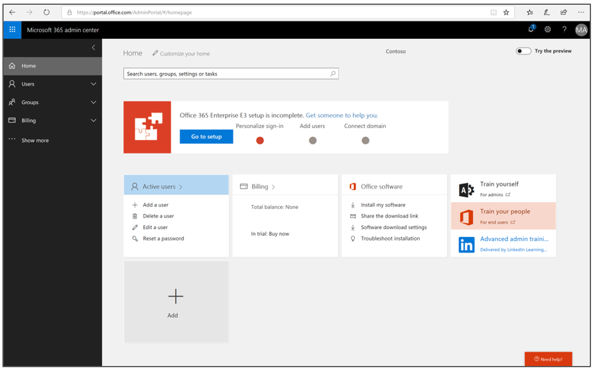
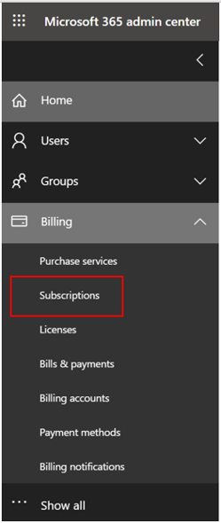
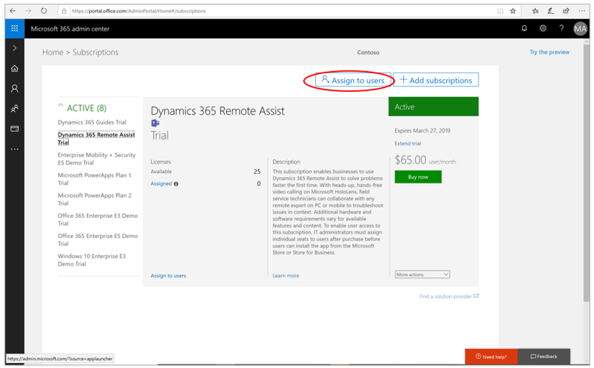
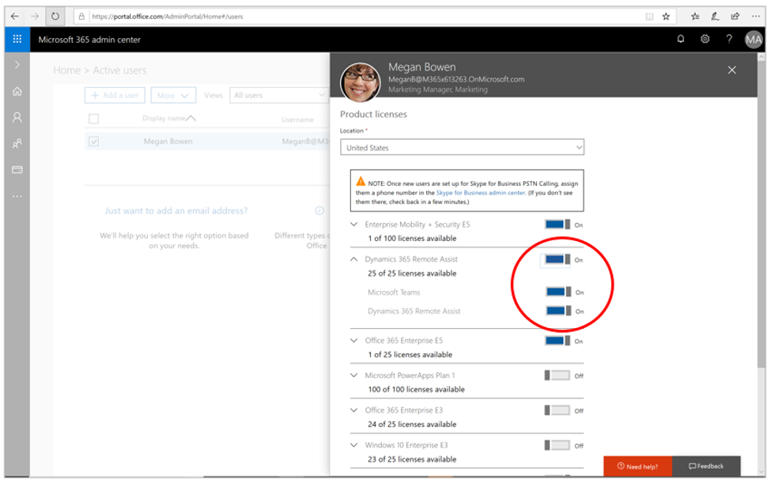
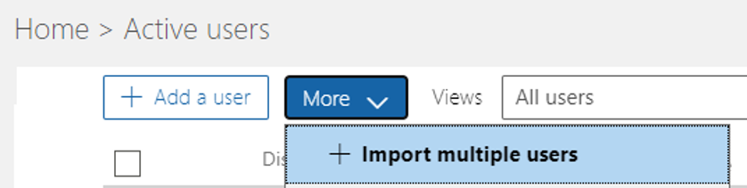

# Deploy Dynamics 365 Remote Assist

Once you have either a [trial](try-remote-assist.md) or have [purchased](buy-remote-assist.md) for Dynamics 365 Remote Assist, you can assign licenses to users. Once assigned, users can deploy Remote Assist on their individual devices.

> [!Note]
> There are two types of users for Remote Assist and Remote Assist Attach: remote experts and field service technicians. Field service technicians require a Remote Assist **and** a Microsoft Teams license. When you buy Remote Assist licenses, Micrsoft Teams licenses are included. However, remote experts (who aren't in the field) require only a Microsoft Teams license. For more information, visit the article on [deploying Microsoft Teams licenses in your organization](https://docs.microsoft.com/dynamics365/mixed-reality/remote-assist/use-microsoft-teams-with-remote-assist).

In this article, we’ll walk through how to deploy Remote Assist or Remote Assist Attach (for Field Service customers): 
-	Assign licenses to users in your organization (for IT Admins)
-	Deploying Remote Assist on your device (for individuals in your organization) 

You can also learn how to configure [deploy multi-tenant company deployments](multi-tenant-deployment.md) or [enable vendors and contractors to use Remote Assist](vendor-use-RA.md).

## Add and assign licenses

### Prerequisites 
- Your organization must have a Microsoft 365 or Office 365 [administrator account](https://www.microsoft.com/microsoft-365/business/office-365-administration). For more information, [learn more about admin permission](https://docs.microsoft.com/office365/admin/admin-overview/admin-overview?redirectSourcePath=%252farticle%252foffice-365-admin-overview-c7228a3e-061f-4575-b1ef-adf1d1669870&view=o365-worldwide). 
- You'll need either a free trial of Remote Assist, or have purchased licenses. Visit our articles on [free trials](try-remote-assist.md) and [buying Remote Assist](buy-remote-assist.md) for more information.
- Make sure that users in your organization have the required licensing and devices. For more information, visit the article on [licensing and product requirement](https://docs.microsoft.com/dynamics365/mixed-reality/remote-assist/requirements).

>[!Note] 
> The Microsoft Teams license included with Remote Assist allows you to collaborate with Teams users and use *most* Remote Assist features. Additional features that use other products (for instance, OneDrive for file sharing) require an [Office 365 Business Premium or Office 365 Business Essentials license](https://products.office.com/compare-all-microsoft-office-products?&activetab=tab:primaryr2). Learn more about how to [manage Office 365 licenses](https://docs.microsoft.com/microsoft-365/commerce/licenses/buy-licenses?view=o365-worldwide).

### Adding and assigning licenses
Once prerequisites are met, you can now add and assign licenses to *individual users* or a *group of users* in your organization through the Microsoft 365 or Office 365 administrator portal. 

1.	Log into the [Microsoft 365 or Office 365 administrator portal](https://www.microsoft.com/microsoft-365/business/office-365-administration ) using your organization’s admin account.

2.	Make sure the **Try the new admin center** toggle is turned off.

3.	In the left navigation bar, select **Billing** > **Subscriptions**. 

4.	Select **Assign to users**. 

1. Select **Add a user**. For more information, visit the [Office 365 article on adding users](https://docs.microsoft.com/office365/admin/add-users/add-users?view=o365-worldwide). You can find more information about adding users].

6.	Find the users in your organization that you want to add; make sure to provide them with Dynamics 365 Remote Assist and Microsoft Teams licenses under the **Product licenses** section. 

7. To add multiple users, go to **More** > **Import multiple users**. Fill out the CSV file, set user options, and view your results. 

8.	After you have added a user or users, you can now assign licenses to them through the Microsoft 365 or Office 365 administrator portal. Visit [this Office 365 article for instructions](https://docs.microsoft.com/office365/admin/manage/assign-licenses-to-users?view=o365-worldwide).

Users in your organization can now set up Remote Assist on their devices! Let's see how. 

## Deploying on your devices

After sorting out your licenses, users can setup and use the app on their HoloLens, HoloLens 2, or mobile devices. 

### Prerequisites
- Your organization's IT admin must add you as a user and assign you a Remote Assist license **and** Microsoft Teams license in the Microsoft 365 or Office 365 administrator portal, as described in this article's first section. 
- A [Microsoft Teams account](https://teams.microsoft.com/start). Visit our topic on [using Teams with Remote Assist](https://docs.microsoft.com/dynamics365/mixed-reality/remote-assist/use-microsoft-teams-with-remote-assist) for more information. 
- Azure Active Directory [Premium Trial](https://azure.microsoft.com/trial/get-started-active-directory/) (for HoloLens users only)
- A HoloLens, HoloLens 2, or mobile device. Licensing and product requirements can be found [here](https://docs.microsoft.com/dynamics365/mixed-reality/remote-assist/requirements).

### Steps for HoloLens and HoloLens 2
1.	Go to the **Start** menu and then select **Microsoft Store**. 
2.	Search for and download **Dynamics 365 Remote Assist** and launch the app.
3.	Sign into Remote Assist with your Microsoft Teams account. 
4.	You'll be taken to your Contacts page. Note that if you're using a free trial, you'll be prompted to start your **Free Trial of Dynamics 365 Remote Assist**. 
5.	You can now use Dynamics 365 Remote Assist on your HoloLens or HoloLens 2! Next up, [learn how make calls](making-taking-calls-hololens.md). 

### Steps for mobile devices
1.	Go to the appropriate iOS and Android app store.
2.	Search for and download **Dynamics 365 Remote Assist** and launch the app.
3.	Sign into Remote Assist with your Microsoft Teams account. 
4.	You'll be taken to your Contacts page. Note that if you're using a free trial, you'll be prompted to start your **Free Trial of Dynamics 365 Remote Assist**.
5.	You can now use Dynamics 365 Remote Assist on your mobile device! Next up, [learn how make calls](mobile-app/making-calls-with-ar.md). 

>[!Note]
> For Enterprise environments that manage application deployments using an MDM provider, please contact d365rafb@microsoft.com for assistance obtaining the Remote Assist mobile application binary.

## Next steps
- [Set up Microsoft Teams on PC or mobile for various scenarios](set-up-teams.md).
- [Install Dynamics 365 Remote Assist model-driven app] asset-capture-setup-environment.md
