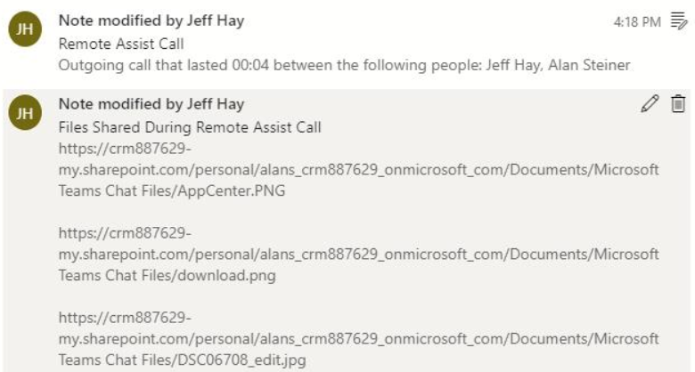

# Display a file and save shared files to OneDrive or your work order

During your repair or inspection, you and your collaborators may want to view, refer to, and annotate an image or PDF. 
For example, a remote collaborator can share a reference image to help you better understand what an asset should look like after you've successfully repaired it. You can show remote collaborators a PDF of instructions you were following before you called a remote collaborator.

After the file appears in your space, any call participant can annotate the file, just as they would annotate any physical object.

## Display a OneDrive file in your space

To display a OneDrive file during a video call, select the OneDrive icon (as seen here: ), or say “Remote Assist, OneDrive” and select the file. The file will pop up as a new slate in your space. Your remote collaborators will be able to see the image or PDF file as long as you’re looking at it. Supported files include: 
- .jpg
- .bmp 
- .png
- .tif or .tiff 
- .pdf
- still .gif 

At this time, a link to the OneDrive file will *not* be sent in the chat.

## Save a file shared by a remote collaborator to OneDrive

When a Teams user shares a file from OneDrive or from their device, it will appear as a new slate in your space. A link to the file will be shared in the chat. Even after the call ends, you can find the link in your Teams chat. 

You may also want to save the file to your OneDrive for future reference. For example, the Teams user may send a PDF of a schematic you can use in future repairs, so you want to save it to your OneDrive and share the OneDrive file with others. 

To save the file to OneDrive, select the OneDrive icon (as seen here: ) in the top right of the slate. The OneDrive file is then automatically saved to a folder called **HoloLens Received Files**.

>[!Note]
>The top right corner of the PDF displays the page number you’re currently on as well as the total number of pages. You can use the **Previous** and **Next** arrows to navigate pages. If you're looking at a PDF with many pages, you may want to jump to a specific page. To just to a page, select the current page number you;re on. A numeric keyboard will pop out. Select the page number you want to go to.

You can annotate files just like you annotate your space.

## Save a file shared by a remote collaborator to your work order

Field Service organizations often want to capture tribal knowledge and relevant contextual information from their technicians in the field. Contextual information includes the schematics and reference images the remote collaborator shares to assist with an issue. These files can be used for training and to build a knowledgebase for faster problem resolution and first-time fix rate. 

If you made a Remote Assist call in the context of a Field Service booking, you can save the schematics and reference files the remote collaborator shared to the work order that the booking is associated with. When the call ends, you'll see a list of files the remote collaborator shared, as seen in the following screenshot.

 
Select **Post All** to save the files to work order, along with the **Call Log**. The **Call Log** includes the names of the call participants and the call duration.

Specifically, two new notes will be created and attached to the work order. As shown in the following screenshot, one note will include call log info, and the other note will include a plain text link to each file. 

 
