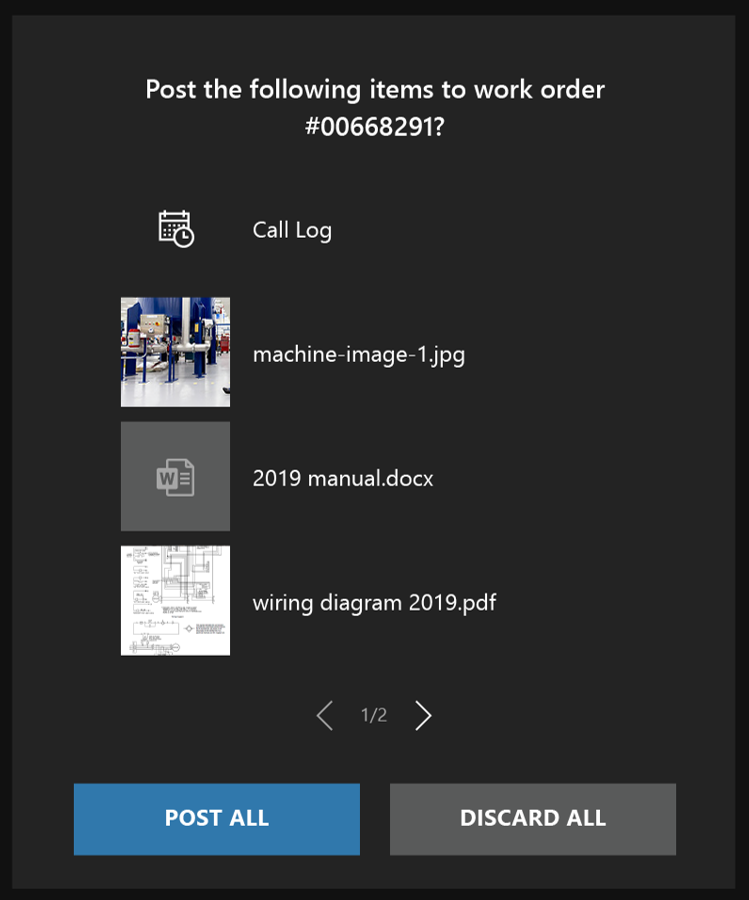

# View service-related documentation and save shared files

During your repair or inspection, you may want to refer to an image or PDF related to the asset or procedure you are completing.
For example, you can place a wiring diagram in the space next to the asset you are working on. During a video call, a remote collaborator can share a reference to help you better understand what an asset should look like after you've successfully repaired it.

If you're in a video call, any call participant can annotate the file, just as they would annotate any physical object.

## Prepare your workspace with files from OneDrive

Files are accessible at any time in Dynamics 365 Remote Assist. You do not need to be in a call to access your files from OneDrive and place them in your workspace. To display a OneDrive file, select the **Files tab**, or say “Remote Assist, Files" and select the file. The file will pop up as a new slate in your space. If you are on a video call, remote collaborators will be able to see the image or PDF file as long as you’re looking at it. Supported files include:

- .jpg
- .bmp 
- .png
- .tif or .tiff 
- .pdf
- still .gif 

At this time, a link to the OneDrive file will *not* be sent in the Teams chat if you open a file during a call.

## Save a file shared by a remote collaborator to OneDrive

When a Teams user shares a file from OneDrive or from their device during a video call, it will appear as a new slate in your space. A link to the file will be shared in the chat. Even after the call ends, you can find the link in your Teams chat. 

You may also want to save the file to your OneDrive for future reference. For example, the Teams user may send a PDF of a schematic you can use in future repairs, so you want to save it to your OneDrive and share the OneDrive file with others. 

To save the file to OneDrive, select the OneDrive icon (as seen here: ) in the top right of the slate. The OneDrive file is then automatically saved to a folder called **HoloLens Received Files**.

>[!Note]
>The top right corner of the PDF displays the page number you’re currently on as well as the total number of pages. You can use the **Previous** and **Next** arrows to navigate pages. To navigate to a specific page, select the current page number. A numeric keyboard will pop out. Select the page number you want to navigate to.

## Save a file shared by a remote collaborator to your work order

Field Service organizations often want to capture tribal knowledge and relevant contextual information from technicians, inspectors, and remote collaborators. Contextual information includes the schematics and reference images that call participants share. These files can be used for training and building a knowledge base for faster problem resolution and first-time fix rate. 

If you made a Dynamics 365 Remote Assist call in the context of a Field Service booking, you can post the files shared during the call to the work order that the booking is associated with. When the call ends, you'll see a list of files that you and any remote collaborator shared, as seen in the following screenshot.

 
Select **Post All** to save the files and **Call Log** to the work order. The **Call Log** includes the names of the call participants and the call duration.

Specifically, two new notes will be created and attached to the work order. One note will include call log info, and the other note will include a plain text link to each file. 

[!INCLUDE[footer-include](../includes/footer-banner.md)]
