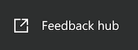
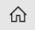
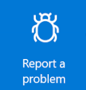
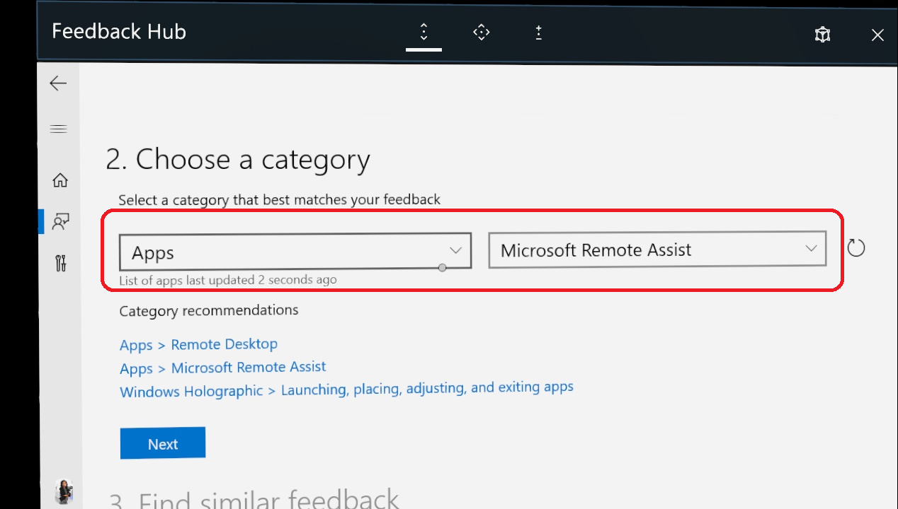

# Frequently asked questions for Dynamics 365 Remote Assist HoloLens

Here are some answers to common questions about using Dynamics 365 Remote Assist on HoloLens and HoloLens 2. In general, you can request help using our [Dynamics 365 Remote Assist Community Forum](https://community.dynamics.com/365/remoteassist). And if you'd like to suggest an idea or vote for future ideas, try our [Dynamics 365 Remote Assist Ideas Portal](https://experience.dynamics.com/ideas/categories/?forum=4323c621-52bc-e811-a975-000d3a1bec70&forumName=Dynamics%20365%20Remote%20Assist). 

## How can I tell what version I'm using?

In Remote Assist HoloLens, go to the **Settings tab**, and then find the version number in the bottom left of the screen.

## How can I use the newest version of Dynamics 365 Remote Assist?

There are several ways to [update your app](https://docs.microsoft.com/hololens/holographic-store-apps#update-apps). [Learn about the newest version of Dynamics 365 Remote Assist.](version-history-remote-assist-hololens.md)

## What languages is Remote Assist HoloLens available in?

Remote Assist on HoloLens is available in English. As of October 2018, it's also [available in Simplified Chinese and Japanese](https://docs.microsoft.com/windows/mixed-reality/release-notes-october-2018#for-international-customers). Learn how to [switch to the Chinese or Japanese version of HoloLens](https://docs.microsoft.com/hololens/hololens1-install-localized).

Remote Assist on HoloLens 2 is available in the [following languages](https://docs.microsoft.com/hololens/hololens2-language-support).

## Why am I not getting incoming call notifications?

This can happen if you’re signed in to Remote Assist with a different account than the one you used to sign in to your HoloLens. Make sure you’re signed into both the app and the device with the same account. 

## I see a message saying I have no internet connection.

To use Remote Assist, you need an internet connection. For more information about connecting to the internet on your HoloLens, visit [this support article](https://support.microsoft.com/help/12629).

## Remote Assist is frozen or unresponsive.

Try closing and reopening Remote Assist. If you’re still having problems, [restart your HoloLens](https://support.microsoft.com/help/12642).

## Remote Assist isn't showing my contacts.

If you don’t see the contacts you expect, try the following actions:

- Make sure you’ve signed in to Teams at least once with the account you’re using on your HoloLens.

- Close and reopen Remote Assist.

- [Restart your HoloLens](https://support.microsoft.com/help/12642).

## The Mixed Reality toolbar doesn’t appear on the Teams desktop application during a Remote Assist call.

This might happen if Teams has downloaded a new version of the client application in the background but is still running the older version of the app. Restarting your PC will usually fix this issue. This also might happen if the Remote Assist HoloLens user has lost tracking.

## Why does audio sometimes cut out even in quiet environments?

If Remote Assist is used in a loud environment, use headphones on both ends for better communication. Using headphones for both users prevents any echo filtering from proactively turning on noise cancellation, which turns off audio.

## I signed in to my HoloLens, but I still can't sign in to Remote Assist.

If you’re having trouble signing in to Remote Assist, try the following:

- Make sure you’re using a work or school account, not a Microsoft account (MSA), to sign in to HoloLens.

-  Make sure that the work or school account you’re using has a valid [Office 365 Business](https://products.office.com/business/office) Premium or Essentials subscription with [Microsoft Teams](https://products.office.com/microsoft-teams/group-chat-software) enabled.

- Make sure your HoloLens is connected to the internet.

- Check with your administrator to make sure your device and network are set up to work with Remote Assist.

## Can I share files from SharePoint on Remote Assist?

No, you can only share local files and files from OneDrive.

## Can a Teams desktop user show the Remote Assist HoloLens user a video or PowerPoint?

Yes. We understand that technicians, inspectors, and remote collaborators want to refer to a wide variety of resources and reference documents during the call. By using the Teams desktop **Share** feature, the Teams desktop user can show the Remote Assist HoloLens whatever they are looking at on their desktop or in a specific application window. For example, the Teams desktop user can show the technician a video playing in a web browser. Furthermore, because the Teams desktop user's screen or application window is shared in real time, all call participants will see when the Teams desktop user pauses or restarts the video. 

## When a Remote Assist call ends, how can I access the messages, snapshots, and files from the call?

All messages, links, or images sent in the text chat will be available for all participants via Teams chat, but not via Remote Assist chat. Additional details below.

**Snapshots from Remote Assist HoloLens user:** Snapshots are saved differently depending on whether the Remote Assist call is associated with a Dynamics 365 Field Service booking.
- If a Remote Assist call is associated with a booking, the Remote Assist user will take a snapshot and decide whether to save it to OneDrive or to the booking.
- If a Remote Assist call is not associated with a booking, the Remote Assist user’s snapshot will automatically be saved in OneDrive.  

Then, regardless of how snapshots are saved, a link to the snapshot is sent via the text chat, and the Teams user can view the snapshot and also view the link to the snapshot. 

**Files:** When a Teams user shares a file, a link to the file is sent in the chat. During the call, the Remote Assist user can use the controls in the top-right corner of a file to save it to their OneDrive.  

## How can I improve hologram stability?

Hologram stability refers to how well a placed hologram stays where you placed it – be this perceptual or actual.

- *Perceptual* instability could refer to a hologram that seems to move with your head motion, instead of tracking the placed position in space.
- *Actual* instability could refer to a hologram whose coordinates have changed in virtual space, or whose position relative to a real-world object has shifted regardless of user input or head tracking.

Holograms are always going to be most stable **when your head (not your eyes) is pointed directly at them**. The expected tolerance for hologram stability is that they remain within 1 cm of the placed position for every 1 m of distance from the device.

To improve hologram stability, complete eye calibration. 

- To complete eye calibration on HoloLens, [manually start the calibration process]( https://docs.microsoft.com/hololens/hololens-calibration#calibrating-your-hololens-1st-gen). 
- HoloLens 2 will prompt you to calibrate the device under several circumstances. [Complete eye calibration]( https://docs.microsoft.com/hololens/hololens-calibration#calibrating-your-hololens-2) when requested. It will only take about 20 seconds. 

## Multiple people in my organization use Remote Assist on the same HoloLens. How do I clean my HoloLens?

Learn how to clean [HoloLens](https://docs.microsoft.com/hololens/hololens1-hardware#care-and-cleaning) and [HoloLens 2](https://docs.microsoft.com/hololens/hololens2-maintenance). 

## Can I save call artifacts to a Field Service work order?

Yes! If you opened a Field Service booking and then made a Remote Assist call, at the end of the call, you'll be prompted to post the call log and files shared during the call to the work order associated with that booking.

To view the call log and files, sign into Field Service and select the work order. Two new notes will have been created and attached to the work order. One note will include call log info. The other note will include and a link to each file in plain text. You can also edit the note to include the Stream link of the recorded call, which can be found in your Teams chat.

For more information, visit our article on [displaying and saving files](display-save-files.md).

## How do I file a support ticket?

If you encounter an issue that blocks you from using the application and you do not see an answer on our [user forum](https://community.dynamics.com/365/remoteassist), please [file a support ticket](https://support.microsoft.com/supportforbusiness/productselection?sapid=e9391227-fa6d-927b-0fff-f96288631b8f). Support will work directly with you and communicate daily until the issue is resolved.  

## How do I report a bug?

If you encounter an issue, use the HoloLens Feedback Hub to let us know so we can resolve it in future releases.

There are two ways to get to the HoloLens Feedback Hub application to report a bug. 

1. From the **Start menu**: At any time, you can go to the **Start menu** and launch **Feedback Hub**. 
2. From Remote Assist: Select the **Settings tab** from the left navigation. Select the **Links** sub tab, and in the **Links** section, select **Feedback Hub** to launch **Feedback Hub**. 

When you're in the HoloLens Feedback Hub: 

1. From the home tab (represented by this icon, select **Report a problem**, as seen in the following screenshot.

2. In the **Enter your feedback** section, summarize your feedback. To type, tap the text field and a holographic keyboard will appear. Then, select **Next**. To edit your response to any step after you’ve chosen **Next**, select **Edit**, which is to the top right of the text field. 
3. In the **Choose a category** section, categorize the issue using "Apps" and "Microsoft Remote Assist." To select an item in the drop-down menu, select the menu.
   - If you're using HoloLens, scroll by gazing at the content of the app window. Tap and hold and then move your hand slightly upwards or downwards to scroll the content.
   - If you're using HoloLens 2, scroll by placing your finger on the drop-down menu and move your finger up and down, as you would on a touch screen device. 

4. In the **Find similar feedback** section, select "Make new bug."
5. In the **Additional details** section:
   - Optionally select "Consider this a blocking issue."  
   - Categorize your problem.
6. Select **Recreate your problem**:
   - Select **Start recording**.
   - Use the start menu to launch Remote Assist and replicate the issue.
   - When you're finished replicating the issue, use the start menu to return to **Feedback Hub**.
   - Select **End recording**.
   - Diagnostic data, a video, and audio from the recording will be attached. You may remove each one if you want to. 

> [!Note]
> Optionally, check the "This is blocking me" box if the issue is blocking you from completing your work or tasks. 

