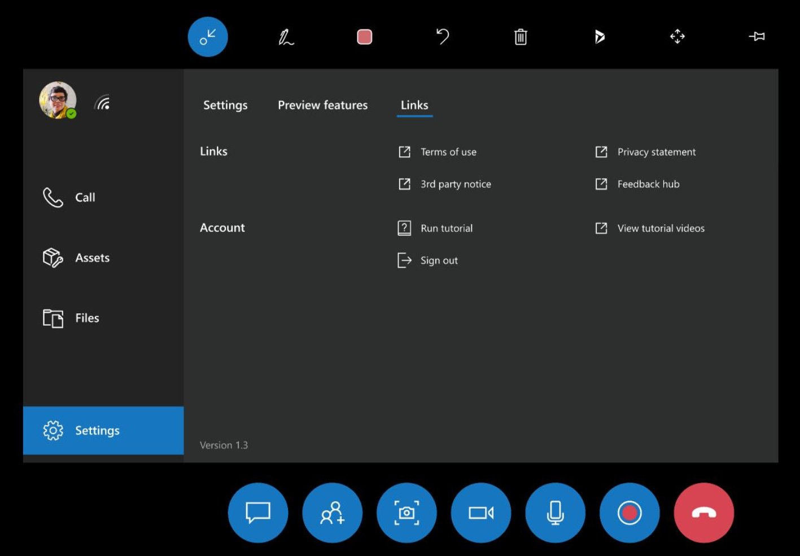

# Frequently asked questions about Dynamics 365 Remote Assist HoloLens

[!INCLUDE[try-guides-ra](../includes/try-guides-ra.md)]

Here are some answers to common questions about using Dynamics 365 Remote Assist on HoloLens 2. In general, you can request help using our [Dynamics 365 Remote Assist Community Forum](https://community.dynamics.com/forums/thread/?partialUrl=remoteassist). 

## How can I tell which version I'm using?

In Remote Assist HoloLens, go to the **Settings tab**, and then find the version number in the bottom left of the **Settings** page.

## How do I get the latest version of Dynamics 365 Remote Assist?

There are several ways to [update your app](/hololens/holographic-store-apps#update-apps). [Learn about the newest version of Dynamics 365 Remote Assist.](version-history-remote-assist-hololens.md)

## What languages is Dynamics 365 Remote Assist HoloLens available in?

Dynamics 365 Remote Assist on HoloLens 2 is available in the [following languages](/hololens/hololens2-language-support).

## Does Dynamics 365 Remote Assist support QR-code scanning?

A HoloLens user can scan a QR code (for example, to go directly to a specific URL when using the browser) from the OS shell (outside of an immersive application). You can't scan a QR code from Dynamics 365 Remote Assist. 

## How do I stream my HoloLens view to a PC using Miracast?

The Connect app for wireless projection using Miracast is no longer installed by default, but is available as an optional feature. To install the app, select **Settings** > **Apps** > **Optional features** > **Add a feature**, and then install the Wireless Display app.

## I see a message saying I have no internet connection

To use Dynamics 365 Remote Assist, you need an internet connection. Go to [Connect HoloLens to a network](https://support.microsoft.com/help/12629).

## Why does audio sometimes cut out even in quiet environments?

If Dynamics 365 Remote Assist is used in a loud environment, use headphones on both ends for better communication. Using headphones for both users prevents any echo filtering from proactively turning on noise cancellation, which turns off audio.

## Can I share files from SharePoint on Dynamics 365 Remote Assist?

No, you can only share local files and files from OneDrive.

## Can a Teams desktop user show the Dynamics 365 Remote Assist HoloLens user a video or PowerPoint?

Yes, technicians, inspectors, and remote collaborators can refer to a wide variety of resources and reference documents during the call. Through the Teams desktop **Share** feature, the Teams desktop user can show the Dynamics 365 Remote Assist HoloLens whatever they're looking at on their desktop or in a specific application window. For example, the Teams desktop user can show the technician a video playing in a web browser. Because the Teams desktop user's screen or application window is shared in real time, all call participants see when the Teams desktop user pauses or restarts the video. 

## When a Dynamics 365 Remote Assist call ends, how can I access the messages, snapshots, and files from the call?

All messages, links, or images sent in the text chat are available for all participants via Teams chat, but not via Dynamics 365 Remote Assist chat.

**Snapshots from Dynamics 365 Remote Assist HoloLens user:** Snapshots are saved differently depending on whether the Dynamics 365 Remote Assist call is associated with a Dynamics 365 Field Service booking.

- If a Dynamics 365 Remote Assist call is associated with a booking, the Dynamics 365 Remote Assist user can take a snapshot and decide whether to save it to OneDrive or to the booking.

- If a Dynamics 365 Remote Assist call isn't associated with a booking, the Dynamics 365 Dynamics 365 Remote Assist user’s snapshot is automatically  saved in OneDrive.  

Regardless of how snapshots are saved, a link to the snapshot is sent via the text chat, and the Teams user can view the snapshot and also view the link to the snapshot.

**Files:** When a Teams user shares a file, a link to the file is sent in the chat. During the call, the Dynamics 365 Remote Assist user can use the controls in the top-right corner of a file to save it to their OneDrive.  

## How can I improve hologram stability?

Hologram stability refers to how well a placed hologram stays where you placed it.

- *Perceptual* instability is a hologram that seems to move with your head motion, instead of tracking the placed position in space.

- *Actual* instability is a hologram whose coordinates have changed in virtual space, or whose position relative to a real-world object has shifted regardless of user input or head tracking.

Holograms are always going to be most stable **when your head (not your eyes) is pointed directly at them**. The expected tolerance for hologram stability is that they remain within 1 cm of the placed position for every 1 m of distance from the device.

To improve hologram stability, complete eye calibration. HoloLens 2 prompts you to calibrate the device under several circumstances. [Complete eye calibration](/hololens/hololens-calibration#calibrating-your-hololens-2) when requested. It only takes about 20 seconds.

## Multiple people in my organization use Dynamics 365 Remote Assist on the same HoloLens. How do I clean my HoloLens?

Learn how to clean [HoloLens 2](/hololens/hololens2-maintenance).

## Can I save call artifacts to a Field Service work order?

Yes. If you opened a Field Service booking and made a Dynamics 365 Remote Assist call, at the end of the call, you're prompted. You can post the call log and files shared during the call to the work order associated with that booking.

To view the call log and files, sign in to Field Service and select the work order. Two new notes were created and attached to the work order. One note includes call log info. The other note includes a link to each file in plain text. You can also edit the note to include the Stream link of the recorded call, which can be found in your Teams chat.

Learn more on [displaying and saving files](display-save-files.md).

## How do I report a bug?

If you encounter an issue, use the HoloLens Feedback Hub to let us know so we can resolve it in future releases.

There are two ways to get to the HoloLens Feedback Hub application to report a bug.

1. Launch the **Feedback Hub**.

   - From the **Start menu**: Launch **Feedback Hub**.
   - From Dynamics 365 Remote Assist: Select the **Settings tab** from the left navigation. Select the **Links** sub tab, and in the **Links** section, select **Feedback Hub**.

1. From the home tab in the HoloLens Feedback Hub, select **Report a problem**.

1. In the **Enter your feedback** section, summarize your feedback. To type, tap the text field and a holographic keyboard appears. Then, select **Next**. To edit your response to any step after you’ve chosen **Next**, select **Edit**, which is to the top right of the text field.

1. In the **Choose a category** section, select **Apps** and **Microsoft Remote Assist**. To select an item in the drop-down menu, select the menu.

   - If you're using HoloLens, scroll by gazing at the content of the app window. Tap and hold and then move your hand slightly upwards or downwards to scroll the content.

   - If you're using HoloLens 2, scroll by placing your finger on the drop-down menu and move your finger up and down, as you would on a touch screen device.

    

1. In the **Find similar feedback** section, select **Make new bug**.

1. In the **Additional details** section:

   - Optionally select **Consider this a blocking issue**.  

   - Categorize your problem.

1. Select **Recreate your problem**:

   - Select **Start recording**.

   - Use the start menu to launch Dynamics 365 Remote Assist and replicate the issue.

   - When you're finished replicating the issue, use the start menu to return to **Feedback Hub**.

   - Select **End recording**.

   - Diagnostic data, a video, and audio from the recording are attached. You can remove each one if you want to.

    > [!Note]
    > Optionally, check **This is blocking me** if the issue is blocking you from completing your work or tasks.
    >
    > To provide the best possible data for fixing issues, we recommend that you set your device telemetry to **Optional Diagnostic data** when you set up Dynamics 365 Remote Assist. You can also make this change through the **Settings** menu within the app:
    > - For Windows 10: Select **Start** > **Settings** > **Privacy** > **Diagnostics & feedback** > **Optional Diagnostic data**.
    > - For Windows 11: Right-click the **Start** button and select **Settings** > **Privacy & Security** > **Diagnostics & feedback** > **Diagnostic data**.

[!INCLUDE[footer-include](../includes/footer-banner.md)]
